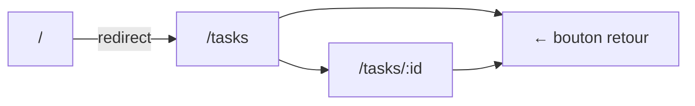
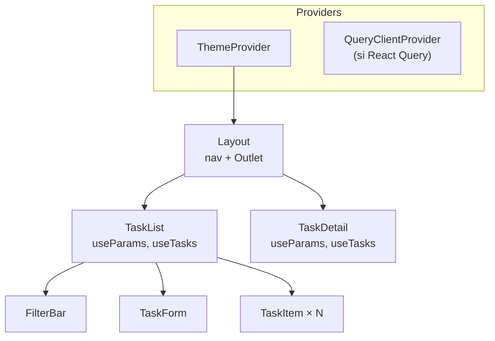

# Projet — une app de gestion de tâches

Le projet final assemble tout ce qu'on a vu en un projet cohérent :
composants, hooks, Context, React Router et data fetching.

> **Objectif —** construire une application de gestion de tâches (**Task Manager**)
> entièrement en React 19 + TypeScript, avec navigation, état global et persistance locale.

## Fonctionnalités

- [ ] Lister les tâches avec statut (en cours / terminée)
- [ ] Ajouter une tâche (formulaire contrôlé)
- [ ] Marquer une tâche comme terminée / non terminée
- [ ] Supprimer une tâche
- [ ] Filtrer : toutes / en cours / terminées
- [ ] Persistance dans `localStorage`
- [ ] Navigation : `/tasks` (liste) + `/tasks/:id` (détail)
- [ ] Thème clair/sombre via Context

## Architecture proposée

```
src/
├─ contexts/
│  └─ ThemeContext.tsx      ← fournit le thème
├─ hooks/
│  ├─ useTasks.ts           ← logique métier (CRUD + filtre)
│  └─ useLocalStorage.ts    ← persistance générique
├─ pages/
│  ├─ Layout.tsx            ← nav + Outlet
│  ├─ TaskList.tsx          ← liste avec filtre
│  └─ TaskDetail.tsx        ← détail d'une tâche
├─ components/
│  ├─ TaskItem.tsx          ← item de liste
│  ├─ TaskForm.tsx          ← formulaire d'ajout
│  └─ FilterBar.tsx         ← boutons de filtre
├─ types/
│  └─ task.ts               ← interface Task
└─ router.tsx               ← routes déclarées
```

## Le modèle de données

```ts
// src/types/task.ts
export interface Task {
  id: string          // crypto.randomUUID()
  title: string
  description: string
  done: boolean
  createdAt: string   // ISO date string
}

export type FilterValue = 'all' | 'active' | 'done'
```

## Les diagrammes de navigation



## Les composants et leur rôle



Le projet est **guidé** : les deux leçons suivantes montrent le code étape par étape.
