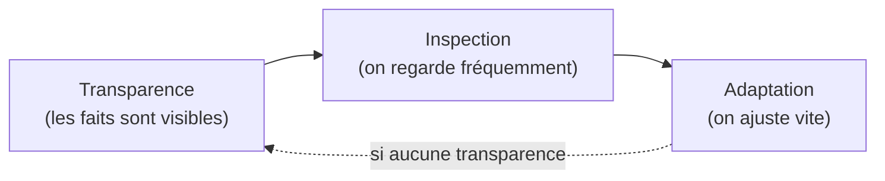

## Scrum repose sur deux théories, nommées explicitement

> « Scrum est fondé sur l'empirisme et la pensée Lean. L'empirisme affirme que la
> connaissance provient de l'expérience et que la prise de décision s'appuie sur
> l'observation de faits. La pensée Lean réduit le gaspillage et se focalise sur
> l'essentiel. »

C'est une question fréquente au PSM I : « Sur quoi Scrum est-il fondé ? » — la réponse
attendue est précisément ces deux mots, **empirisme** et **pensée Lean** (Lean thinking),
pas « l'agilité » (Scrum précède le terme « agile », qui est un adjectif descriptif, pas la
source théorique citée par le Guide).

> « Scrum utilise une approche itérative et incrémentale pour optimiser la prédictibilité
> et le contrôle du risque. »

## Les trois piliers de l'empirisme

> « Scrum combine quatre événements formels pour l'inspection et l'adaptation dans un
> événement conteneur, le Sprint. Ces événements fonctionnent parce qu'ils mettent en œuvre
> les piliers empiriques de Scrum de **transparence**, d'**inspection** et
> d'**adaptation**. »

**Repère d'examen** : le Sprint est le conteneur ; à l'intérieur, **quatre** événements
formels (Sprint Planning, Daily Scrum, Sprint Review, Sprint Retrospective) — ce qui fait
bien **cinq** événements Scrum au total en comptant le Sprint lui-même. Une question qui
demande « combien d'événements Scrum ? » sans préciser peut piéger : le Guide dit « quatre
événements... dans un événement conteneur », donc 4 + 1 = 5.

### 1. Transparence

> « Le processus et le travail émergents doivent être visibles pour ceux qui effectuent le
> travail ainsi que pour ceux qui le reçoivent. Avec Scrum, les décisions importantes sont
> fondées sur l'état perçu de ses trois artefacts formels. Des artefacts peu transparents
> peuvent mener à des décisions qui diminuent la valeur et augmentent le risque. »
>
> « La transparence permet l'inspection. Une inspection sans transparence est trompeuse et
> source de gaspillage. »

Concrètement : un Sprint Backlog que seul le Scrum Master comprend, un Product Backlog non
ordonné, un Increment dont personne ne sait s'il respecte la Definition of Done — tout ça
casse la transparence, donc casse la chaîne empirique entière.

### 2. Inspection

> « Les artefacts Scrum et les progrès vers les objectifs convenus doivent être inspectés
> fréquemment et avec diligence pour détecter des écarts ou des problèmes potentiellement
> indésirables. Pour faciliter l'inspection, Scrum fournit une cadence sous la forme de ses
> cinq événements. »
>
> « L'inspection permet l'adaptation. Une inspection sans adaptation est considérée comme
> infructueuse. Les événements Scrum sont conçus pour provoquer le changement. »

C'est la justification théorique du Daily Scrum, de la Sprint Review, de la Sprint
Retrospective : ce ne sont pas des rituels bureaucratiques, ce sont des points d'inspection
programmés. Inspecter sans jamais rien changer ensuite (« on note le problème, on continue
pareil ») vide l'inspection de son sens.

### 3. Adaptation

> « Si certains aspects d'un processus s'écartent des limites acceptables ou si le produit
> résultant est inacceptable, alors le processus appliqué ou les éléments produits doivent
> être adaptés. L'adaptation doit être effectuée le plus rapidement possible afin de
> minimiser tout écart supplémentaire. »
>
> « L'adaptation devient plus difficile lorsque les personnes impliquées ne sont pas
> en possession de tous leurs moyens ou autogérées. Une Scrum Team doit s'adapter dès lors que l'inspection révèle
> quelque chose de nouveau. »

**Piège d'examen classique** : une équipe qui identifie un problème en Sprint Retrospective
mais dont le management décide seul des changements, sans que l'équipe ait de marge de
manœuvre réelle — l'adaptation est structurellement compromise, quel que soit le soin mis
dans l'inspection.

## Pourquoi « Lean » et pas seulement « empirique » ?

La pensée Lean apporte le deuxième axe, complémentaire : réduire le gaspillage et se
concentrer sur l'essentiel. C'est ce qui justifie, par exemple, que le Sprint Backlog ne
soit détaillé qu'« au fur et à mesure » plutôt que planifié exhaustivement à l'avance —
planifier plus que nécessaire est un gaspillage dans un environnement complexe où une
grande part du travail futur reste, par définition, inconnue :

> « Dans des environnements complexes, une grande part est laissée à l'inconnu. Seul ce qui
> s'est déjà passé peut être utilisé pour une prise de décision à venir. »

## À retenir

- Scrum = **empirisme** + **pensée Lean**, pas « l'agilité » en général.
- Les 3 piliers empiriques, dans cet ordre logique : **transparence → inspection →
  adaptation**. Chacun n'a de sens que si le précédent est acquis.
- « 5 événements » = le Sprint (conteneur) + les 4 événements formels d'inspection/adaptation
  qu'il contient.
