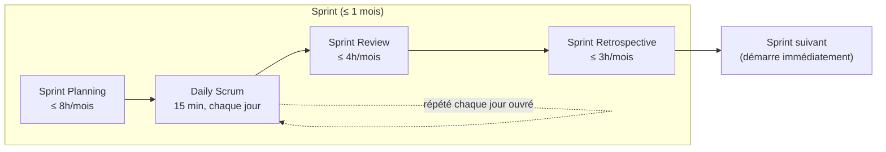

## Le Sprint n'est pas un événement parmi d'autres — c'est le conteneur

> « Le Sprint est un conteneur pour tous les autres événements. Chaque événement dans
> Scrum est une occasion formelle pour inspecter et adapter les artefacts Scrum. Ces
> événements sont spécifiquement conçus pour permettre la transparence requise. »

C'est la structure à avoir en tête avant de détailler chaque rituel : les 4 autres
événements (Sprint Planning, Daily Scrum, Sprint Review, Sprint Retrospective) se déroulent
**à l'intérieur** d'un Sprint, jamais en dehors.

> « Les Sprints sont le cœur de Scrum, où les idées sont transformées en valeur. Ce sont
> des événements d'une durée fixe, d'un mois ou moins, pour créer une cohérence. **Un
> nouveau Sprint commence immédiatement après la fin du précédent.** »

Pas de pause entre deux Sprints — pas de « semaine tampon », pas de flottement. C'est un
point d'examen simple mais souvent raté : un Sprint s'enchaîne directement au suivant.

## Les 4 règles qui s'appliquent PENDANT le Sprint

> « Durant le Sprint :
> - Aucun changement n'est permis qui pourrait remettre en cause l'Objectif de Sprint ;
> - Les objectifs de qualité ne sont jamais revus à la baisse ;
> - Le Product Backlog est affiné si nécessaire ; et
> - Le périmètre peut être clarifié et renégocié avec le Product Owner selon ce qu'on en
>   apprend. »

Ces quatre règles cohabitent : le Sprint Goal est protégé, la qualité ne se négocie jamais
à la baisse, mais le détail du périmètre reste vivant — ce n'est pas une contradiction,
c'est l'équilibre entre stabilité de l'objectif et adaptabilité du chemin pour y parvenir.

## Pourquoi une durée maximale d'un mois

> « Les Sprints permettent la prédictibilité en assurant l'inspection et l'adaptation de la
> progression vers un Objectif de Produit, au moins une fois par mois calendaire. Lorsque
> l'horizon d'un Sprint est trop lointain, l'Objectif de Sprint risque de ne plus être le
> bon, la complexité peut augmenter, et le risque augmenter avec elle. Les Sprints plus
> courts raccourcissent le cycle de l'apprentissage, limitant ainsi les risques liés aux
> coûts et à l'effort. **Chaque Sprint peut être considéré comme un projet court.** »

Le Guide ne fixe **aucune durée minimale** ni de durée « standard » (2 semaines n'est
qu'une convention d'usage très répandue, pas une prescription du Guide). La seule règle
formelle : un mois maximum.

## Burndown, burnup : outils utiles, jamais un substitut à l'empirisme

> « Diverses pratiques existent pour évaluer la progression, telles que les courbes de
> burn-down, ou celles de burn-up ou les diagrammes de flux cumulatifs. Bien que leur
> utilité soit prouvée, ces courbes ne remplacent pas l'importance de l'empirisme. Dans des
> environnements complexes, une grande part est laissée à l'inconnu. Seul ce qui s'est déjà
> passé peut être utilisé pour une prise de décision à venir. »

**Piège fréquent** : penser que le Guide impose un burndown chart. Il le cite en exemple de
pratique utile, hors cadre prescrit — comme le sont story points ou vélocité, vus en
détail au module 5.

## Annulation du Sprint

> « Un Sprint pourrait être annulé si l'Objectif de Sprint devient obsolète. **Seul le
> Product Owner a le pouvoir d'annuler le Sprint.** »

C'est un événement rarissime en pratique (le Guide dit « pourrait », pas « peut »
fréquemment) — un changement de cap radical de l'entreprise, un pivot produit soudain.
Un simple retard, une mésentente d'équipe, ou une priorité qui change légèrement ne
justifient jamais une annulation.

## Anti-patterns réels d'entreprise

1. **Le « Sprint 0 » interminable** — une phase de setup technique sans Sprint Goal ni
   Increment livrable, présentée comme « nécessaire avant de vraiment commencer ». Le Guide
   ne connaît aucun « Sprint 0 » : chaque Sprint produit un Increment inspectable.
2. **Les Sprints qui s'étirent « juste cette fois »** — dépasser la borne d'un mois parce
   que « on est presque au bout » revient à casser la cadence d'inspection régulière que le
   Sprint garantit.
3. **Le flottement entre deux Sprints** — une semaine « de battement » pour rattraper le
   retard avant de lancer le Sprint suivant contredit directement « un nouveau Sprint
   commence immédiatement après la fin du précédent ».

## À retenir

- Le Sprint est le **conteneur** : tous les autres événements ont lieu dedans, jamais en
  dehors.
- Durée maximale **1 mois** ; pas de durée minimale imposée ; enchaînement immédiat entre
  deux Sprints.
- Pendant le Sprint : Sprint Goal protégé, qualité jamais rabaissée, périmètre négociable
  avec le PO.
- Seul le **Product Owner** peut annuler un Sprint, et seulement si le Sprint Goal devient
  obsolète.
