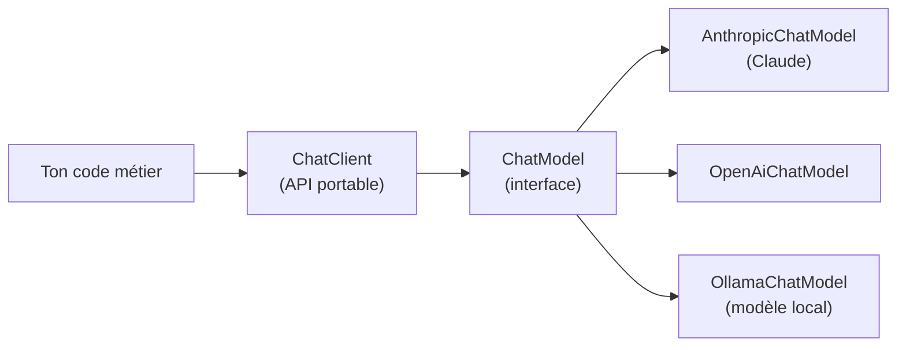

## Tu fais déjà ça, en PHP et en Python

Tu intègres déjà des LLM en production : de l'**OCR** et de la **vision**
avec Claude via **Symfony AI** (`ai-bundle`) côté PHP, et des pipelines
Python/FastAPI côté data. **Spring AI** ne réinvente rien de ce que tu sais
déjà — c'est la **même idée**, transposée dans l'écosystème Java/Spring :
un client, des prompts, un modèle qui répond.

Le vrai sujet de ce module n'est donc pas « qu'est-ce qu'un LLM », c'est :
**comment Spring structure l'accès à un LLM**, pour que ton code ne soit pas
soudé à un fournisseur particulier.

## Le problème que Spring AI résout

Sans lui, appeler Claude en Java reviendrait à utiliser le SDK Anthropic
directement : un format de message propre à Anthropic, une API de
tool-calling propre à Anthropic, un format de streaming propre à Anthropic.
Bascule vers OpenAI ou un modèle local (Ollama) plus tard ? Tu réécris tout.

**Spring AI** intercale une **abstraction portable** : ton code métier parle
à une interface commune (`ChatModel`, puis `ChatClient` par-dessus), et c'est
une implémentation — un **starter** — qui traduit vers l'API réelle du
fournisseur choisi.

> **Symfony AI → Spring AI.** C'est exactement le rôle de la `Platform`
> d'`ai-bundle` : tes prompts et ton code métier restent identiques, seul le
> **bridge** configuré (`anthropic`, `openai`, `ollama`...) change dans
> `config/packages/ai.yaml`. Spring AI fait la même chose avec un
> **starter Maven/Gradle** différent + des propriétés `application.properties`
> différentes — zéro ligne de code métier à changer.



## Les starters : un par fournisseur

Chaque fournisseur de modèle a son propre starter, qui autoconfigure le
`ChatModel` correspondant dès qu'il est présent sur le classpath — le même
mécanisme d'autoconfiguration que tu as vu dans le cours Spring Boot.

```xml
<!-- pom.xml — Claude, le fournisseur que tu utilises déjà -->
<dependency>
    <groupId>org.springframework.ai</groupId>
    <artifactId>spring-ai-starter-model-anthropic</artifactId>
</dependency>
```

| Starter | Fournisseur |
|---|---|
| `spring-ai-starter-model-anthropic` | Claude (Anthropic) |
| `spring-ai-starter-model-openai` | GPT (OpenAI) |
| `spring-ai-starter-model-ollama` | Modèles locaux (Llama, Mistral...) via Ollama |

```properties
# application.properties
spring.ai.anthropic.api-key=${ANTHROPIC_API_KEY}
spring.ai.anthropic.chat.options.model=claude-sonnet-4-5-20250929
spring.ai.anthropic.chat.options.temperature=0.7
```

## Le `ChatClient` : ton point d'entrée unique

Une fois le starter présent, Spring Boot autoconfigure un bean `ChatModel`.
Tu construis un `ChatClient` par-dessus — c'est **lui** que tu utilises au
quotidien, une API fluide pensée pour rester lisible.

```java
// A minimal, working call to the configured model (Claude here)
@Service
public class GreetingService {

    private final ChatClient chatClient;

    // ChatModel is auto-configured by the starter present on the classpath
    public GreetingService(ChatModel chatModel) {
        this.chatClient = ChatClient.builder(chatModel).build();
    }

    public String greet(String name) {
        return chatClient.prompt()
                .user("Say a short, friendly hello to " + name)
                .call()
                .content();
    }
}
```

Pas de client HTTP à écrire, pas de format JSON à assembler à la main : le
starter s'occupe de parler le protocole réel du fournisseur.

> ⚠️ **Erreur fréquente — croire que `ChatClient` parle directement à
> l'API du fournisseur.** Non : `ChatClient` s'appuie toujours sur un
> `ChatModel` (interface), et c'est le starter injecté qui fournit
> l'implémentation concrète (`AnthropicChatModel`, `OpenAiChatModel`...).
> Changer de fournisseur = changer de starter + de propriétés, **pas**
> réécrire `GreetingService`.

## À retenir

- Spring AI résout le même problème que la `Platform` de Symfony AI : une
  **API portable** au-dessus de fournisseurs de LLM interchangeables.
- Un **starter** par fournisseur (`spring-ai-starter-model-anthropic` pour
  Claude) autoconfigure le `ChatModel` correspondant, comme un bridge Symfony
  AI configuré dans `ai.yaml`.
- Le `ChatClient` est ton point d'entrée quotidien : `.prompt().user(...)
  .call().content()` pour l'appel le plus simple.
