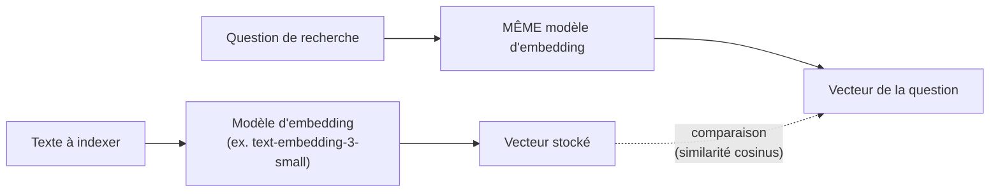

## Le problème : comparer du texte sur le *sens*, pas les mots

Rechercher « facture impayée » dans une base de documents avec un simple
`LIKE '%facture%'` rate tout document qui parle de « paiement en retard » ou
d'« invoice overdue » sans utiliser le mot exact. Un **embedding** résout
ça : c'est une transformation d'un texte en un **vecteur de nombres** qui
capture son **sens**, pas ses mots exacts.

> **Ce que tu sais déjà.** Tu manipules déjà cette idée sans forcément la
> nommer : sur tes pipelines OCR/document, comparer deux textes « au sens
> près » plutôt qu'au mot près est exactement le problème qu'un embedding
> résout mathématiquement.

## Concrètement : un texte devient un point dans l'espace

```text
"facture impayée"        → [0.12, -0.05, 0.88, ..., 0.31]   (ex. 1536 nombres)
"invoice overdue"        → [0.14, -0.04, 0.85, ..., 0.29]   (proche du vecteur ci-dessus !)
"recette de cuisine"     → [-0.71, 0.60, 0.02, ..., -0.44]  (très éloigné)
```

Deux textes de **sens proche** produisent des vecteurs **proches dans
l'espace**, même s'ils ne partagent aucun mot. C'est ce qui rend possible la
recherche « sémantique » : plutôt que de chercher un mot exact, on cherche
les vecteurs les plus proches du vecteur de la question.

## Mesurer la proximité : la similarité cosinus

La mesure la plus utilisée est la **similarité cosinus** : l'angle entre
deux vecteurs. Plus l'angle est petit (les vecteurs pointent dans la même
direction), plus les textes sont sémantiquement proches.

| Similarité cosinus | Interprétation |
|---|---|
| proche de `1` | sens quasi identique |
| proche de `0` | aucun rapport |
| proche de `-1` | sens opposé (rare en pratique sur du texte) |

> **Réflexe à prendre.** Un embedding ne « comprend » rien : c'est une
> projection statistique apprise sur d'énormes volumes de texte. Il capture
> des régularités de sens, pas une compréhension véritable — suffisant pour
> retrouver des documents pertinents, pas pour raisonner dessus (ça, c'est
> le rôle du LLM, après coup).

## Un point crucial : toujours le même modèle d'embedding



> ⚠️ **Erreur fréquente — changer de modèle d'embedding en cours de route.**
> Deux modèles différents ne produisent **pas** des vecteurs comparables,
> même sur le même texte : les dimensions n'ont pas la même signification
> d'un modèle à l'autre. Change de modèle d'embedding → il faut **réindexer**
> toute la base vectorielle, comme une migration de schéma qu'on ne peut pas
> éviter.

## À retenir

- Un **embedding** transforme un texte en vecteur de nombres qui capture son
  **sens** — deux textes proches en sens ont des vecteurs proches.
- La **similarité cosinus** mesure cette proximité (angle entre vecteurs).
- Le modèle d'embedding utilisé à l'**indexation** doit être **strictement
  le même** que celui utilisé à la **recherche** — sinon les vecteurs ne sont
  plus comparables.
