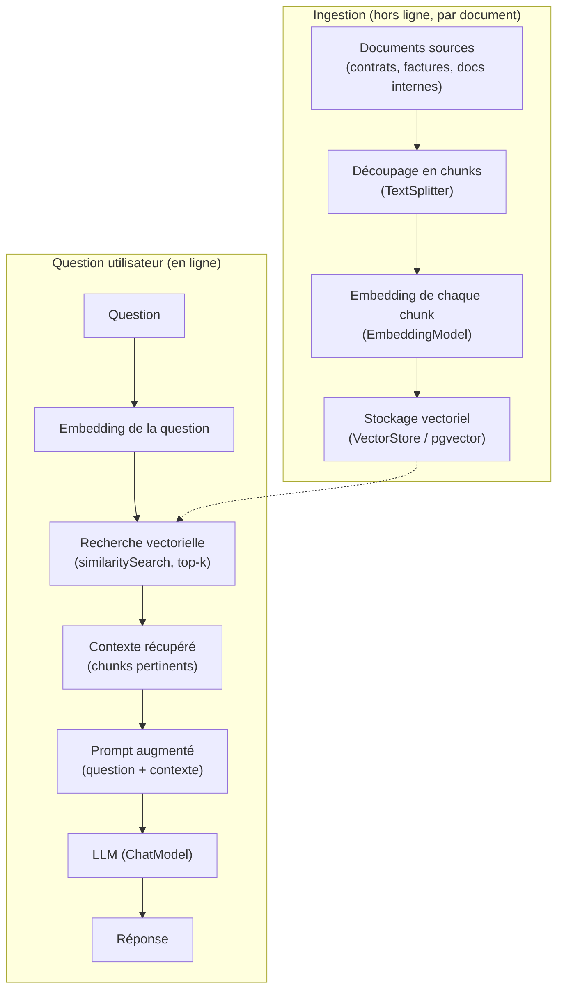

## Deux phases bien distinctes

Un pipeline RAG se découpe en deux temps qu'il ne faut jamais confondre :
une phase **d'ingestion** (hors ligne, une fois par document — ou à chaque
mise à jour), et une phase de **requête** (en ligne, à chaque question posée
par un utilisateur).



## Phase 1 — Ingestion : lire, découper, indexer

### Lire le document source

```java
// Reads PDF, DOCX, PPT... via Apache Tika under the hood
TikaDocumentReader reader = new TikaDocumentReader("classpath:/docs/refund-policy.pdf");
List<Document> rawDocuments = reader.get();
```

### Découper en chunks

Un document entier est presque toujours **trop long** pour tenir dans un
seul chunk pertinent : un `TextSplitter` le découpe en morceaux de taille
raisonnable (par nombre de tokens), avec un léger recouvrement pour ne pas
couper une idée en plein milieu.

```java
TokenTextSplitter splitter = new TokenTextSplitter();
List<Document> chunks = splitter.apply(rawDocuments);
```

> **Réflexe à prendre.** La taille du chunk est un compromis : trop petit,
> le contexte manque de sens isolé ; trop grand, tu perds la précision de la
> recherche (et tu remplis le prompt de texte inutile). Commence avec les
> valeurs par défaut du `TextSplitter`, puis ajuste seulement si les
> réponses manquent de pertinence.

### Indexer les chunks

```java
@Service
public class DocumentIngestionService {

    private final VectorStore vectorStore;

    public DocumentIngestionService(VectorStore vectorStore) {
        this.vectorStore = vectorStore;
    }

    public void ingest(String resourcePath, Map<String, Object> metadata) {
        TikaDocumentReader reader = new TikaDocumentReader(resourcePath);
        List<Document> chunks = new TokenTextSplitter().apply(reader.get());

        // Attach shared metadata (e.g. clientId, docType) to every chunk
        chunks.forEach(chunk -> chunk.getMetadata().putAll(metadata));

        vectorStore.add(chunks);
    }
}
```

## Phase 2 — Requête : chercher, augmenter, générer

```java
@Service
public class RagQueryService {

    private final VectorStore vectorStore;
    private final ChatClient chatClient;

    public RagQueryService(VectorStore vectorStore, ChatModel chatModel) {
        this.vectorStore = vectorStore;
        this.chatClient = ChatClient.builder(chatModel).build();
    }

    public String answer(String question) {
        // 1) Retrieval: find the most relevant chunks
        List<Document> relevantChunks = vectorStore.similaritySearch(
                SearchRequest.builder().query(question).topK(4).build());

        String context = relevantChunks.stream()
                .map(Document::getText)
                .collect(Collectors.joining("\n---\n"));

        // 2) Augmentation: inject the retrieved context into the prompt
        // 3) Generation: the LLM answers using the provided context
        return chatClient.prompt()
                .system("""
                    Answer ONLY using the context below. If the answer is
                    not in the context, say you don't know.

                    Context:
                    {context}
                    """)
                .user(question)
                .call()
                .content();
    }
}
```

Tu peux écrire ce pipeline « à la main » comme ci-dessus — utile pour bien
comprendre le mécanisme. En pratique, Spring AI fournit un composant tout
prêt pour la partie requête : le **`QuestionAnswerAdvisor`**, objet de la
prochaine leçon.

## À retenir

- **Ingestion** (hors ligne) : lire → découper en chunks (`TextSplitter`) →
  indexer (`VectorStore`). Fait une fois par document, ou à chaque mise à
  jour.
- **Requête** (en ligne, par question) : embedder la question → recherche
  vectorielle (`similaritySearch`) → construire un prompt augmenté avec le
  contexte trouvé → appeler le LLM.
- La taille des chunks est un compromis pertinence/contexte — pars des
  réglages par défaut, ajuste seulement si nécessaire.
