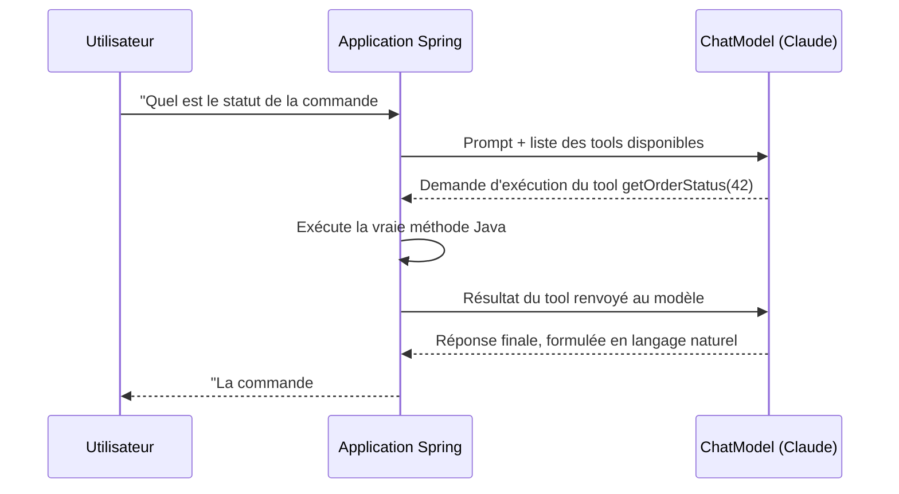

## Le problème : un LLM ne peut pas agir, seulement répondre

Un LLM seul ne peut pas interroger ta base de données, appeler une API
interne, ou faire un calcul exact — il ne fait que **générer du texte**.
Le *function calling* (ou *tool calling*) change ça : tu déclares des
fonctions Java que le modèle peut **demander à exécuter**, en te laissant,
toi, exécuter le vrai code — le modèle ne fait qu'orchestrer.

> **Ce que tu fais déjà, côté métier.** Tu as déjà des services métier
> (scoring, supervision, requêtes de statut) exposés en Symfony. Le
> *tool calling* consiste à rendre ces mêmes services **appelables par le
> LLM**, plutôt que de tout faire deviner au modèle depuis le texte seul.

## Le round-trip, étape par étape



Spring AI gère **tout ce cycle automatiquement** : détecter la demande
d'exécution, appeler la méthode Java, renvoyer le résultat au modèle,
récupérer la réponse finale. Tu n'écris que la méthode métier et son
annotation.

## Déclarer un tool avec `@Tool`

```java
@Component
public class OrderTools {

    private final OrderRepository orderRepository;

    public OrderTools(OrderRepository orderRepository) {
        this.orderRepository = orderRepository;
    }

    @Tool(description = "Get the current status of an order by its id")
    public String getOrderStatus(@ToolParam(description = "The order id") Long orderId) {
        return orderRepository.findById(orderId)
                .map(Order::status)
                .orElse("unknown order");
    }
}
```

La **description** (au niveau de la méthode et de chaque paramètre) n'est
pas un simple commentaire : c'est ce que le modèle lit pour décider **quand**
et **comment** appeler ce tool. Une description vague donne un tool mal
utilisé.

## Enregistrer le tool auprès du ChatClient

```java
@Service
public class OrderAssistant {

    private final ChatClient chatClient;

    public OrderAssistant(ChatModel chatModel, OrderTools orderTools) {
        this.chatClient = ChatClient.builder(chatModel)
                .defaultTools(orderTools)   // makes @Tool methods callable by the model
                .build();
    }

    public String ask(String question) {
        return chatClient.prompt()
                .user(question)
                .call()
                .content();
    }
}
```

Le modèle décide **lui-même**, à la lecture de la question, s'il a besoin
d'appeler `getOrderStatus` ou s'il peut répondre directement — tu n'écris
aucune logique de routage manuelle.

> ⚠️ **Erreur fréquente — exposer un tool trop large.** Un tool qui exécute
> du SQL arbitraire, ou qui accède à des données sans contrôle
> d'autorisation, transforme une simple question utilisateur en risque de
> sécurité (injection de prompt qui pousse le modèle à appeler le tool avec
> des paramètres inattendus). Un tool doit être **étroit et typé** — une
> action précise, avec ses propres contrôles d'accès internes — jamais un
> accès générique « fais ce que tu veux ».

## À retenir

- Le *function calling* laisse le LLM **demander** l'exécution d'une action,
  mais c'est toujours **ton code** qui l'exécute réellement.
- `@Tool` (méthode) + `@ToolParam` (paramètre) : les descriptions guident le
  modèle sur le "quand" et le "comment" appeler le tool — soigne-les.
- `.defaultTools(...)` enregistre les tools sur le `ChatClient` ; le modèle
  choisit lui-même de les invoquer ou non, selon la question posée.
- Garde chaque tool **étroit et typé** : jamais un accès générique qui
  laisserait un modèle (ou une injection de prompt) faire n'importe quoi.
