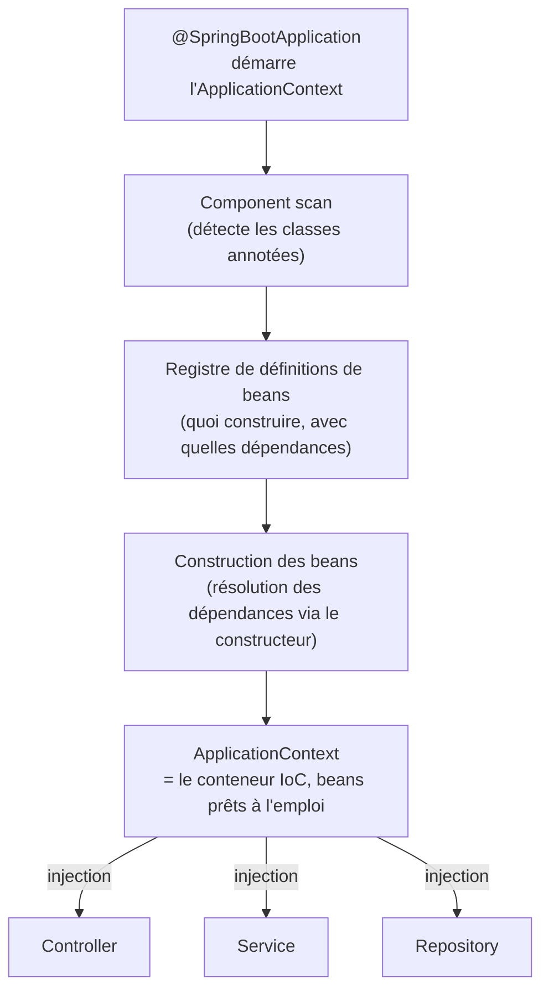

## L'inversion de contrôle, en une phrase

Sans IoC, **tes classes créent elles-mêmes** leurs dépendances (`new
TaxCalculator()` dans le constructeur). Avec l'IoC, **un conteneur externe**
crée les objets, résout leurs dépendances et te les fournit — tu ne fais plus
`new`, tu **déclares** ce dont tu as besoin et le conteneur s'occupe du reste.

> **Symfony → Spring.** C'est le **conteneur de services** Symfony, à l'identique
> dans le principe : tu ne fais jamais `new ProductRepository()` dans un
> contrôleur, tu le déclares en argument de constructeur et le conteneur
> l'injecte. Côté Spring, le conteneur s'appelle l'`ApplicationContext` ; les
> objets qu'il gère s'appellent des **beans** (l'équivalent exact des
> **services** Symfony).



## Les annotations « stéréotypes »

Spring ne transforme **pas** automatiquement toute classe en bean : il faut
la marquer explicitement avec une annotation de **stéréotype**.

| Annotation | Rôle |
|---|---|
| `@Component` | Bean générique — cas de base, sens neutre |
| `@Service` | Bean de logique métier (spécialisation de `@Component`) |
| `@Repository` | Bean d'accès aux données (+ traduction des exceptions JDBC/Hibernate) |
| `@Controller` / `@RestController` | Bean de couche web (vu au module suivant) |

```java
// TaxRateProvider.java
package com.example.shop.pricing;

import org.springframework.stereotype.Component;

@Component
public class TaxRateProvider {

    public double currentRate() {
        return 0.20;
    }
}
```

```java
// InvoiceService.java
package com.example.shop.billing;

import com.example.shop.pricing.TaxRateProvider;
import org.springframework.stereotype.Service;

@Service
public class InvoiceService {

    private final TaxRateProvider taxRateProvider;

    // Spring resolves and injects TaxRateProvider automatically.
    public InvoiceService(TaxRateProvider taxRateProvider) {
        this.taxRateProvider = taxRateProvider;
    }

    public double priceWithTax(double price) {
        return price * (1 + taxRateProvider.currentRate());
    }
}
```

> ⚠️ **Erreur fréquente — oublier le stéréotype.** En Symfony, un
> `services.yaml` avec `resource: '../src/'` transforme **toutes** les classes
> de `src/` en services par défaut (autoconfiguration Symfony). Spring
> **n'a pas** ce comportement : une classe sans `@Component`/`@Service`/
> `@Repository` **n'existe pas** pour le conteneur. L'injecter ailleurs
> lève `NoSuchBeanDefinitionException` au démarrage — annote systématiquement
> chaque classe destinée à être injectée.

## `@Component` vs `@Service` vs `@Repository` : une question de sens, pas de mécanique

Techniquement, les trois annotations font la **même chose** (déclarer un
bean) — `@Service` et `@Repository` sont même définies avec `@Component` en
interne. La différence est **sémantique**, pour documenter l'intention, sauf
pour `@Repository` qui ajoute un vrai comportement : la traduction des
exceptions bas niveau (JDBC, Hibernate) en `DataAccessException` Spring,
uniformes quel que soit le driver.

> **Symfony → Spring.** Symfony n'a pas cette distinction par annotation : un
> service est un service, qu'il soit dans `src/Service/` ou
> `src/Repository/` — c'est une convention de **dossier**, pas de contrat
> technique. Spring formalise la même intention par le **typage** de
> l'annotation.

## À retenir

- Le conteneur IoC (`ApplicationContext`) construit et fournit les **beans**
  — l'équivalent exact du conteneur de services Symfony.
- **Aucune autodétection implicite** : chaque classe doit porter `@Component`,
  `@Service` ou `@Repository` pour devenir un bean.
- `@Repository` ajoute la traduction d'exceptions ; `@Service`/`@Component`
  sont sémantiquement équivalents à `@Component`.
