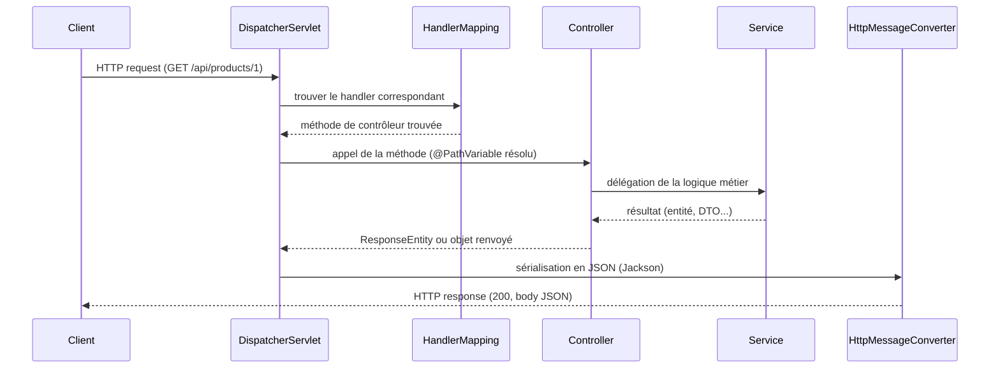

## Le cycle de vie d'une requête Spring MVC

Avant de parler de statuts HTTP, il faut visualiser le trajet complet d'une
requête — c'est la question d'entretien la plus classique sur Spring MVC.



> **Symfony → Spring.** Le `DispatcherServlet` joue exactement le rôle du
> **Kernel** Symfony (`HttpKernel::handle()`) : point d'entrée unique qui
> résout la route (`HandlerMapping` ≈ le `Router`), appelle le contrôleur, et
> transforme la valeur renvoyée en réponse HTTP via un `HttpMessageConverter`
> (≈ le composant Serializer / `$this->json(...)`).

## `ResponseEntity<T>` : contrôler statut, headers et corps

Renvoyer directement un objet donne toujours un `200 OK`. Pour choisir le
statut (ex. `201 Created` après une création), utilise `ResponseEntity`.

```java
import org.springframework.http.ResponseEntity;
import org.springframework.web.bind.annotation.*;

@RestController
@RequestMapping("/api/products")
public class ProductController {

    @PostMapping
    public ResponseEntity<Product> create(@RequestBody CreateProductRequest request) {
        Product created = productService.create(request.name(), request.price());
        return ResponseEntity.status(HttpStatus.CREATED).body(created);
    }

    @GetMapping("/{id}")
    public ResponseEntity<Product> findOne(@PathVariable Long id) {
        return productService.findOptional(id)
                .map(ResponseEntity::ok)              // 200 OK with body
                .orElse(ResponseEntity.notFound().build()); // 404, no body
    }

    @DeleteMapping("/{id}")
    public ResponseEntity<Void> delete(@PathVariable Long id) {
        productService.delete(id);
        return ResponseEntity.noContent().build();    // 204
    }
}
```

> **Symfony → Spring.** `ResponseEntity` correspond à construire toi-même un
> `JsonResponse` avec un statut explicite (`new JsonResponse($data,
> Response::HTTP_CREATED)`) — la différence est que Spring te donne une
> **API fluide typée** (`.status(...).body(...)`) plutôt que des constantes
> passées en argument.

## Gérer les erreurs proprement : `@ExceptionHandler`

```java
public class ProductNotFoundException extends RuntimeException {
    public ProductNotFoundException(Long id) {
        super("Product " + id + " not found");
    }
}
```

```java
import org.springframework.http.HttpStatus;
import org.springframework.web.bind.annotation.ExceptionHandler;
import org.springframework.web.bind.annotation.ResponseStatus;
import org.springframework.web.bind.annotation.RestControllerAdvice;

@RestControllerAdvice
public class GlobalExceptionHandler {

    @ExceptionHandler(ProductNotFoundException.class)
    @ResponseStatus(HttpStatus.NOT_FOUND)
    public ErrorResponse handleNotFound(ProductNotFoundException ex) {
        return new ErrorResponse(ex.getMessage());
    }
}

public record ErrorResponse(String message) {}
```

> **Symfony → Spring.** `@RestControllerAdvice` + `@ExceptionHandler`
> correspond à un **listener de l'événement `kernel.exception`**
> (`#[AsEventListener(event: KernelEvents::EXCEPTION)]`) : un point central
> qui transforme une exception métier en réponse HTTP appropriée, sans
> polluer chaque contrôleur avec des `try/catch` répétés.

> ⚠️ **Erreur fréquente — laisser fuiter la stack trace.** Sans gestionnaire
> global, une exception non capturée renvoie par défaut une page d'erreur
> générique (ou un JSON d'erreur Spring Boot par défaut, potentiellement
> verbeux en profil `dev`). Ne compte jamais sur ce comportement par défaut
> en production — comme tu ne laisserais jamais Symfony afficher sa page de
> debug en prod.

## À retenir

- Le cycle Spring MVC : `DispatcherServlet` → `HandlerMapping` → contrôleur
  → service → `ResponseEntity`/objet → `HttpMessageConverter` → réponse.
- `ResponseEntity` donne un contrôle explicite du statut HTTP, des headers et
  du corps — l'équivalent d'un `JsonResponse` construit à la main.
- `@RestControllerAdvice` + `@ExceptionHandler` centralise la traduction des
  exceptions en réponses HTTP — le pendant du listener `kernel.exception`.
