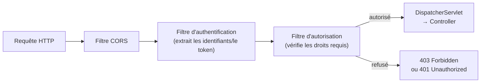

## Une chaîne de filtres, avant même d'atteindre le contrôleur

Spring Security s'intercale **avant** le `DispatcherServlet` : chaque requête
traverse une **chaîne de filtres servlet**, qui vérifie l'authentification et
l'autorisation avant même que la requête n'atteigne un contrôleur.



> **Symfony → Spring.** C'est exactement le rôle du **firewall** Symfony :
> une chaîne d'écouteurs sur l'événement `kernel.request`, exécutée **avant**
> le contrôleur, qui authentifie puis autorise. La `SecurityFilterChain`
> Spring est le pendant direct d'un firewall Symfony configuré dans
> `security.yaml`.

## Déclarer une `SecurityFilterChain`

```java
// SecurityConfig.java
package com.example.shop.security;

import org.springframework.context.annotation.Bean;
import org.springframework.context.annotation.Configuration;
import org.springframework.security.config.annotation.web.builders.HttpSecurity;
import org.springframework.security.web.SecurityFilterChain;

import static org.springframework.security.config.Customizer.withDefaults;

@Configuration
public class SecurityConfig {

    @Bean
    public SecurityFilterChain filterChain(HttpSecurity http) throws Exception {
        http
            .csrf(csrf -> csrf.disable())                       // disabled: stateless REST API, no cookies/forms
            .authorizeHttpRequests(auth -> auth
                .requestMatchers("/api/auth/**").permitAll()    // public endpoints
                .requestMatchers("/api/admin/**").hasRole("ADMIN")
                .anyRequest().authenticated()                   // everything else requires authentication
            )
            .httpBasic(withDefaults());                          // Basic Auth for this example

        return http.build();
    }
}
```

> **Symfony → Spring.** Compare avec un `security.yaml` typique :

```yaml
# security.yaml
security:
    firewalls:
        main:
            pattern: ^/api
            stateless: true
            provider: app_user_provider

    access_control:
        - { path: ^/api/auth, roles: PUBLIC_ACCESS }
        - { path: ^/api/admin, roles: ROLE_ADMIN }
        - { path: ^/api, roles: IS_AUTHENTICATED_FULLY }
```

> `.authorizeHttpRequests(...)` correspond terme à terme à
> `access_control` : une liste ordonnée de règles associant un motif d'URL à
> un niveau d'accès requis, évaluées **dans l'ordre** (la première règle qui
> matche s'applique) — dans les deux frameworks.

## `csrf().disable()` : pourquoi, sur une API REST stateless

> 💡 **À retenir.** La protection CSRF protège les formulaires **avec
> session/cookie** — inutile sur une API REST **stateless** authentifiée par
> token (JWT, header `Authorization`). C'est le même raisonnement qui pousse
> à déclarer un firewall Symfony `stateless: true` : sans session serveur,
> le risque CSRF classique (basé sur les cookies) disparaît.

## À retenir

- Spring Security intercepte la requête **avant** le contrôleur, via une
  `SecurityFilterChain` — le pendant exact du firewall Symfony.
- `authorizeHttpRequests` fonctionne comme `access_control` : une liste de
  règles évaluées dans l'ordre, motif d'URL → niveau d'accès requis.
- Désactive CSRF sur une API stateless (token-based), exactement comme un
  firewall Symfony `stateless: true`.
