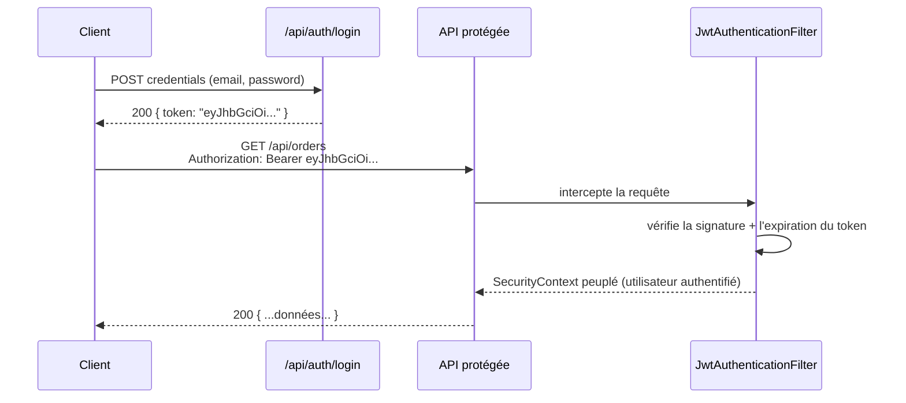

## Pourquoi un JWT, en une phrase

Une API REST **stateless** (sans session serveur) a besoin d'un moyen de
prouver l'identité de l'appelant **à chaque requête**, sans rien stocker
côté serveur. Le **JWT** (*JSON Web Token*) répond à ce besoin : un jeton
signé, envoyé dans l'en-tête `Authorization: Bearer <token>`, que le serveur
vérifie sans avoir besoin de le stocker.

> **Symfony → Spring.** Même problème, même solution des deux côtés : le
> bundle **LexikJWTAuthenticationBundle** est la référence côté Symfony —
> un firewall `stateless: true` qui valide un JWT à chaque requête, sans
> session. L'architecture Spring décrite ici est la traduction directe de
> ce firewall.

## Le flux, vue d'ensemble



## Un filtre custom pour valider le token

```java
// JwtAuthenticationFilter.java
package com.example.shop.security;

import jakarta.servlet.FilterChain;
import jakarta.servlet.http.HttpServletRequest;
import jakarta.servlet.http.HttpServletResponse;
import org.springframework.security.authentication.UsernamePasswordAuthenticationToken;
import org.springframework.security.core.context.SecurityContextHolder;
import org.springframework.web.filter.OncePerRequestFilter;

import java.io.IOException;

public class JwtAuthenticationFilter extends OncePerRequestFilter {

    private final JwtService jwtService;

    public JwtAuthenticationFilter(JwtService jwtService) {
        this.jwtService = jwtService;
    }

    @Override
    protected void doFilterInternal(HttpServletRequest request, HttpServletResponse response, FilterChain chain)
            throws IOException, jakarta.servlet.ServletException {

        String header = request.getHeader("Authorization");

        if (header != null && header.startsWith("Bearer ")) {
            String token = header.substring(7);

            if (jwtService.isValid(token)) {
                String username = jwtService.extractUsername(token);
                var authentication = new UsernamePasswordAuthenticationToken(username, null, jwtService.extractAuthorities(token));
                SecurityContextHolder.getContext().setAuthentication(authentication);
            }
        }

        chain.doFilter(request, response);
    }
}
```

`OncePerRequestFilter` s'insère dans la `SecurityFilterChain` (module
précédent) : c'est le filtre qui remplace l'authentification par
session/cookie par une vérification de token à chaque requête.

> 💡 **À retenir.** Ce cours **survole** volontairement le sujet : produire,
> signer et vérifier des JWT (bibliothèque `jjwt`, ou le starter
> `spring-boot-starter-oauth2-resource-server` pour une validation standard
> face à un fournisseur d'identité) est un vrai sujet à part entière. Retiens
> le **principe** — stateless, `Authorization: Bearer`, filtre
> d'authentification avant le contrôleur — le reste s'apprend à l'usage,
> exactement comme LexikJWTAuthenticationBundle abstrait la mécanique
> détaillée côté Symfony.

## À retenir

- JWT = authentification **stateless**, jeton signé vérifié à chaque requête
  via l'en-tête `Authorization: Bearer`.
- Un `OncePerRequestFilter` custom (ou `spring-boot-starter-oauth2-resource-server`)
  valide le token et peuple le `SecurityContext` — le pendant du firewall
  stateless LexikJWT en Symfony.
- Le principe compte plus que l'implémentation détaillée à ce stade — un
  sujet à approfondir séparément si besoin.
