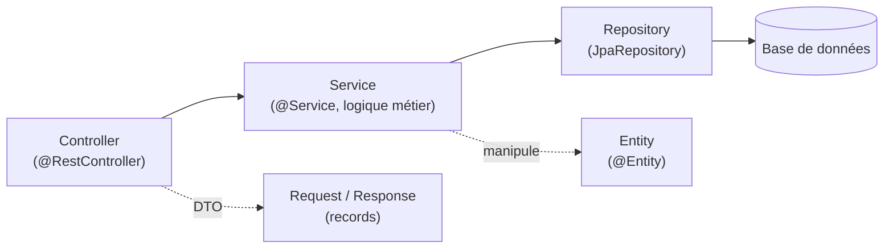

## L'architecture en couches, presque identique à Symfony

```
src/main/java/com/example/shop/
├─ ShopApplication.java
├─ product/
│  ├─ Product.java                    (entité JPA)
│  ├─ ProductRepository.java          (accès aux données)
│  ├─ ProductService.java             (logique métier)
│  ├─ ProductController.java          (couche web)
│  ├─ CreateProductRequest.java       (DTO d'entrée)
│  └─ ProductResponse.java            (DTO de sortie)
├─ order/
│  └─ ...                             (même découpage, autre domaine)
├─ security/
│  ├─ SecurityConfig.java
│  └─ AppUserDetailsService.java
└─ config/
   └─ AppProperties.java
```



> **Symfony → Spring.** Le découpage est **presque identique** à celui d'un
> projet Symfony bien organisé :

| Spring | Symfony | Rôle |
|---|---|---|
| `product/Product.java` | `src/Entity/Product.php` | Entité persistante |
| `product/ProductRepository.java` | `src/Repository/ProductRepository.php` | Accès aux données |
| `product/ProductService.java` | `src/Service/ProductService.php` | Logique métier |
| `product/ProductController.java` | `src/Controller/ProductController.php` | Couche web/HTTP |
| `product/CreateProductRequest.java` | `src/Dto/CreateProductRequest.php` (ou `Form`) | DTO d'entrée |

## Package par domaine, pas par couche technique

Le regroupement ci-dessus (`product/`, `order/`, `security/`) organise par
**domaine métier**, pas par type technique (pas de dossier `controllers/`
regroupant TOUS les contrôleurs de l'application, toutes ressources
confondues).

> **Réflexe à prendre.** C'est le même réflexe que découper un module
> NestJS ou un bundle Symfony **par domaine** plutôt que par couche : plus
> l'application grossit, plus il devient naturel de retrouver tout ce qui
> concerne « produits » au même endroit, plutôt que de sauter entre trois
> dossiers techniques différents pour une seule fonctionnalité.

## Où vit la logique métier ?

> ⚠️ **Erreur fréquente — un contrôleur qui fait tout.** Un contrôleur
> **fin** délègue immédiatement au service : validation déjà faite par
> `@Valid`, appel du service, mapping vers un DTO de réponse. La logique
> métier (règles, calculs, orchestration entre repositories) vit dans le
> **service**, jamais dans le contrôleur — exactement la même discipline
> attendue d'un contrôleur Symfony fin, sans logique métier directement
> dans l'action.

## À retenir

- L'architecture en couches Spring (`Controller` → `Service` → `Repository`
  → `Entity`) est quasiment un décalque de l'organisation Symfony.
- Organise par **domaine métier** (un package par ressource), pas par couche
  technique — même réflexe qu'un bundle Symfony bien découpé.
- Le contrôleur reste **fin** : validation déjà déléguée, logique métier
  dans le service, mapping vers DTO en sortie.
