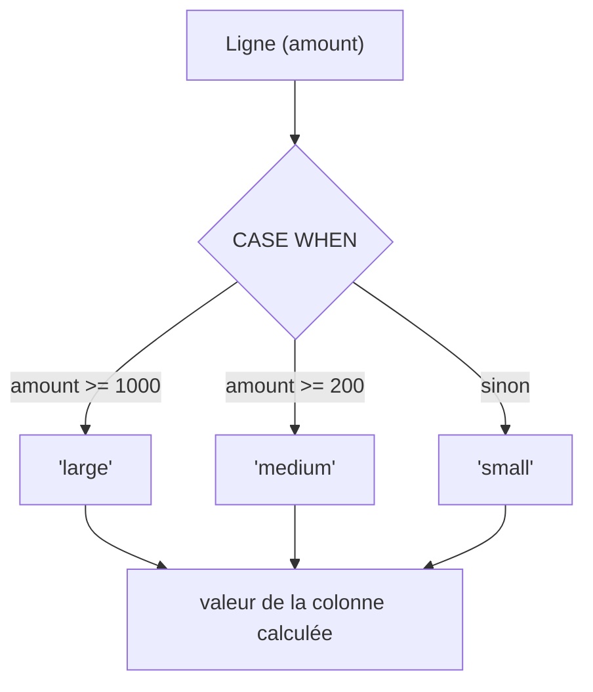

# NULL, DISTINCT et expressions conditionnelles

Cette leçon approfondit trois points qui font trébucher même les analystes expérimentés.

## NULL en détail : les trois surprises

### Surprise 1 — l'égalité avec NULL

```sql
-- ❌ never matches, even when region IS NULL
WHERE region = NULL

-- ✅ correct
WHERE region IS NULL
WHERE region IS NOT NULL
```

### Surprise 2 — NULL dans les agrégats

`SUM`, `AVG`, `MIN`, `MAX` **ignorent les NULL**. C'est souvent voulu, mais peut fausser
une moyenne si les valeurs manquantes ne sont pas aléatoires.

```sql
SELECT
  COUNT(*)           AS nb_total_rows,       -- counts NULLs
  COUNT(amount)      AS nb_non_null_amounts,  -- skips NULLs
  AVG(amount)        AS avg_of_non_null,      -- NULLs excluded from avg
  COALESCE(AVG(amount), 0) AS avg_or_zero     -- replaces NULL result with 0
FROM orders;
```

### Surprise 3 — NOT IN avec un NULL dans la liste

```sql
-- If the subquery returns even one NULL, NOT IN returns zero rows!
WHERE product_id NOT IN (SELECT product_id FROM blacklist)
-- ✅ safer
WHERE NOT EXISTS (SELECT 1 FROM blacklist WHERE blacklist.product_id = orders.product_id)
```

> **À retenir —** `NULL` est « inconnu », pas une valeur. Pour le tester : `IS NULL` /
> `IS NOT NULL`. Dans les agrégats, les `NULL` sont ignorés silencieusement. `NOT IN`
> devient piégeux dès qu'un `NULL` peut apparaître dans la liste : préfère `NOT EXISTS`.

## COALESCE : remplacer les NULL

```sql
-- replace a missing region with 'Unknown'
SELECT order_id, COALESCE(region, 'Unknown') AS region
FROM orders;
```

`COALESCE(a, b, c)` renvoie le **premier argument non-NULL**.

## DISTINCT : quelques subtilités

`DISTINCT` porte sur **la combinaison entière** des colonnes listées — pas sur une seule.

```sql
SELECT DISTINCT region, category FROM orders;
-- unique (region, category) pairs, not just unique regions
```

`COUNT(DISTINCT col)` : compte les valeurs distinctes **non-NULL** d'une colonne.

```sql
SELECT COUNT(DISTINCT customer_id) AS unique_customers FROM orders;
```

Attention : `DISTINCT` sur de nombreuses colonnes peut être lent (tri interne).
Si tu veux juste dédupliquer, vérifie d'abord si le problème n'est pas une jointure 1-N.

## CASE WHEN : colonne calculée conditionnelle

Équivalent SQL d'un `if/else`, utilisable dans `SELECT`, `WHERE`, `ORDER BY`, `GROUP BY` :

```sql
SELECT
  order_id,
  amount,
  CASE
    WHEN amount >= 1000 THEN 'large'
    WHEN amount >= 200  THEN 'medium'
    ELSE 'small'
  END AS order_size
FROM orders;
```

Classique en analyse : segmenter une mesure continue en catégories pour un rapport.

```sql
-- count per segment
SELECT
  CASE
    WHEN amount >= 1000 THEN 'large'
    WHEN amount >= 200  THEN 'medium'
    ELSE 'small'
  END AS order_size,
  COUNT(*) AS nb_orders
FROM orders
GROUP BY order_size
ORDER BY nb_orders DESC;
```


