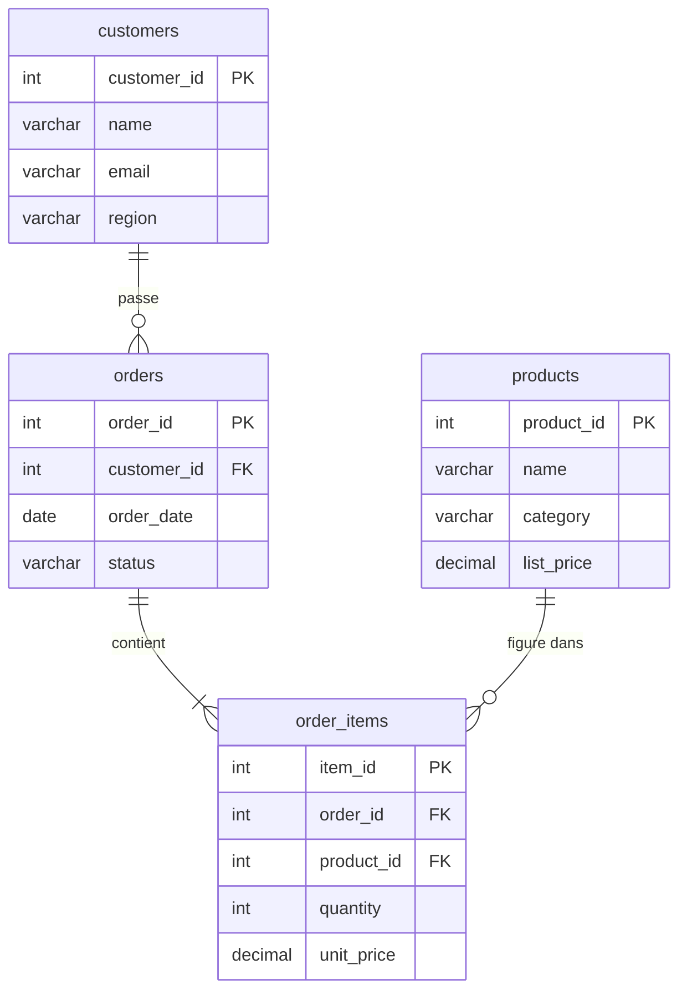

# Agréger : le cœur de l'analyse SQL

C'est l'équivalent du TCD (tableau croisé dynamique) Excel : on **groupe** par une
dimension et on **agrège** une mesure.

## Schéma du jeu de données

Le jeu de données de ce parcours simule un back-office e-commerce : clients, commandes,
lignes de commande et produits. Les exemples pédagogiques utilisent `orders.amount` pour
rester lisibles ; les cas d'agence utilisent le schéma complet avec `order_items`.



## Les fonctions d'agrégation

```sql
SELECT
  COUNT(*)        AS nb_orders,
  SUM(amount)     AS total_revenue,
  AVG(amount)     AS avg_basket,
  MIN(amount)     AS min_amount,
  MAX(amount)     AS max_amount
FROM orders;
```

Attention : `COUNT(*)` compte les **lignes**, `COUNT(column)` compte les valeurs
**non-NULL** de la colonne, et `COUNT(DISTINCT customer_id)` les valeurs **distinctes**.
Les agrégats (`SUM`, `AVG`…) **ignorent les NULL**.

## GROUP BY : agréger par dimension

« CA par catégorie » :

```sql
SELECT category, SUM(amount) AS total_revenue
FROM orders
GROUP BY category
ORDER BY total_revenue DESC;
```

**Données en entrée (`orders`, extrait) :**

| order_id | customer_id | category | amount |
|---|---|---|---|
| 101 | 1 | Hardware | 120.00 |
| 102 | 2 | Software |  80.00 |
| 103 | 1 | Hardware | 200.00 |
| 104 | 3 | Software | 150.00 |
| 105 | 2 | Services |  95.00 |

**Résultat — 5 lignes réduites à 3, une par catégorie :**

| category | total_revenue |
|---|---|
| Hardware | 320.00 |
| Software | 230.00 |
| Services |  95.00 |

Règle d'or : **toute colonne du `SELECT` qui n'est pas agrégée doit être dans le
`GROUP BY`**.

On peut grouper par plusieurs dimensions (matrice région × catégorie) :

```sql
SELECT region, category, SUM(amount) AS total_revenue
FROM orders
GROUP BY region, category;
```

## Grouper par mois

```sql
-- PostgreSQL
SELECT DATE_TRUNC('month', order_date) AS month, SUM(amount) AS total_revenue
FROM orders
GROUP BY DATE_TRUNC('month', order_date)
ORDER BY month;
```

## Cas d'agence : revenus par catégorie (schéma complet)

En production, le montant d'une commande est calculé depuis `order_items` (quantité ×
prix unitaire), pas stocké directement dans `orders`. La requête réaliste joint d'abord,
puis agrège :

```sql
-- revenue and order count by product category
SELECT
  p.category,
  COUNT(DISTINCT oi.order_id)       AS nb_orders,
  SUM(oi.quantity * oi.unit_price)  AS total_revenue
FROM order_items AS oi
JOIN products    AS p  ON p.product_id = oi.product_id
GROUP BY p.category
ORDER BY total_revenue DESC;
```

| category | nb_orders | total_revenue |
|---|---|---|
| Hardware |         5 |      4 200.00 |
| Software |         3 |      1 800.00 |
| Services |         2 |        950.00 |

## HAVING : filtrer APRÈS agrégation

`WHERE` filtre les **lignes**, `HAVING` filtre les **groupes** :

```sql
-- categories whose revenue exceeds 1000
SELECT category, SUM(amount) AS total_revenue
FROM orders
GROUP BY category
HAVING SUM(amount) > 1000;
```

On combine souvent les deux : `WHERE` réduit les lignes en entrée, `HAVING` filtre les
agrégats en sortie.

```sql
SELECT category, SUM(amount) AS total_revenue
FROM orders
WHERE order_date >= DATE '2024-01-01'   -- before aggregation
GROUP BY category
HAVING SUM(amount) > 1000;               -- after aggregation
```

> **À retenir —** `WHERE` = avant le `GROUP BY` (sur les lignes), `HAVING` = après (sur
> les agrégats). On ne peut pas mettre `SUM(amount) > 1000` dans un `WHERE`.

## Erreurs classiques

**Colonne absente du `GROUP BY`** : en PostgreSQL, toute colonne du `SELECT` qui n'est
ni agrégée ni dans le `GROUP BY` génère une erreur. MySQL en mode permissif laisse
passer — ce qui masque souvent un bug de logique.

```sql
-- ERROR in PostgreSQL: column "name" must appear in the GROUP BY clause
SELECT customer_id, name, SUM(amount) AS total
FROM orders
GROUP BY customer_id;
```

Correction : ajouter `name` au `GROUP BY`, ou joindre `customers` **après** avoir agrégé
`orders` (plus propre en analyse).

**Agrégat dans un `WHERE`** : le moteur applique les agrégats après le `WHERE` — ils ne
sont pas encore disponibles à l'étape de filtrage. Utiliser `HAVING`.

```sql
-- ERROR: aggregate functions not allowed in WHERE
SELECT category, SUM(amount) AS total
FROM orders
WHERE SUM(amount) > 1000     -- wrong: SUM not yet computed at this stage
GROUP BY category;
```

## Tips performance

**EXPLAIN ANALYZE — lire le plan simplifié**

```sql
EXPLAIN ANALYZE
SELECT category, SUM(amount) AS total_revenue
FROM orders
GROUP BY category;
```

```
HashAggregate  (cost=1.07..1.12 rows=5 width=44)
  Group Key: category
  ->  Seq Scan on orders  (cost=0.00..1.05 rows=5 width=24)
```

Points à surveiller : `Seq Scan` sur une grande table = lecture complète = coûteux.
Avec un index sur `category`, PostgreSQL peut passer à un `Index Scan` ou à un
*Index Only Scan* si toutes les colonnes nécessaires sont couvertes.

**Index sur les colonnes de `GROUP BY` et de filtrage fréquents**

```sql
-- speed up GROUP BY category
CREATE INDEX idx_orders_category ON orders (category);

-- composite index: filter on product_id + aggregate on order_id in one pass
CREATE INDEX idx_order_items_product ON order_items (product_id, order_id);
```

**Éviter `SELECT *` avant d'agréger**

```sql
-- costly: loads all columns, most are then discarded
SELECT * FROM order_items WHERE order_id = 42;

-- efficient: only load what is needed
SELECT product_id, quantity, unit_price FROM order_items WHERE order_id = 42;
```

PostgreSQL peut effectuer un *Index Only Scan* (sans accès à la table) si toutes les
colonnes requises sont couvertes par l'index — `SELECT *` l'empêche.
