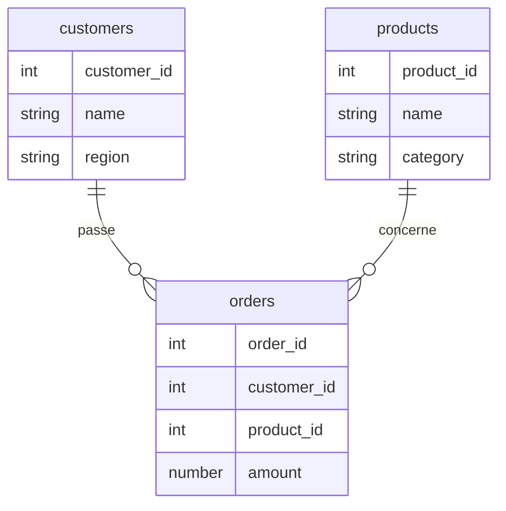
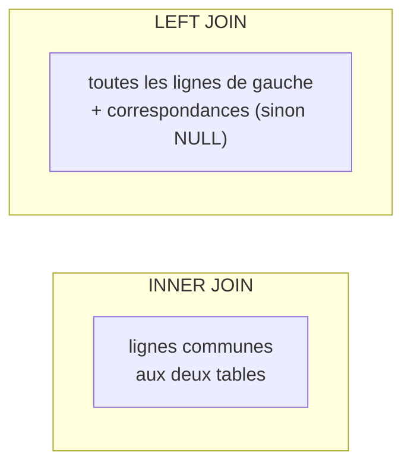

# Joindre : recombiner les tables

Les données sont réparties dans plusieurs tables (normalisation). Une jointure
**recolle** les lignes liées par une clé. Côté analyste, on enrichit `orders` avec les
attributs du produit ou du client.



## INNER JOIN : l'intersection

Ne garde que les lignes qui **matchent des deux côtés**.

```sql
SELECT o.order_id, o.amount, p.name AS product_name, p.category
FROM orders AS o
JOIN products AS p ON p.product_id = o.product_id;
```

Une commande dont le `product_id` n'existe pas dans `products` **disparaît** du résultat.

## LEFT JOIN : tout garder à gauche

Garde **toutes** les lignes de la table de gauche ; côté droit `NULL` quand il n'y a pas
de correspondance.

```sql
SELECT c.customer_id, c.name, o.order_id
FROM customers AS c
LEFT JOIN orders AS o ON o.customer_id = c.customer_id;
```

Indispensable pour trouver les clients **sans commande** :

```sql
SELECT c.customer_id, c.name
FROM customers AS c
LEFT JOIN orders AS o ON o.customer_id = c.customer_id
WHERE o.order_id IS NULL;     -- no order attached
```



## Jointures multiples

On enchaîne les `JOIN` pour assembler plusieurs tables :

```sql
SELECT o.order_id, c.name AS customer, p.name AS product, o.amount
FROM orders AS o
JOIN customers AS c ON c.customer_id = o.customer_id
JOIN products  AS p ON p.product_id = o.product_id;
```

## Les deux pièges classiques

**1. Le filtre du LEFT JOIN dans le WHERE.** Mettre une condition sur la table de droite
dans le `WHERE` annule l'effet du `LEFT JOIN` (les `NULL` sont écartés). Si la condition
doit s'appliquer **avant** la jointure, place-la dans le `ON` :

```sql
-- keep all customers, even those with no 2024 order
LEFT JOIN orders AS o
  ON o.customer_id = c.customer_id
  AND o.order_date >= DATE '2024-01-01'
```

**2. Les doublons (fan-out).** Si la clé de droite n'est pas unique, chaque ligne de
gauche est **dupliquée** par le nombre de correspondances. Un `SUM(amount)` après une
telle jointure peut être **gonflé**. Vérifie toujours la cardinalité (1-1, 1-N) avant
d'agréger.

> **À retenir —** `INNER` = intersection ; `LEFT` = tout à gauche + NULL à droite. Filtre
> la table de droite dans le **`ON`** (pas le `WHERE`) si tu veux préserver le LEFT, et
> méfie-toi des **doublons** avant d'agréger.
