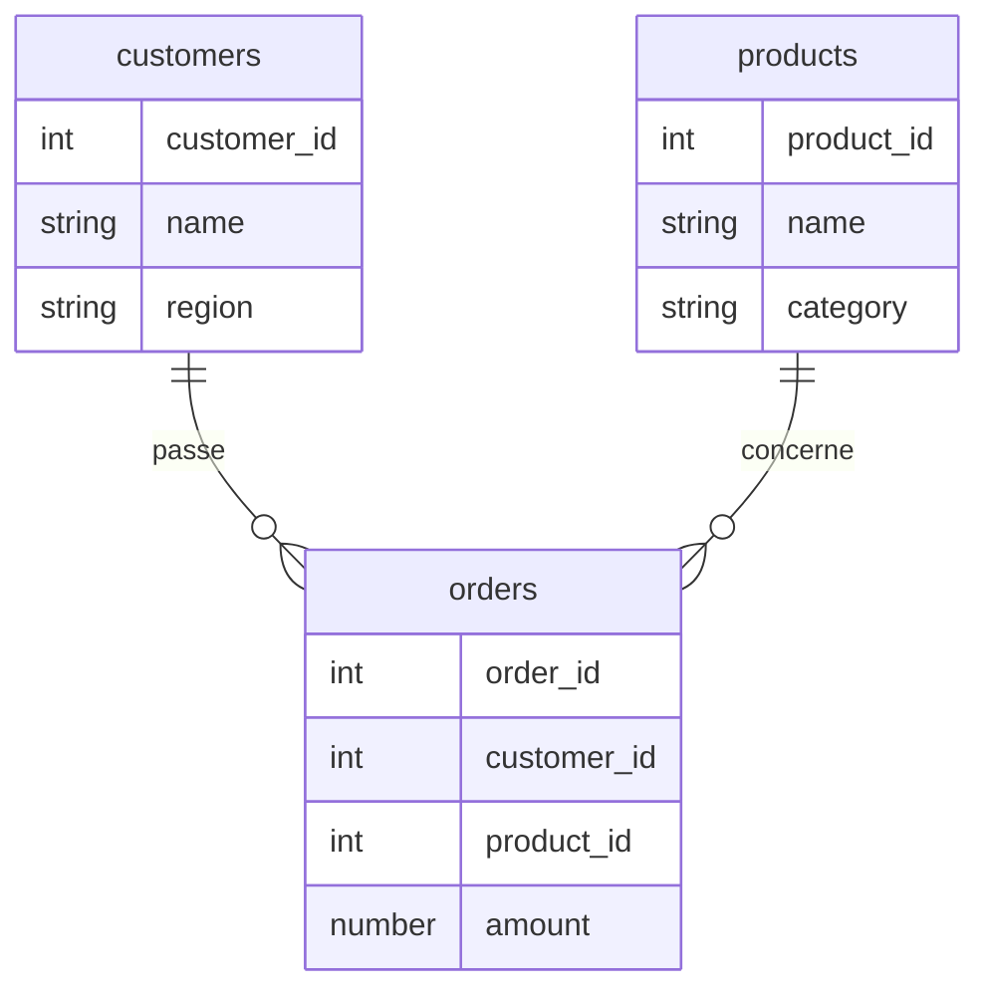
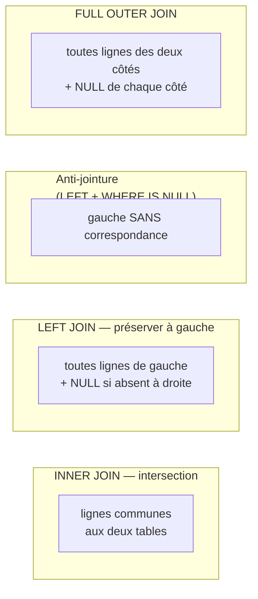

# Joindre : recombiner les tables

Les données sont réparties dans plusieurs tables (normalisation). Une jointure
**recolle** les lignes liées par une clé. Côté analyste, on enrichit `orders` avec les
attributs du produit ou du client.


```mermaid
erDiagram
    customers ||--o{ orders : "passe"
    products  ||--o{ orders : "concerne"
    customers {
        int customer_id
        string name
        string region
    }
    products {
        int product_id
        string name
        string category
    }
    orders {
        int order_id
        int customer_id
        int product_id
        number amount
    }
```

## INNER JOIN : l'intersection

Ne garde que les lignes qui **matchent des deux côtés**.

```sql
SELECT o.order_id, o.amount, p.name AS product_name, p.category
FROM orders AS o
JOIN products AS p ON p.product_id = o.product_id;
```

**Visualisation — données en entrée :**

Table `orders` :

| order_id | product_id | amount |
|---|---|---|
| 101 | 10 | 120.00 |
| 102 | 11 |  80.00 |
| 103 | 99 | 200.00 |

Table `products` :

| product_id | name | category |
|---|---|---|
| 10 | Laptop | Hardware |
| 11 | License | Software |
| (99 absent) | — | — |

**Résultat INNER JOIN — la commande 103 disparaît (product_id 99 absent) :**

| order_id | amount | product_name | category |
|---|---|---|---|
| 101 | 120.00 | Laptop | Hardware |
| 102 |  80.00 | License | Software |

Une commande dont le `product_id` n'existe pas dans `products` **disparaît** du résultat.

## LEFT JOIN : tout garder à gauche

Garde **toutes** les lignes de la table de gauche ; côté droit `NULL` quand il n'y a pas
de correspondance.

```sql
SELECT c.customer_id, c.name, o.order_id
FROM customers AS c
LEFT JOIN orders AS o ON o.customer_id = c.customer_id;
```

Indispensable pour trouver les clients **sans commande** :

```sql
SELECT c.customer_id, c.name
FROM customers AS c
LEFT JOIN orders AS o ON o.customer_id = c.customer_id
WHERE o.order_id IS NULL;     -- no order attached
```

**Visualisation — LEFT JOIN (tous les clients, même sans commande) :**

Table `customers` :

| customer_id | name |
|---|---|
| 1 | Alice |
| 2 | Bob |
| 3 | Carol |

Table `orders` :

| order_id | customer_id |
|---|---|
| 101 | 1 |
| 102 | 2 |

**Résultat LEFT JOIN — Carol conservée avec NULL :**

| customer_id | name | order_id |
|---|---|---|
| 1 | Alice | 101 |
| 2 | Bob   | 102 |
| 3 | Carol | NULL |

**Après filtre `WHERE o.order_id IS NULL` — uniquement les clients sans commande :**

| customer_id | name |
|---|---|
| 3 | Carol |


```mermaid
flowchart LR
    subgraph INNER["INNER JOIN — intersection"]
        I["lignes communes\naux deux tables"]
    end
    subgraph LEFT["LEFT JOIN — préserver à gauche"]
        L["toutes lignes de gauche\n+ NULL si absent à droite"]
    end
    subgraph ANTI["Anti-jointure\n(LEFT + WHERE IS NULL)"]
        A["gauche SANS correspondance"]
    end
    subgraph FULL["FULL OUTER JOIN"]
        F["toutes lignes des deux côtés\n+ NULL de chaque côté"]
    end
```

| Jointure | Lignes conservées | Cas d'usage courant |
|---|---|---|
| `INNER JOIN` | uniquement celles qui matchent des deux côtés | enrichir des commandes avec les attributs produit |
| `LEFT JOIN` | toutes celles de gauche + correspondances | détecter des entités sans lien (clients sans commande) |
| `RIGHT JOIN` | toutes celles de droite + correspondances | équivalent inversé du LEFT (peu usité) |
| `FULL OUTER JOIN` | toutes les lignes, NULL de chaque côté | rapprochement de deux référentiels indépendants |

## Jointures multiples

On enchaîne les `JOIN` pour assembler plusieurs tables :

```sql
SELECT o.order_id, c.name AS customer, p.name AS product, o.amount
FROM orders AS o
JOIN customers AS c ON c.customer_id = o.customer_id
JOIN products  AS p ON p.product_id = o.product_id;
```


## Les deux pièges classiques

**1. Le filtre du LEFT JOIN dans le WHERE.** Mettre une condition sur la table de droite
dans le `WHERE` annule l'effet du `LEFT JOIN` (les `NULL` sont écartés). Si la condition
doit s'appliquer **avant** la jointure, place-la dans le `ON` :

```sql
-- keep all customers, even those with no 2024 order
LEFT JOIN orders AS o
  ON o.customer_id = c.customer_id
  AND o.order_date >= DATE '2024-01-01'
```

**2. Les doublons (fan-out).** Si la clé de droite n'est pas unique, chaque ligne de
gauche est **dupliquée** par le nombre de correspondances. Un `SUM(amount)` après une
telle jointure peut être **gonflé**. Vérifie toujours la cardinalité (1-1, 1-N) avant
d'agréger.

## Cas d'agence : vue complète commande / client / produit

En combinant les 4 tables du schéma e-commerce, on obtient une vue analytique complète :

```sql
-- full breakdown: customer, product category, order total
SELECT
  c.name           AS customer,
  p.category,
  o.order_id,
  SUM(oi.quantity * oi.unit_price) AS order_total
FROM orders      AS o
JOIN customers   AS c  ON c.customer_id = o.customer_id
JOIN order_items AS oi ON oi.order_id   = o.order_id
JOIN products    AS p  ON p.product_id  = oi.product_id
GROUP BY c.name, p.category, o.order_id
ORDER BY order_total DESC;
```

| customer | category | order_id | order_total |
|---|---|---|---|
| Alice | Hardware | 103 | 850.00 |
| Bob   | Software | 102 | 320.00 |
| Alice | Hardware | 101 | 120.00 |

## Tips performance : index sur les clés étrangères

PostgreSQL **n'indexe pas automatiquement** les colonnes FK (contrairement à MySQL/InnoDB).
Sans index, chaque `JOIN` déclenche un `Seq Scan` complet sur la table jointure.

```sql
-- essential indexes to speed up joins on the e-commerce schema
CREATE INDEX idx_orders_customer_id    ON orders      (customer_id);
CREATE INDEX idx_orders_date           ON orders      (order_date);
CREATE INDEX idx_order_items_order_id  ON order_items (order_id);
CREATE INDEX idx_order_items_product   ON order_items (product_id);
```

Vérifier l'effet avec `EXPLAIN ANALYZE` : `Seq Scan` → `Index Scan` ou
`Bitmap Index Scan` après création des index.

```sql
EXPLAIN ANALYZE
SELECT o.order_id, c.name
FROM orders AS o
JOIN customers AS c ON c.customer_id = o.customer_id
WHERE o.order_date >= DATE '2024-01-01';
```

> **À retenir —** `INNER` = intersection ; `LEFT` = tout à gauche + NULL à droite. Filtre
> la table de droite dans le **`ON`** (pas le `WHERE`) si tu veux préserver le LEFT, et
> méfie-toi des **doublons** avant d'agréger.
