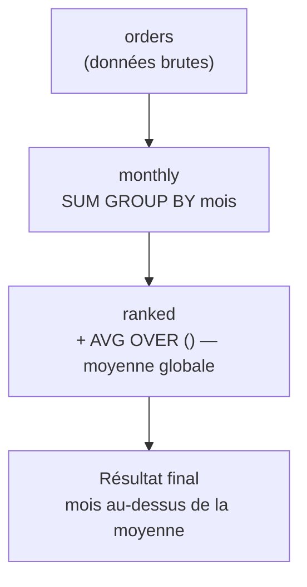

# CTE : nommer les étapes avec WITH

Une **CTE** (Common Table Expression) est une sous-requête **nommée**, déclarée en tête
avec `WITH`. C'est l'outil n°1 pour rendre une analyse lisible : on décompose en étapes
qui se lisent de haut en bas, comme un pipeline.

## De la sous-requête imbriquée à la CTE

Avant — imbrication difficile à lire :

```sql
SELECT category, total_revenue
FROM (
  SELECT category, SUM(amount) AS total_revenue
  FROM orders
  GROUP BY category
) AS t
WHERE total_revenue > 1000
ORDER BY total_revenue DESC;
```

Après — la même chose en étapes nommées :

```sql
WITH revenue_by_category AS (
  SELECT category, SUM(amount) AS total_revenue
  FROM orders
  GROUP BY category
)
SELECT category, total_revenue
FROM revenue_by_category
WHERE total_revenue > 1000
ORDER BY total_revenue DESC;
```

## Chaîner plusieurs CTE

Chaque CTE peut référencer les précédentes — un vrai pipeline :

```sql
WITH monthly AS (
  SELECT DATE_TRUNC('month', order_date) AS month, SUM(amount) AS revenue
  FROM orders
  GROUP BY DATE_TRUNC('month', order_date)
),
ranked AS (
  SELECT month, revenue,
         AVG(revenue) OVER () AS avg_revenue
  FROM monthly
)
SELECT month, revenue
FROM ranked
WHERE revenue > avg_revenue        -- months above average
ORDER BY month;
```

La visualisation suivante montre comment les données transitent d'une CTE à la suivante
dans l'exemple de la section précédente :



Chaque étape est lisible et testable isolément — c'est l'avantage principal des CTE
par rapport à l'imbrication.

## CTE récursive : hiérarchies et graphes

Une CTE récursive se référence elle-même pour parcourir des **hiérarchies** (arborescences
de catégories, organigrammes) ou des **graphes**. Structure : un *cas de base* (racines)
`UNION ALL` un *pas récursif* (enfants → parent).

```sql
-- categories: id INT, parent_id INT (NULL = root), name VARCHAR
-- build the full display path: "Electronics > Computers > Laptops"
WITH RECURSIVE category_path AS (

  -- base case: top-level categories (no parent)
  SELECT id, parent_id, name, name AS full_path, 1 AS depth
  FROM categories
  WHERE parent_id IS NULL

  UNION ALL

  -- recursive step: attach each child to its parent's path
  SELECT c.id, c.parent_id, c.name,
         cp.full_path || ' > ' || c.name,
         cp.depth + 1
  FROM categories    AS c
  JOIN category_path AS cp ON cp.id = c.parent_id
)
SELECT id, depth, full_path
FROM category_path
ORDER BY full_path;
```

| id | depth | full_path |
|---|---|---|
|  1 | 1 | Electronics |
|  3 | 2 | Electronics > Computers |
|  7 | 3 | Electronics > Computers > Laptops |
|  2 | 1 | Clothing |
|  5 | 2 | Clothing > Shoes |

> Attention : une référence circulaire dans les données ferait boucler la requête
> indéfiniment. Protège-toi avec `WHERE depth < 20` ou la clause `CYCLE` (PostgreSQL 14+).

## Cas d'agence : pipeline CA mensuel + moyenne glissante

```sql
-- step 1: monthly revenue computed from order_items
WITH monthly AS (
  SELECT
    DATE_TRUNC('month', o.order_date) AS month,
    SUM(oi.quantity * oi.unit_price)  AS revenue
  FROM orders      AS o
  JOIN order_items AS oi ON oi.order_id = o.order_id
  GROUP BY DATE_TRUNC('month', o.order_date)
),
-- step 2: add 3-month rolling average using a window function
rolling AS (
  SELECT
    month,
    revenue,
    AVG(revenue) OVER (
      ORDER BY month
      ROWS BETWEEN 2 PRECEDING AND CURRENT ROW
    ) AS rolling_avg_3m
  FROM monthly
)
-- final: flag months below rolling average (potential downturns)
SELECT
  TO_CHAR(month, 'YYYY-MM') AS month,
  revenue,
  ROUND(rolling_avg_3m, 2)  AS rolling_avg_3m
FROM rolling
WHERE revenue < rolling_avg_3m
ORDER BY month;
```

| month | revenue | rolling_avg_3m |
|---|---|---|
| 2024-03 | 7 800 | 8 367.00 |
| 2024-07 | 6 200 | 8 133.33 |

Chaque CTE est une **étape nommée** lisible isolément : `monthly` calcule le CA,
`rolling` y ajoute la moyenne mobile, la requête finale filtre les mois à risque.

## CTE vs sous-requête : quand quoi ?

- **CTE** : dès qu'une étape est réutilisée, ou que l'imbrication nuit à la lecture. À
  privilégier pour les analyses qui s'enchaînent.
- **Sous-requête scalaire/`EXISTS`** : pour une valeur ou un test ponctuel dans un
  `WHERE`/`SELECT`.

> **À retenir —** la CTE ne change pas le résultat, elle change la **lisibilité**. Pense
> « pipeline d'étapes nommées » : chaque `WITH` est une vue temporaire de la requête.
