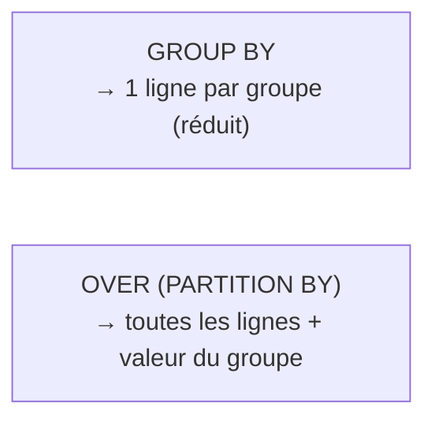

# Fonctions fenêtre : agréger SANS regrouper

Une fonction fenêtre calcule une valeur sur un **ensemble de lignes liées** (la
« fenêtre ») **tout en gardant le détail ligne par ligne**. Contrairement au `GROUP BY`
qui réduit, la fenêtre **enrichit** : autant de lignes en sortie qu'en entrée.

```sql
SELECT
  order_id,
  category,
  amount,
  SUM(amount) OVER (PARTITION BY category) AS category_total
FROM orders;
```

Chaque ligne conserve son détail **et** voit le total de sa catégorie. Impossible avec un
simple `GROUP BY`.




## Anatomie de OVER

```sql
fonction(...) OVER (
  PARTITION BY <colonnes>     -- the groups (optional)
  ORDER BY    <colonnes>      -- ordering within the window (for ranks/running totals)
)
```

## Numéroter et classer : ROW_NUMBER, RANK

```sql
SELECT
  category,
  product_id,
  amount,
  ROW_NUMBER() OVER (PARTITION BY category ORDER BY amount DESC) AS rn,
  RANK()       OVER (PARTITION BY category ORDER BY amount DESC) AS rnk
FROM orders;
```

- `ROW_NUMBER` : numéro **unique** par partition (1, 2, 3…), même en cas d'égalité.
- `RANK` : même rang en cas d'égalité, puis **saute** (1, 1, 3…).
- `DENSE_RANK` : même rang en cas d'égalité, **sans** saut (1, 1, 2…).

## Cas n°1 : top-N par groupe

« Les 3 plus grosses commandes **par catégorie** ». Le rang se calcule dans une CTE, puis
on filtre — on ne peut pas mettre une fonction fenêtre dans un `WHERE` directement.

```sql
WITH ranked AS (
  SELECT
    order_id, category, amount,
    ROW_NUMBER() OVER (PARTITION BY category ORDER BY amount DESC) AS rn
  FROM orders
)
SELECT order_id, category, amount
FROM ranked
WHERE rn <= 3;
```

## Cas n°2 : cumul (running total)

Ajouter `ORDER BY` dans la fenêtre transforme l'agrégat en **cumul** :

```sql
SELECT
  order_date,
  amount,
  SUM(amount) OVER (ORDER BY order_date) AS running_total
FROM orders;
```

> **À retenir —** `GROUP BY` **réduit**, la fenêtre **enrichit**. `PARTITION BY` = les
> groupes, `ORDER BY` dans la fenêtre = rangs et cumuls. Pour un **top-N par groupe** :
> `ROW_NUMBER()` dans une CTE, puis `WHERE rn <= N`.
