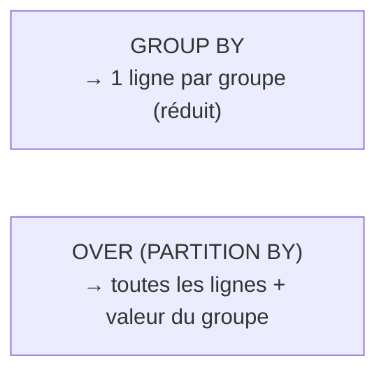

# Fonctions fenêtre : agréger SANS regrouper

Une fonction fenêtre calcule une valeur sur un **ensemble de lignes liées** (la
« fenêtre ») **tout en gardant le détail ligne par ligne**. Contrairement au `GROUP BY`
qui réduit, la fenêtre **enrichit** : autant de lignes en sortie qu'en entrée.

```sql
SELECT
  order_id,
  category,
  amount,
  SUM(amount) OVER (PARTITION BY category) AS category_total
FROM orders;
```

**Visualisation — données en entrée :**

| order_id | category | amount |
|---|---|---|
| 101 | Hardware | 120.00 |
| 102 | Software |  80.00 |
| 103 | Hardware | 200.00 |
| 104 | Software | 150.00 |
| 105 | Services |  95.00 |

**Résultat avec `SUM(amount) OVER (PARTITION BY category)` — 5 lignes conservées :**

| order_id | category | amount | category_total |
|---|---|---|---|
| 101 | Hardware | 120.00 | 320.00 |
| 103 | Hardware | 200.00 | 320.00 |
| 102 | Software |  80.00 | 230.00 |
| 104 | Software | 150.00 | 230.00 |
| 105 | Services |  95.00 |  95.00 |

Un `GROUP BY category` aurait réduit à **3 lignes**. La fenêtre garde les 5 lignes et
**enrichit** chacune avec le total de son groupe.

Chaque ligne conserve son détail **et** voit le total de sa catégorie. Impossible avec un
simple `GROUP BY`.


```mermaid
flowchart LR
    G["GROUP BY\n→ 1 ligne par groupe (réduit)"]
    W["OVER (PARTITION BY)\n→ toutes les lignes + valeur du groupe"]
```


## Anatomie de OVER

```sql
fonction(...) OVER (
  PARTITION BY <colonnes>     -- the groups (optional)
  ORDER BY    <colonnes>      -- ordering within the window (for ranks/running totals)
)
```

## Numéroter et classer : ROW_NUMBER, RANK

```sql
SELECT
  category,
  product_id,
  amount,
  ROW_NUMBER() OVER (PARTITION BY category ORDER BY amount DESC) AS rn,
  RANK()       OVER (PARTITION BY category ORDER BY amount DESC) AS rnk
FROM orders;
```

- `ROW_NUMBER` : numéro **unique** par partition (1, 2, 3…), même en cas d'égalité.
- `RANK` : même rang en cas d'égalité, puis **saute** (1, 1, 3…).
- `DENSE_RANK` : même rang en cas d'égalité, **sans** saut (1, 1, 2…).

## Cas n°1 : top-N par groupe

« Les 3 plus grosses commandes **par catégorie** ». Le rang se calcule dans une CTE, puis
on filtre — on ne peut pas mettre une fonction fenêtre dans un `WHERE` directement.

```sql
WITH ranked AS (
  SELECT
    order_id, category, amount,
    ROW_NUMBER() OVER (PARTITION BY category ORDER BY amount DESC) AS rn
  FROM orders
)
SELECT order_id, category, amount
FROM ranked
WHERE rn <= 3;
```

## Cas n°2 : cumul (running total)

Ajouter `ORDER BY` dans la fenêtre transforme l'agrégat en **cumul** :

```sql
SELECT
  order_date,
  amount,
  SUM(amount) OVER (ORDER BY order_date) AS running_total
FROM orders;
```

## Cas n°3 : comparaison mois / mois (LAG et LEAD)

`LAG(col)` donne la valeur de la **ligne précédente** dans la fenêtre, `LEAD(col)` celle
de la **ligne suivante**. Idéal pour calculer des évolutions temporelles sans jointure.

```sql
-- month-over-month revenue evolution
WITH monthly AS (
  SELECT
    DATE_TRUNC('month', o.order_date) AS month,
    SUM(oi.quantity * oi.unit_price)  AS revenue
  FROM orders      AS o
  JOIN order_items AS oi ON oi.order_id = o.order_id
  GROUP BY DATE_TRUNC('month', o.order_date)
)
SELECT
  TO_CHAR(month, 'YYYY-MM')                                AS month,
  revenue,
  LAG(revenue) OVER (ORDER BY month)                       AS prev_revenue,
  ROUND(
    (revenue - LAG(revenue) OVER (ORDER BY month)) * 100.0
    / NULLIF(LAG(revenue) OVER (ORDER BY month), 0),
    1
  )                                                        AS pct_change
FROM monthly
ORDER BY month;
```

| month | revenue | prev_revenue | pct_change |
|---|---|---|---|
| 2024-01 | 8 200 | NULL | NULL |
| 2024-02 | 9 100 | 8 200 | +10.9 |
| 2024-03 | 7 800 | 9 100 | −14.3 |

- `LAG(col)` : valeur de la ligne précédente (offset 1 par défaut).
- `LEAD(col)` : valeur de la ligne suivante.
- `NULLIF(expr, 0)` : évite la division par zéro sur le premier mois (valeur NULL).

## Cas d'agence : part de chaque commande dans le total global

```sql
-- percentage share of each order in total revenue
SELECT
  o.order_id,
  SUM(oi.quantity * oi.unit_price)                        AS order_total,
  SUM(SUM(oi.quantity * oi.unit_price)) OVER ()           AS grand_total,
  ROUND(
    SUM(oi.quantity * oi.unit_price) * 100.0
    / SUM(SUM(oi.quantity * oi.unit_price)) OVER (),
    1
  )                                                       AS pct_of_total
FROM orders      AS o
JOIN order_items AS oi ON oi.order_id = o.order_id
GROUP BY o.order_id
ORDER BY order_total DESC;
```

| order_id | order_total | grand_total | pct_of_total |
|---|---|---|---|
| 103 | 850.00 | 1 920.00 | 44.3 |
| 102 | 720.00 | 1 920.00 | 37.5 |
| 101 | 350.00 | 1 920.00 | 18.2 |

Notez `SUM(SUM(...)) OVER ()` : le `SUM` interne est l'agrégat du `GROUP BY`, le
`SUM(...) OVER ()` est la fenêtre calculée sur l'ensemble du résultat agrégé.

## Tips performance

**Index sur les colonnes de classement**

```sql
-- speeds up ROW_NUMBER() OVER (PARTITION BY category ORDER BY amount DESC)
CREATE INDEX idx_orders_cat_amount ON orders (category, amount DESC);

-- speeds up running totals ordered by date
CREATE INDEX idx_orders_date ON orders (order_date);
```

Les fonctions fenêtre sont calculées **après** le `WHERE` et le `GROUP BY` : elles
opèrent sur le résultat déjà réduit. L'index sert surtout au tri interne de la fenêtre.

**Nommer une clause OVER répétée (PostgreSQL)**

Si la même clause `OVER (...)` apparaît plusieurs fois, déclarez-la une seule fois avec
`WINDOW` pour éviter la répétition et aider l'optimiseur :

```sql
SELECT
  order_id, category, amount,
  SUM(amount)  OVER w AS cat_total,
  AVG(amount)  OVER w AS cat_avg,
  ROW_NUMBER() OVER w AS rn
FROM orders
WINDOW w AS (PARTITION BY category ORDER BY amount DESC);
```

> **À retenir —** `GROUP BY` **réduit**, la fenêtre **enrichit**. `PARTITION BY` = les
> groupes, `ORDER BY` dans la fenêtre = rangs et cumuls. Pour un **top-N par groupe** :
> `ROW_NUMBER()` dans une CTE, puis `WHERE rn <= N`.
