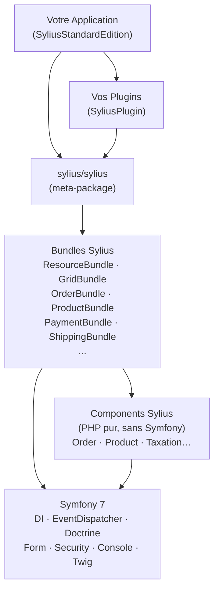
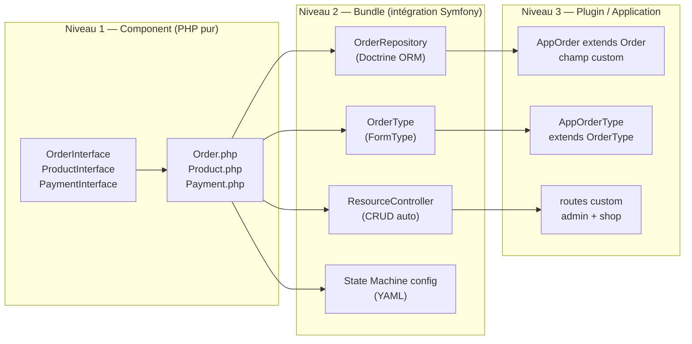
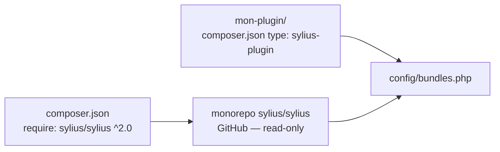

# Architecture de Sylius — vue du développeur Symfony

Sylius n'est pas un CMS posé sur Symfony : c'est **une collection de composants Symfony organisés en couches**. Comprendre la carte avant de coder évite de chercher la mauvaise brique pendant une mission.

## La pile réelle de Sylius



### Trois couches à connaître

| Couche | Namespace | Ce qu'elle contient |
|---|---|---|
| **Components** | `Sylius\Component\*` | Modèles, interfaces, logique métier (pas de Symfony) |
| **Bundles** | `Sylius\Bundle\*` | Configuration Symfony, DI, Forms, Controllers |
| **Application** | `App\` / votre plugin | Personnalisations, routes, templates |

> **Repère** : Un `Sylius\Component\Order\Model\Order` ne connaît ni Doctrine ni Symfony. Son Bundle (`Sylius\Bundle\OrderBundle`) l'enregistre comme Resource, configure Doctrine et expose un CRUD. C'est le **même pattern** que `FosUserBundle` dans Symfony 3.x, mais généralisé à tout le commerce.

### Zoom : Component/Bundle/Plugin — les trois niveaux d'abstraction



Ce découpage en trois niveaux est la raison pour laquelle Sylius est extensible sans fork : vous ne touchez qu'au niveau 3.

## Monorepo `sylius/sylius` vs plugin standalone

Sylius est développé dans un monorepo (`github.com/Sylius/Sylius`) : tous les packages `sylius/*` y vivent. Votre boutique installe `sylius/sylius` (le meta-package) via Composer.

Un **plugin standalone** (ex. `bitbag/sylius-cms-plugin`) est un package Composer indépendant qui déclare `"type": "sylius-plugin"` dans son `composer.json`. Il suit les mêmes conventions qu'un Bundle Symfony mais respecte les points d'extension Sylius (Resources, Grids, overrides).



## Correspondances avec Symfony

| Concept Symfony | Équivalent Sylius | Remarque |
|---|---|---|
| `Bundle` | `Plugin` | Étend `AbstractResourceBundle` ou `Bundle` |
| `AppKernel` / `Kernel` | `Kernel` de l'app standard | Identique, register via `bundles.php` |
| `Entity` | `Resource` | Doit implémenter une interface Sylius |
| `ServiceProvider` (DI) | `DependencyInjection/Extension` | Idem Bundle Symfony |
| `EventDispatcher` | `EventDispatcher` Symfony + callbacks State Machine | Même service, plus les hooks SM |
| `FormType` | `FormType` + mapping Resource | Enregistré via Resource config |
| `Repository` | `ResourceRepository` | Interface `RepositoryInterface` + méthodes custom |
| `new MyEntity()` | `$factory->createNew()` | La factory est décorable par un plugin tiers |
| `EntityManager::flush()` | `$manager->flush()` via `app.manager.<resource>` | Alias Sylius sur l'ObjectManager Doctrine |
| tag `kernel.event_listener` | tag `sylius.order_processor` / `sylius.shipping_calculator` etc. | Tags Sylius pour les chaînes de responsabilité |

### Mapping detaillé : DI tags Symfony → tags Sylius

Sylius étend le système de tags Symfony pour ses propres chaînes de responsabilité. Voilà les équivalents directs :

| Tag Symfony générique | Tag Sylius spécifique | Usage |
|---|---|---|
| `kernel.event_listener` | `sylius.order_processor` | Recalcul des totaux (priorité) |
| `kernel.event_listener` | `sylius.shipping_calculator` | Calcul des frais de port |
| `kernel.event_listener` | `sylius.promotion_action` | Actions de promotion |
| `kernel.event_listener` | `sylius.promotion_rule_checker` | Règles d'éligibilité promo |
| `form.type` | `form.type` (idem) | Mais déclaré aussi dans Resource config |
| `twig.extension` | `twig.extension` (idem) | Aucun tag spécifique Sylius |

```bash
# Commande CLI utile : lister tous les services Sylius dans le conteneur
bin/console debug:container | grep sylius

# Filtrer par type de tag
bin/console debug:container --tag=sylius.order_processor
bin/console debug:container --tag=sylius.shipping_calculator

# Voir les paramètres d'un service précis
bin/console debug:container sylius.repository.order
bin/console debug:container sylius.factory.product
```

## Structure de fichiers d'un plugin Sylius

```
mon-plugin/
├── composer.json               # type: sylius-plugin
├── MonPlugin.php               # extends AbstractResourceBundle
├── DependencyInjection/
│   ├── MonPluginExtension.php  # extends AbstractResourceBundleExtension
│   └── Configuration.php
├── Resources/
│   └── config/
│       ├── app/
│       │   └── resources.yaml  # resources declaration
│       └── doctrine/           # Doctrine mappings
└── src/
    ├── Model/
    ├── Repository/
    └── Form/
```

## PSR et séparation des couches

Sylius respecte **PSR-4** pour l'autoloading et s'appuie sur les interfaces pour le découplage. La règle d'or :

- On code **contre des interfaces** (`OrderInterface`, `ProductInterface`) jamais contre les classes concrètes — cela permet l'override sans toucher au code du bundle.
- Les **Events** passent par l'`EventDispatcher` standard de Symfony (`sylius.order.pre_create`, etc.).
- La **persistance** est assurée par Doctrine ORM ; les entités peuvent être mappées en XML ou en annotations/attributs PHP 8.

> **Piège agence** : ne pas remplacer les classes concrètes dans les `use` de vos propres services — utilisez toujours les interfaces. Une mise à jour mineure de Sylius peut renommer une propriété interne sans casser l'interface, mais casse vos dépendances sur la classe concrète.

## Commandes CLI indispensables

```bash
# Installation initiale de Sylius (base de données, fixtures de démo)
bin/console sylius:install

# Charger uniquement les fixtures (sans réinstaller)
bin/console sylius:fixtures:load

# Charger un suite de fixtures spécifique
bin/console sylius:fixtures:load default

# Vider le cache après un changement de config Resource/Grid
bin/console cache:clear

# Inspecter la config Sylius résolue (utile pour debugger les overrides)
bin/console debug:config sylius_resource
bin/console debug:config sylius_grid

# Lister tous les services enregistrés par Sylius
bin/console debug:container | grep "sylius\." | head -30

# Voir l'arbre des workflows (Sylius 2.x)
bin/console workflow:dump sylius_order | dot -Tpng -o /tmp/order.png
```

## ⚠️ Pièges upgrade Sylius 1.x → 2.x

| Point de rupture | Sylius 1.x | Sylius 2.x |
|---|---|---|
| State Machine | `winzou/state-machine-bundle` | `symfony/workflow` natif |
| Namespace admin | `SyliusUiBundle::*` | `@SyliusAdmin/*` restructuré |
| `AbstractResourceBundle` | requis pour les overrides | toujours requis mais `model_namespaces` évolue |
| Behat contexts | `Sylius\Behat\Context\Ui\Admin\*` | renommés, certains fusionnés |
| `sylius_order_checkout` | Winzou graph | Symfony Workflow `sylius_order_checkout` |
| PHP minimum | 7.4 | 8.2 obligatoire |
| `ResourceInterface::getId()` | retourne `int` | retourne `int\|null` (union type) |

Pour une migration 1.x → 2.x en agence, commencez toujours par `bin/console sylius:upgrade:migrations-list` et lisez le `UPGRADE-2.0.md` du monorepo.

## À retenir

- Sylius = Components (PHP pur) + Bundles (intégration Symfony) + votre application.
- Tout le code propre à votre boutique ou plugin doit pointer sur les **interfaces** des Components.
- Le plugin Sylius est un Bundle Symfony avec des conventions supplémentaires (`sylius-plugin` type Composer, `AbstractResourceBundle`).
- Les personnalisations qui ignorent les couches d'abstraction sont les premières à casser lors des upgrades.
