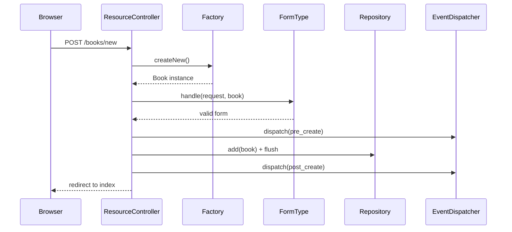
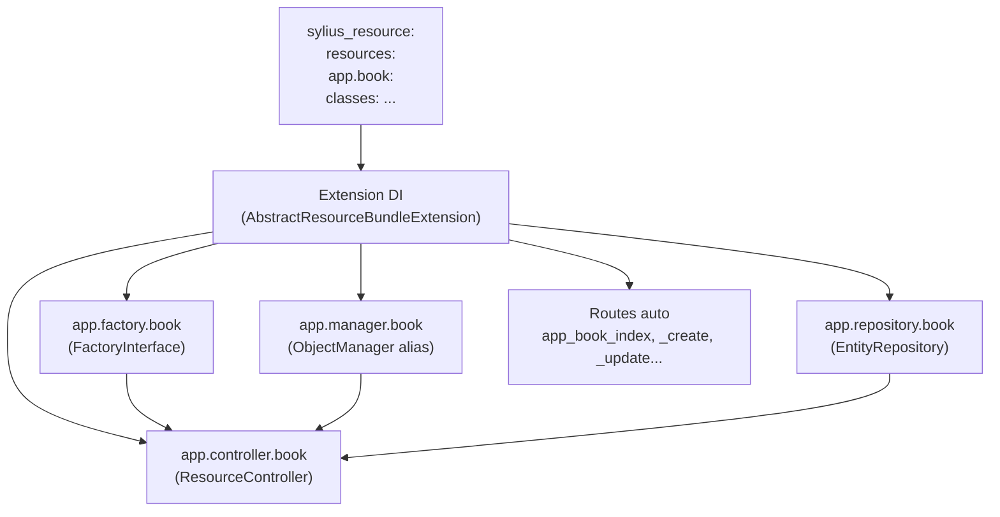

# SyliusResourceBundle — le CRUD automatique de Sylius

Si Symfony vous donne les briques (DI, Doctrine, Forms), `SyliusResourceBundle` les assemble automatiquement pour créer **un CRUD complet depuis une simple déclaration YAML**. C'est la première chose à maîtriser pour travailler efficacement sur Sylius.

## Analogie Symfony

| Ce que vous faites à la main dans Symfony | Ce que ResourceBundle fait automatiquement |
|---|---|
| Créer un `EntityRepository` | `ResourceRepository` généré et injecté |
| Écrire un `FormType` pour chaque action | Déclaré dans la config Resource |
| Créer les controllers Create/Read/Update/Delete | `ResourceController` généré |
| Déclarer des routes CRUD | Routes auto depuis `sylius.resource` |
| Créer une Factory | `ResourceFactory` injectée |

> **Repère** : ResourceBundle, c'est comme si SonataAdmin généralisait son CRUD à n'importe quelle entité — mais **sans interface graphique imposée** et entièrement piloté par config YAML.

## Déclaration minimale d'une Resource

```yaml
# config/packages/sylius_resource.yaml
sylius_resource:
    resources:
        app.book:                        # alias_namespace.resource_name
            classes:
                model:      App\Entity\Book
                interface:  App\Model\BookInterface
                controller: Sylius\Bundle\ResourceBundle\Controller\ResourceController
                repository: Sylius\Bundle\ResourceBundle\Doctrine\ORM\EntityRepository
                factory:    Sylius\Component\Resource\Factory\Factory
                form:       App\Form\Type\BookType
```

Cette déclaration suffit à enregistrer :
- le service `app.repository.book`
- le service `app.factory.book`
- le service `app.manager.book`
- les routes CRUD (`app_book_index`, `app_book_create`, etc.)

## L'interface `ResourceInterface`

Toute entité Sylius doit implémenter `Sylius\Component\Resource\Model\ResourceInterface` :

```php
<?php
// src/Model/BookInterface.php

namespace App\Model;

use Sylius\Component\Resource\Model\ResourceInterface;

interface BookInterface extends ResourceInterface
{
    public function getTitle(): ?string;
    public function setTitle(string $title): void;
}
```

```php
<?php
// src/Entity/Book.php

namespace App\Entity;

use App\Model\BookInterface;
use Sylius\Component\Resource\Model\ResourceTrait;

class Book implements BookInterface
{
    use ResourceTrait; // provides getId()

    private ?string $title = null;

    public function getTitle(): ?string { return $this->title; }
    public function setTitle(string $title): void { $this->title = $title; }
}
```

## La Factory

La `Factory` est le point d'entrée pour créer des instances, **jamais `new` direct** en code Sylius :

```php
<?php
// Inject by type or by ID: app.factory.book
use Sylius\Component\Resource\Factory\FactoryInterface;

final class BookCreator
{
    public function __construct(
        private readonly FactoryInterface $bookFactory,
    ) {}

    public function createDraft(): BookInterface
    {
        /** @var BookInterface $book */
        $book = $this->bookFactory->createNew(); // instancie + initialise
        $book->setTitle('Draft');

        return $book;
    }
}
```

> **Pourquoi ?** Parce que n'importe quel plugin peut décorer ou remplacer la Factory (`sylius_resource: resources: app.book: classes: factory: MyCustomFactory`) sans toucher à votre code métier.

## Le Repository

```php
<?php
use Sylius\Component\Resource\Repository\RepositoryInterface;

// All methods from RepositoryInterface:
// findAll(), findOneBy(), findBy(), add(), remove()

// Custom methods in your repository class:
use Sylius\Bundle\ResourceBundle\Doctrine\ORM\EntityRepository;

final class BookRepository extends EntityRepository
{
    public function findPublished(): array
    {
        return $this->createQueryBuilder('o')
            ->andWhere('o.published = :published')
            ->setParameter('published', true)
            ->getQuery()
            ->getResult();
    }
}
```

## Le Manager (Persist & Flush)

Sylius expose `app.manager.book` qui encapsule l'`EntityManager` Doctrine :

```php
<?php
use Sylius\Component\Resource\Repository\RepositoryInterface;

// The manager wraps Doctrine's EntityManager
// app.manager.book is an ObjectManager alias

$book = $this->bookFactory->createNew();
$book->setTitle('Mon livre');

$this->bookManager->persist($book);
$this->bookManager->flush();
```

## Routes auto et configuration

```yaml
# config/routes/app_book.yaml
app_book:
    resource: |
        alias: app.book
    type: sylius.resource
```

Cela génère automatiquement :

```
app_book_index    GET    /books
app_book_create   GET    /books/new
                  POST   /books/new
app_book_update   GET    /books/{id}/edit
                  PUT    /books/{id}/edit
app_book_delete   DELETE /books/{id}
app_book_show     GET    /books/{id}
```

## Cycle de vie via Events

ResourceBundle dispatche des événements Symfony sur chaque opération CRUD :

```php
// Events dispatched automatically:
// sylius.book.pre_create  / sylius.book.post_create
// sylius.book.pre_update  / sylius.book.post_update
// sylius.book.pre_delete  / sylius.book.post_delete

use Sylius\Bundle\ResourceBundle\Event\ResourceControllerEvent;
use Symfony\Component\EventDispatcher\Attribute\AsEventListener;

#[AsEventListener(event: 'sylius.book.pre_create')]
final class BookCreationListener
{
    public function __invoke(ResourceControllerEvent $event): void
    {
        /** @var BookInterface $book */
        $book = $event->getSubject();
        // validation or enrichment before persist
    }
}
```

## Diagramme de flux ResourceBundle



### Résolution d'une Resource : Factory → Manager → Repository

Quand Sylius traite une requête sur une Resource, il résout les services dans cet ordre :



Les trois services (`factory`, `manager`, `repository`) sont tous **décorables** : un plugin tiers peut remplacer l'un d'eux en déclarant une `decoration` dans son `services.yaml`, sans que votre code métier ne change d'un iota.

## Exemple d'agence : plugin Wishlist avec override d'entité

Voici le pattern complet utilisé dans un plugin de liste de souhaits. L'entité `Wishlist` doit être liée à un `Customer` Sylius existant.

```php
<?php
// src/Model/WishlistInterface.php

namespace Acme\WishlistPlugin\Model;

use Sylius\Component\Core\Model\CustomerInterface;
use Sylius\Component\Resource\Model\ResourceInterface;

interface WishlistInterface extends ResourceInterface
{
    public function getCustomer(): ?CustomerInterface;
    public function setCustomer(?CustomerInterface $customer): void;
    public function getName(): ?string;
    public function setName(string $name): void;
}
```

```php
<?php
// src/Entity/Wishlist.php

namespace Acme\WishlistPlugin\Entity;

use Acme\WishlistPlugin\Model\WishlistInterface;
use Doctrine\Common\Collections\ArrayCollection;
use Doctrine\ORM\Mapping as ORM;
use Sylius\Component\Core\Model\CustomerInterface;
use Sylius\Component\Resource\Model\ResourceTrait;

#[ORM\Entity]
#[ORM\Table(name: 'acme_wishlist')]
class Wishlist implements WishlistInterface
{
    use ResourceTrait; // provides getId()

    #[ORM\ManyToOne(targetEntity: CustomerInterface::class)]
    #[ORM\JoinColumn(nullable: true)]
    private ?CustomerInterface $customer = null;

    #[ORM\Column(type: 'string', length: 255)]
    private ?string $name = null;

    public function __construct()
    {
        $this->items = new ArrayCollection();
    }

    public function getCustomer(): ?CustomerInterface { return $this->customer; }
    public function setCustomer(?CustomerInterface $customer): void { $this->customer = $customer; }
    public function getName(): ?string { return $this->name; }
    public function setName(string $name): void { $this->name = $name; }
}
```

```yaml
# Resources/config/app/config.yaml
sylius_resource:
    resources:
        acme_wishlist.wishlist:
            classes:
                model:      Acme\WishlistPlugin\Entity\Wishlist
                interface:  Acme\WishlistPlugin\Model\WishlistInterface
                repository: Acme\WishlistPlugin\Repository\WishlistRepository
                factory:    Sylius\Component\Resource\Factory\Factory
                form:       Acme\WishlistPlugin\Form\Type\WishlistType
```

Résultat : les services `acme_wishlist.factory.wishlist`, `acme_wishlist.manager.wishlist` et `acme_wishlist.repository.wishlist` sont disponibles immédiatement dans le conteneur.

## Commandes CLI utiles pour les Resources

```bash
# Vérifier qu'une resource est bien enregistrée
bin/console debug:container acme_wishlist.factory.wishlist
bin/console debug:container acme_wishlist.repository.wishlist

# Voir toutes les resources déclarées
bin/console debug:config sylius_resource

# Générer le schéma Doctrine après ajout d'une entité Resource
bin/console doctrine:schema:update --force
# (en prod, préférer les migrations)
bin/console doctrine:migrations:diff
bin/console doctrine:migrations:migrate
```

## ⚠️ Pièges upgrade Sylius 1.x → 2.x — ResourceBundle

| Point de rupture | Sylius 1.x | Sylius 2.x |
|---|---|---|
| Mapping Doctrine | XML dans `Resources/config/doctrine/model/` | Attributs PHP 8 ou XML (les deux acceptés) |
| `ResourceInterface::getId()` | `public function getId(): int` | `public function getId(): int\|null` |
| Routes Resource | `type: sylius.resource` avec `_sylius:` | même syntaxe mais vérifier les options `section:` |
| `ResourceController` | hérite de Symfony `Controller` (dépréciée) | hérite de `AbstractController` |
| `RepositoryInterface::findAll()` | retourne `array` | inchangé — mais `findOneBy()` retourne `?object` |

## À retenir

- Déclarer une Resource dans `sylius_resource:` génère automatiquement factory, repository, manager et routes CRUD.
- Toujours coder contre les **interfaces** (`ResourceInterface`, vos interfaces custom).
- Utiliser la **Factory** pour créer des instances — jamais `new` directement.
- Les **events** `sylius.<resource>.<pre|post>_<action>` permettent d'hooker le cycle de vie sans toucher au controller.
- Un Repository custom étend `Sylius\Bundle\ResourceBundle\Doctrine\ORM\EntityRepository` et ajoute ses méthodes métier.

> **Piège agence** : ne pas déclarer `interface:` dans la config Resource. Sans interface, vous ne pouvez pas décorer l'entité dans un plugin tiers, et Sylius ne peut pas résoudre les dépendances par type lors des overrides.
