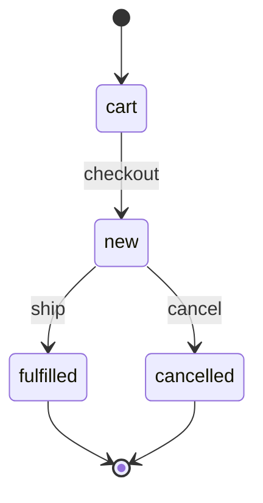
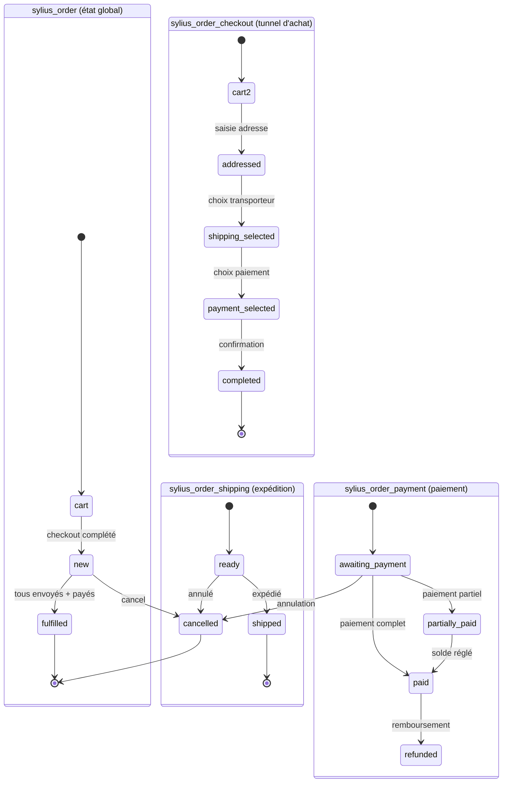

# State Machine — WinzouStateMachineBundle

Avant Sylius 2.x, toute la gestion des états (commandes, paiements, livraisons) passait par `winzou/state-machine-bundle`. Même si Sylius 2.x migre vers Symfony Workflow, comprendre ce bundle est indispensable : les projets clients Sylius 1.x sont nombreux en agence, et la certification couvre les deux systèmes.

## Comparaison rapide

| Aspect | WinzouStateMachine | Symfony Workflow |
|---|---|---|
| Configuration | YAML/PHP dans le Bundle | YAML dans `config/packages/` |
| Callbacks (hooks) | intégrés (`on_enter`, `on_leave`) | Events Symfony standards |
| Guards | `callback` de type `guard` | `GuardEvent` sur `workflow.guard` |
| Visualisation | inexistante (native) | `bin/console workflow:dump` |
| Intégration Symfony | via Bundle dédié | native Symfony 4.3+ |

## Concepts fondamentaux

### Graph, States, Transitions



- **Graph** : le nom de la machine d'état (ex. `sylius_order`).
- **States** : les états possibles de l'objet (ex. `cart`, `new`, `fulfilled`, `cancelled`).
- **Transitions** : les actions qui font passer d'un état à un autre (ex. `checkout` fait passer de `cart` à `new`).

### Configuration YAML (Sylius 1.x style)

```yaml
# config/packages/winzou_state_machine.yaml
winzou_state_machine:
    sylius_order:
        class:          Sylius\Component\Order\Model\Order
        property_path:  state       # the property on the object
        graph:          sylius_order
        state_machine_class: SM\StateMachine\StateMachine
        states:
            cart:      ~
            new:       ~
            cancelled: ~
            fulfilled: ~
        transitions:
            checkout:
                from: [cart]
                to:   new
            cancel:
                from: [new]
                to:   cancelled
            ship:
                from: [new]
                to:   fulfilled
        callbacks:
            before:
                check_stock:
                    on:   'checkout'
                    do:   ['@app.order_stock_checker', 'check']
                    args: ['object']
            after:
                send_confirmation:
                    on:   'checkout'
                    do:   ['@app.order_mailer', 'sendConfirmation']
                    args: ['object']
```

### Appliquer une transition dans le code

```php
<?php

use SM\Factory\FactoryInterface as StateMachineFactoryInterface;
use Sylius\Component\Order\Model\OrderInterface;

final class OrderProcessor
{
    public function __construct(
        private readonly StateMachineFactoryInterface $stateMachineFactory,
    ) {}

    public function checkout(OrderInterface $order): void
    {
        $stateMachine = $this->stateMachineFactory->get($order, 'sylius_order');

        if (!$stateMachine->can('checkout')) {
            throw new \LogicException('Cannot checkout this order in its current state.');
        }

        $stateMachine->apply('checkout'); // triggers callbacks
    }
}
```

### Guards (contrôle conditionnel)

Un guard empêche une transition si la condition n'est pas remplie :

```yaml
callbacks:
    guard:
        guard_checkout:
            on:   'checkout'
            do:   ['@app.order_guard', 'canCheckout']
            args: ['object', 'event']
```

```php
<?php

use SM\Event\TransitionEvent;
use Sylius\Component\Order\Model\OrderInterface;

final class OrderGuard
{
    public function canCheckout(OrderInterface $order, TransitionEvent $event): void
    {
        if ($order->getItems()->isEmpty()) {
            $event->setRejected(); // blocks the transition
        }
    }
}
```

## Les State Machines Sylius intégrées

Sylius fournit plusieurs graphes pré-configurés :

| Graph | Entité | États principaux |
|---|---|---|
| `sylius_order` | `Order` | `cart` → `new` → `fulfilled` / `cancelled` |
| `sylius_order_checkout` | `Order` | `cart` → `addressed` → `shipping_selected` → `payment_selected` → `completed` |
| `sylius_order_payment` | `Order` | `awaiting_payment` → `partially_paid` → `paid` / `cancelled` |
| `sylius_order_shipping` | `Order` | `ready` → `shipped` / `cancelled` |
| `sylius_payment` | `Payment` | `new` → `processing` → `completed` / `failed` / `refunded` |

## Cycle de vie complet d'une commande

Le diagramme suivant montre les **quatre State Machines parallèles** d'une `Order` Sylius, et comment elles s'articulent lors d'une commande réelle :



## Mapping Symfony EventDispatcher → Callbacks Winzou

En Symfony pur, un effet de bord (envoi d'email après une action) s'écrit avec un `EventListener`. Dans Winzou, l'équivalent est un **callback** déclaré dans le YAML. Voici la correspondance directe :

| Symfony standard | Winzou State Machine | Moment d'exécution |
|---|---|---|
| `kernel.event_listener` (tag) | `callbacks.before` | Avant que la transition soit appliquée |
| `kernel.event_listener` (tag) | `callbacks.after` | Après que la transition est appliquée |
| `kernel.event_listener` (tag) | `callbacks.guard` | Pour autoriser/bloquer la transition |
| `EventSubscriberInterface` | `callbacks.before` + `callbacks.after` | Même service, plusieurs transitions |

```yaml
# Équivalent Sylius d'un EventListener Symfony sur "commande confirmée"
callbacks:
    after:
        # Équivalent de : #[AsEventListener(event: 'order.confirmed')]
        send_order_confirmation_email:
            on:   'checkout'          # la transition déclencheuse
            do:   ['@app.order_mailer', 'sendConfirmation']
            args: ['object']          # 'object' = l'Order ; 'event' = TransitionEvent

        # Équivalent de : tag sylius.order_processor
        recalculate_stock:
            on:   'checkout'
            do:   ['@app.stock_manager', 'decrementStock']
            args: ['object']
```

## Exemple d'agence : ajouter un callback sur une State Machine existante

En agence, vous recevez souvent un projet Sylius 1.x et devez ajouter un effet de bord (ex. notifier un ERP externe) lors de l'expédition d'une commande. Voici comment faire **sans modifier** la config du Bundle :

```yaml
# config/packages/winzou_state_machine.yaml
# On merge sur le graph existant — Symfony fusionne les configs YAML
winzou_state_machine:
    sylius_order_shipping:
        callbacks:
            after:
                notify_erp_on_ship:
                    on:   'ship'
                    do:   ['@app.erp_notifier', 'notifyShipment']
                    args: ['object']
```

```php
<?php
// src/Service/ErpNotifier.php

namespace App\Service;

use Sylius\Component\Core\Model\OrderInterface;

final class ErpNotifier
{
    public function notifyShipment(OrderInterface $order): void
    {
        // POST to ERP API with order number and tracking info
        $this->erpClient->post('/shipments', [
            'order_number' => $order->getNumber(),
            'shipped_at'   => new \DateTimeImmutable(),
        ]);
    }
}
```

```yaml
# config/services.yaml
services:
    App\Service\ErpNotifier:
        arguments:
            $erpClient: '@app.erp_http_client'
```

## Commandes CLI utiles

```bash
# Vérifier qu'une transition est possible sur une commande en base
bin/console sylius:debug:state-machine sylius_order --object-id=42

# Lister tous les graphs Winzou enregistrés
bin/console debug:config winzou_state_machine

# En Sylius 2.x (workflow Symfony), dump du graph en PNG
bin/console workflow:dump sylius_order | dot -Tpng -o /tmp/sylius_order.png
```

## ⚠️ Pièges upgrade Sylius 1.x → 2.x — State Machine

| Point de rupture | Sylius 1.x (Winzou) | Sylius 2.x (Symfony Workflow) |
|---|---|---|
| Package | `winzou/state-machine-bundle` | `symfony/workflow` (natif) |
| Config | `winzou_state_machine:` dans YAML | `framework: workflows:` |
| Callbacks | `callbacks.before/after/guard` | Events `workflow.<name>.guard`, `.transition`, `.entered` |
| Appel transition | `$sm->apply('checkout')` | `$workflow->apply($order, 'checkout')` |
| Vérification | `$sm->can('checkout')` | `$workflow->can($order, 'checkout')` |
| Guard | `$event->setRejected()` | `$event->setBlocked(true, 'message')` |
| Visualisation | aucune native | `bin/console workflow:dump` |
| Namespace | `SM\Factory\FactoryInterface` | `Symfony\Component\Workflow\WorkflowInterface` |

La migration des callbacks est le travail le plus long : chaque `callbacks.before/after` devient un `EventListener` sur `workflow.<graph>.transition.<name>`.

## À retenir

- Winzou State Machine = **graphs + states + transitions + callbacks** déclarés en YAML.
- Toujours vérifier `$stateMachine->can('transition')` avant `apply()`.
- Les **callbacks** `before`/`after` remplacent les EventListeners Symfony pour les effets de bord liés aux transitions.
- Les **guards** bloquent une transition de façon conditionnelle sans lancer d'exception.
- En Sylius 1.x, les State Machines sont définies dans les configs des Bundles — ne jamais les copier-coller dans `config/` sans savoir lequel a priorité.

> **Piège agence** : surcharger un graph Winzou en ajoutant des transitions dans votre config sans vérifier les callbacks existants. Vous risquez de court-circuiter des effets de bord critiques (envoi d'email, mise à jour de stock) sans le savoir. Utilisez `bin/console debug:config winzou_state_machine` pour voir la config fusionnée **avant** de toucher quoi que ce soit.
