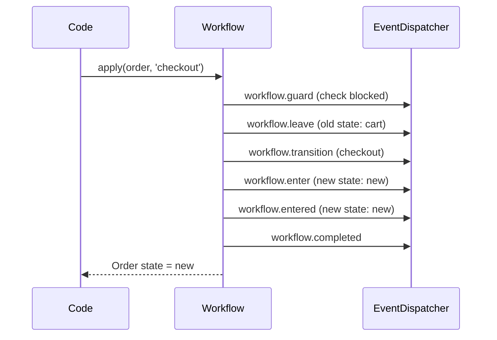

# Symfony Workflow dans Sylius 2.x

Sylius 2.x abandonne `winzou/state-machine-bundle` au profit du composant **Symfony Workflow**, natif depuis Symfony 4.3. Pour un développeur Symfony expérimenté, c'est une excellente nouvelle : la syntaxe, les events et les outils de débogage sont déjà connus.

## Pourquoi le changement ?

| Raison | Détail |
|---|---|
| Standardisation | Symfony Workflow est natif, pas un package tiers |
| Outillage | `bin/console workflow:dump` génère un graphe Graphviz/Mermaid |
| Events Symfony | `workflow.guard`, `workflow.transition`, `workflow.entered` — familiers |
| Types | `workflow` (Petri net, plusieurs états simultanés) ou `state_machine` (un seul état actif) |

## Définir un workflow en YAML

```yaml
# config/packages/workflow.yaml
framework:
    workflows:
        sylius_order:
            type: state_machine          # one active state at a time
            marking_store:
                type: method
                property: state          # calls getState() / setState()
            supports:
                - Sylius\Component\Order\Model\Order
            initial_marking: cart
            places:
                - cart
                - new
                - cancelled
                - fulfilled
            transitions:
                checkout:
                    from: cart
                    to:   new
                cancel:
                    from: [new]
                    to:   cancelled
                ship:
                    from: [new]
                    to:   fulfilled
```

## Appliquer une transition

```php
<?php

use Sylius\Component\Order\Model\OrderInterface;
use Symfony\Component\Workflow\WorkflowInterface;

final class OrderProcessor
{
    public function __construct(
        // Inject by name: 'sylius_order.workflow' or via bind
        private readonly WorkflowInterface $syliusOrderWorkflow,
    ) {}

    public function checkout(OrderInterface $order): void
    {
        if (!$this->syliusOrderWorkflow->can($order, 'checkout')) {
            throw new \LogicException('Cannot checkout: current state is ' . $order->getState());
        }

        $this->syliusOrderWorkflow->apply($order, 'checkout');
        // The 'state' property is updated automatically
    }
}
```

## Guards

Les guards Symfony Workflow utilisent des événements typés :

```php
<?php

use Symfony\Component\EventDispatcher\Attribute\AsEventListener;
use Symfony\Component\Workflow\Event\GuardEvent;

#[AsEventListener(event: 'workflow.sylius_order.guard.checkout')]
final class OrderCheckoutGuard
{
    public function __invoke(GuardEvent $event): void
    {
        /** @var \Sylius\Component\Order\Model\OrderInterface $order */
        $order = $event->getSubject();

        if ($order->getItems()->isEmpty()) {
            $event->setBlocked(true, 'Order has no items.');
        }
    }
}
```

## Events du cycle de vie



Les noms d'événements suivent le pattern `workflow.<workflow_name>.<event_type>.<place|transition>` :

```
workflow.sylius_order.guard.checkout
workflow.sylius_order.leave.cart
workflow.sylius_order.transition.checkout
workflow.sylius_order.enter.new
workflow.sylius_order.entered.new
workflow.sylius_order.completed
```

## Écouter une transition spécifique

```php
<?php

use Symfony\Component\EventDispatcher\Attribute\AsEventListener;
use Symfony\Component\Workflow\Event\Event;

// Triggered after 'checkout' transition completes on sylius_order
#[AsEventListener(event: 'workflow.sylius_order.entered.new')]
final class SendOrderConfirmation
{
    public function __construct(
        private readonly OrderMailerInterface $mailer,
    ) {}

    public function __invoke(Event $event): void
    {
        $order = $event->getSubject();
        $this->mailer->sendConfirmationEmail($order);
    }
}
```

## Visualiser le workflow

```bash
# Generate a Mermaid diagram of the workflow
bin/console workflow:dump sylius_order --dump-format=mermaid

# Generate a Graphviz .dot file
bin/console workflow:dump sylius_order | dot -Tpng > order_workflow.png
```

## Compatibilité Sylius 2.x

Sylius 2.x fournit une couche de compatibilité `sylius/state-machine-abstraction` qui permet aux anciennes déclarations Winzou de fonctionner en parallèle pendant la migration. La config `sylius_workflow:` peut pointer vers l'implémentation :

```yaml
# config/packages/sylius_order.yaml
sylius_order:
    # ...

# Since Sylius 2.0, workflows are declared under framework.workflows
# The winzou config is kept for BC but deprecated
```

> **Repère** : Dans Sylius 2.x, cherchez d'abord la définition dans `framework: workflows:`. Si vous tombez sur `winzou_state_machine:`, vous êtes sur une config héritée ou un bundle tiers non mis à jour.

## À retenir

- Symfony Workflow dans Sylius 2.x = même syntaxe YAML que vous connaissez + `marking_store: type: method`.
- Utilisez `workflow.guard.<nom>` pour les guards, `workflow.entered.<état>` pour les effets de bord post-transition.
- `bin/console workflow:dump` est votre allié pour documenter et déboguer les workflows.
- Préférez `type: state_machine` (un état actif à la fois) pour les flux de commande.

> **Piège agence** : oublier de déclarer `supports:` avec la **classe concrète** (pas l'interface). Symfony Workflow inspecte l'objet via `instanceof` et ne résout pas les interfaces automatiquement dans la config YAML.
