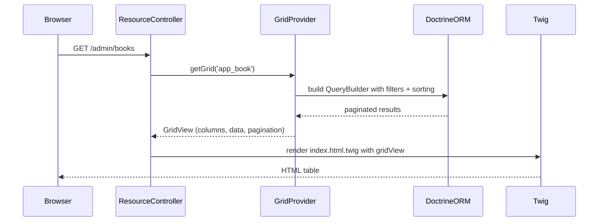

# SyliusGridBundle — tableaux d'administration déclaratifs

`SyliusGridBundle` est le moteur qui génère les listes filtrables/triables/paginées de l'interface Admin. Tout se déclare en YAML : colonnes, actions, filtres. Pas une ligne de controller à écrire.

## Analogie Symfony

SyliusGridBundle est comparable à un **EasyAdminBundle** ou un **SonataAdmin** sans thème imposé. La différence clé : il ne génère que les **listes** (pas le formulaire d'édition — celui-ci est géré par ResourceBundle). On combine les deux : Grid pour l'index, ResourceBundle pour le CRUD.

### Mapping Symfony → SyliusGridBundle

| Ce que vous feriez à la main en Symfony | Ce que GridBundle fait automatiquement |
|---|---|
| Écrire un controller `index()` avec pagination | `ResourceController` avec Grid intégrée |
| Créer un `FormType` de recherche | `filters:` dans le YAML de la Grid |
| Twig avec une table HTML triable | Rendu automatique via template Sylius |
| Paramètres de tri dans la requête | `sorting:` déclaratif, géré par GridProvider |
| Paginator Doctrine + KnpPaginatorBundle | Pagination auto via `GridView` |

## Déclaration d'une Grid

```yaml
# config/packages/sylius_grid.yaml
sylius_grid:
    grids:
        app_book:
            driver:
                name: doctrine/orm
                options:
                    class: App\Entity\Book
            sorting:
                title: asc           # default sort
            fields:
                title:
                    type: string
                    label: sylius.ui.title
                    sortable: ~      # enables sorting by this column
                author:
                    type: string
                    label: app.ui.author
                    sortable: ~
                publishedAt:
                    type: datetime
                    label: app.ui.published_at
                    options:
                        format: 'd/m/Y'
            filters:
                title:
                    type: string
                    label: sylius.ui.title
                author:
                    type: string
                    label: app.ui.author
            actions:
                main:
                    create:
                        type: create
                item:
                    update:
                        type: update
                    delete:
                        type: delete
```

## Types de colonnes disponibles

| Type | Usage |
|---|---|
| `string` | Valeur texte brute |
| `datetime` | Date formatée (option `format`) |
| `boolean` | Oui / Non |
| `twig` | Template Twig custom (option `template`) |
| `money` | Montant formaté (option `currency_field`) |
| `image` | Affichage image (option `path`) |

## Colonne Twig personnalisée

Pour une colonne qui ne rentre pas dans un type standard, utilisez `twig` :

```yaml
fields:
    status:
        type: twig
        label: app.ui.status
        options:
            template: 'admin/book/grid/status.html.twig'
```

```twig
{# templates/admin/book/grid/status.html.twig #}

<span class="badge badge--{{ color }}">
    {{ ('app.book.status.' ~ data)|trans }}
</span>
```

## Filtres

```yaml
filters:
    title:
        type: string       # text input
        label: sylius.ui.title
    status:
        type: select
        label: app.ui.status
        form_options:
            choices:
                app.book.status.draft:     draft
                app.book.status.published: published
    publishedAt:
        type: date
        label: app.ui.published_at
```

## Actions personnalisées

```yaml
actions:
    item:
        publish:
            type: links
            label: app.ui.publish
            icon: checkmark
            options:
                class: btn btn--success btn--sm
                route: app_admin_book_publish
                parameters:
                    id: resource.id
```

## Associer la Grid à une Resource (route + controller)

```yaml
# config/routes/app_admin_book.yaml
app_admin_book:
    resource: |
        alias: app.book
        section: admin
        templates: "@SyliusAdmin/crud"  # use Sylius Admin templates
        grid: app_book                  # the grid declared above
        redirect: index
        vars:
            all:
                subheader: app.ui.manage_books
    type: sylius.resource
```

## Diagramme de rendu d'une Grid



## Exemple d'agence : Grid admin avec filtre par canal (Channel)

En contexte multi-boutique Sylius, les commandes sont liées à un `Channel`. Voici une Grid admin filtrable par canal, cas typique en agence :

```yaml
# config/packages/sylius_grid.yaml
sylius_grid:
    grids:
        app_admin_order:
            driver:
                name: doctrine/orm
                options:
                    class: Sylius\Component\Core\Model\Order
                    # Only show non-cart orders
                    repository:
                        method: createQueryBuilderForAdmin
            sorting:
                createdAt: desc
            fields:
                number:
                    type: string
                    label: sylius.ui.number
                    sortable: ~
                channel:
                    type: twig
                    label: sylius.ui.channel
                    options:
                        template: 'admin/order/grid/channel.html.twig'
                state:
                    type: twig
                    label: sylius.ui.state
                    options:
                        template: '@SyliusAdmin/Order/Grid/Field/state.html.twig'
                total:
                    type: money
                    label: sylius.ui.total
                    options:
                        currency_field: currencyCode
                        divisor: 100
                createdAt:
                    type: datetime
                    label: sylius.ui.date
                    options:
                        format: 'd/m/Y H:i'
                    sortable: ~
            filters:
                # Filtre par canal : liste déroulante des channels actifs
                channel:
                    type: entity
                    label: sylius.ui.channel
                    form_options:
                        class: Sylius\Component\Core\Model\Channel
                        choice_label: name
                number:
                    type: string
                    label: sylius.ui.number
                state:
                    type: select
                    label: sylius.ui.state
                    form_options:
                        choices:
                            sylius.order.state.cart:      cart
                            sylius.order.state.new:       new
                            sylius.order.state.fulfilled: fulfilled
                            sylius.order.state.cancelled: cancelled
                createdAt:
                    type: date
                    label: sylius.ui.date
            actions:
                main:
                    create:
                        type: create
                item:
                    update:
                        type: update
                    delete:
                        type: delete
                    show:
                        type: show
```

```twig
{# templates/admin/order/grid/channel.html.twig #}
<span class="ui label" style="background-color: {{ data.color }}; color: white;">
    {{ data.name }}
</span>
```

```php
<?php
// src/Repository/OrderRepository.php
// Méthode personnalisée utilisée comme driver de la Grid

namespace App\Repository;

use Sylius\Bundle\ResourceBundle\Doctrine\ORM\EntityRepository;

final class OrderRepository extends EntityRepository
{
    public function createQueryBuilderForAdmin(): \Doctrine\ORM\QueryBuilder
    {
        return $this->createQueryBuilder('o')
            ->leftJoin('o.channel', 'channel')
            ->addSelect('channel')
            ->where('o.state != :cartState')
            ->setParameter('cartState', 'cart')
            ->orderBy('o.createdAt', 'DESC');
    }
}
```

```yaml
# Déclarer le repository custom dans la config Resource
sylius_resource:
    resources:
        sylius.order:
            classes:
                repository: App\Repository\OrderRepository
```

## Commandes CLI utiles

```bash
# Voir la configuration résolue de toutes les grids
bin/console debug:config sylius_grid

# Vider le cache après ajout d'un filtre ou d'une colonne
bin/console cache:clear

# Voir quels templates Sylius Admin sont disponibles pour les colonnes
find vendor/sylius/sylius/src/Sylius/Bundle/AdminBundle/Resources/views -name "*.html.twig" | grep Grid
```

## ⚠️ Pièges upgrade Sylius 1.x → 2.x — Grid

| Point de rupture | Sylius 1.x | Sylius 2.x |
|---|---|---|
| Namespace templates | `@SyliusAdmin/Grid/*` | `@SyliusAdmin/Grid/*` (inchangé) |
| Filtre `entity` | `class:` obligatoire | `form_options: { class: }` obligatoire |
| Colonne `money` | option `currency` | option `currency_field` (nom du champ sur l'entité) |
| Config driver repository | `method:` seul | `method:` + `arguments:` possible |
| Grid dans un plugin | préfixe plugin recommandé | obligatoire pour éviter les collisions |

## À retenir

- Tout Grid = `driver` (Doctrine ORM) + `fields` + `filters` + `actions` en YAML.
- Les colonnes `twig` permettent n'importe quel rendu custom sans toucher au controller.
- La Grid est liée à une Resource via la config de route (`grid: app_book`).
- Les filtres sont rendus dans un formulaire automatique ; les types disponibles : `string`, `select`, `date`, `exists`, `entity`.
- Le filtre `entity` est le plus puissant pour les relations Doctrine — il génère un `<select>` peuplé automatiquement.

> **Piège agence** : déclarer une Grid dans `config/packages/sylius_grid.yaml` alors qu'un plugin tiers déclare une Grid du même nom. La dernière config chargée l'emporte. Préfixez toujours vos grids avec le nom de votre app ou plugin (`app_book`, pas juste `book`).
