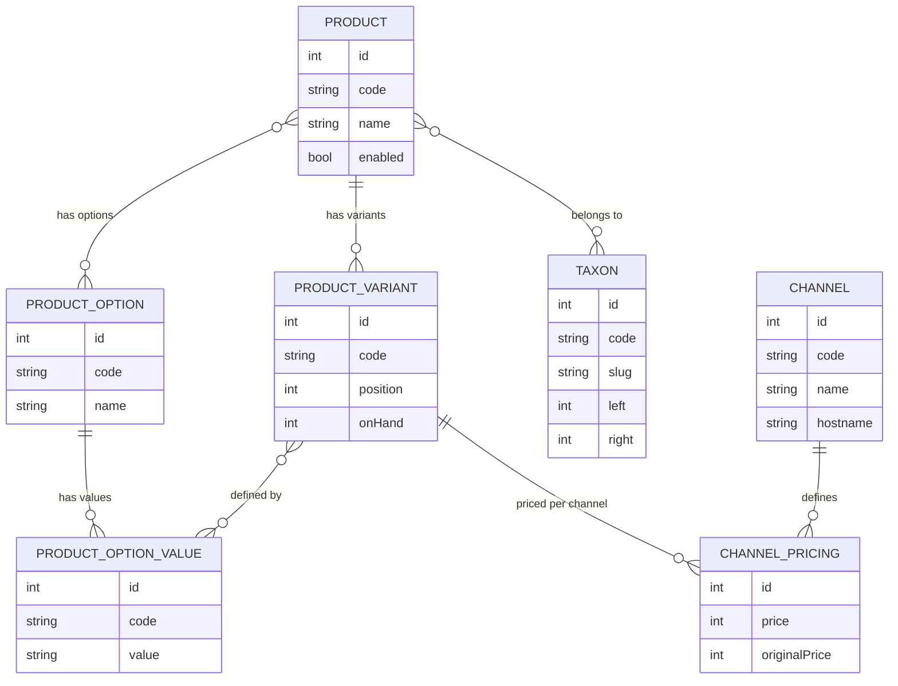

# Catalogue Sylius — Produits, Variantes, Taxons, Channels

Le catalogue Sylius est l'une des parties les plus riches. La hiérarchie `Product → ProductVariant → ProductOption` est la clé de voûte de tout projet e-commerce.

## Modèle de données du catalogue



## Product et ProductVariant

Un **Product** est le concept générique (ex. « T-shirt »). Un **ProductVariant** est l'article achetable (ex. « T-shirt Taille L, Couleur Bleu »).

```php
<?php
// Accessing a product and its variants
use Sylius\Component\Core\Model\ProductInterface;
use Sylius\Component\Core\Model\ProductVariantInterface;

// Product key interfaces:
// Sylius\Component\Product\Model\ProductInterface
// Sylius\Component\Core\Model\ProductInterface (adds channels, images, taxons)

$product->getCode();            // unique code
$product->getName();            // translated name
$product->getVariants();        // Collection of ProductVariantInterface
$product->isEnabled();

// Variant key methods:
$variant->getCode();
$variant->getChannelPricingForChannel($channel); // returns ChannelPricingInterface
$variant->isInStock();          // checks onHand > 0
$variant->getOptionValues();    // Collection of ProductOptionValueInterface
```

## ProductOption et ProductOptionValue

```php
<?php
// Product options define the axes of variation (e.g. "Size", "Color")
// ProductOptionValues are the actual values (e.g. "L", "Blue")

// Example: creating a product with variants programmatically
use Sylius\Component\Product\Model\ProductOptionInterface;
use Sylius\Component\Resource\Factory\FactoryInterface;

/** @var ProductOptionInterface $sizeOption */
$sizeOption = $productOptionFactory->createNew();
$sizeOption->setCode('t_shirt_size');
$sizeOption->setName('Size');

$sValue = $productOptionValueFactory->createNew();
$sValue->setCode('t_shirt_size_s');
$sValue->setValue('S');
$sValue->setOption($sizeOption);
```

## Taxons (arbre de catégories)

Les Taxons forment un **arbre** (via Gedmo NestedSet) :

```
Vêtements (root)
├── Hommes
│   ├── T-shirts
│   └── Pantalons
└── Femmes
    └── Robes
```

```php
<?php
use Sylius\Component\Taxonomy\Model\TaxonInterface;

$taxon->getCode();
$taxon->getName();           // translated
$taxon->getSlug();           // translated, used in URLs
$taxon->getParent();         // TaxonInterface or null
$taxon->getChildren();       // Collection of TaxonInterface
$taxon->isRoot();
```

## Channels

Un Channel représente une **boutique** (ou un sous-site) : langue, devise, zone fiscale, méthodes de livraison/paiement disponibles.

```php
<?php
use Sylius\Component\Channel\Model\ChannelInterface;
use Sylius\Component\Core\Model\ChannelInterface as CoreChannelInterface;

// Core ChannelInterface adds:
$channel->getBaseCurrency();        // CurrencyInterface
$channel->getDefaultLocale();       // LocaleInterface
$channel->getAvailableLocales();
$channel->getTaxCalculationStrategy(); // 'order_items_based' | 'order_based'
$channel->getShippingMethods();
$channel->getPaymentMethods();
```

## Attributs personnalisés

Sylius gère les attributs dynamiques via `ProductAttribute` :

```php
<?php
// In the admin, you create ProductAttribute entities
// Then attach ProductAttributeValue to a ProductVariant

use Sylius\Component\Product\Model\ProductAttributeInterface;

// Types of attributes: text, integer, float, boolean, date, datetime, select, textarea
// Defined via ProductAttributeType services
```

```yaml
# No YAML needed: product attributes are managed via Admin UI
# But you can seed them via DataFixtures:
# Sylius\Bundle\CoreBundle\Fixture\ProductAttributeFixture
```

## Override d'entité via Resource

Pour ajouter un champ `brand` sur `Product` :

```php
<?php
// 1. Create a trait
namespace App\Model;

trait ProductTrait
{
    private ?string $brand = null;

    public function getBrand(): ?string { return $this->brand; }
    public function setBrand(?string $brand): void { $this->brand = $brand; }
}
```

```php
<?php
// 2. Create your entity that extends Sylius Product
namespace App\Entity\Product;

use Doctrine\ORM\Mapping as ORM;
use Sylius\Component\Core\Model\Product as BaseProduct;
use App\Model\ProductTrait;

#[ORM\Entity]
#[ORM\Table(name: 'sylius_product')]
class Product extends BaseProduct
{
    use ProductTrait;
}
```

```yaml
# 3. Override in sylius_product.yaml
sylius_product:
    resources:
        product:
            classes:
                model: App\Entity\Product\Product
```

## À retenir

- **Product** = concept générique ; **ProductVariant** = article achetable avec stock et prix.
- Les prix sont **par Channel** (pas sur la variante directement) via `ChannelPricing`.
- Les Taxons forment un arbre NestedSet ; chaque produit peut appartenir à plusieurs Taxons.
- L'override d'entité = Trait PHP + classe qui étend la classe Sylius + déclaration dans `sylius_<bundle>: resources:`.

> **Piège agence** : oublier de migrer les `ChannelPricing` lors d'un ajout de Channel. Un produit sans `ChannelPricing` pour un Channel ne s'affiche pas dans la boutique de ce Channel — il n'y a pas d'erreur, juste une page vide.
