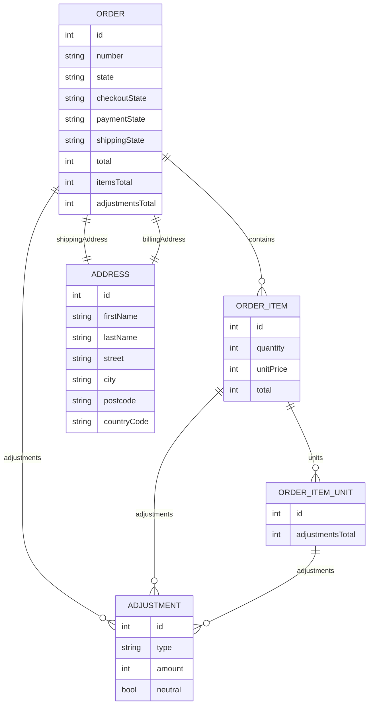
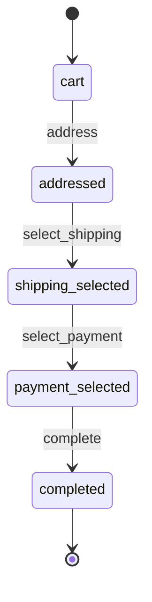
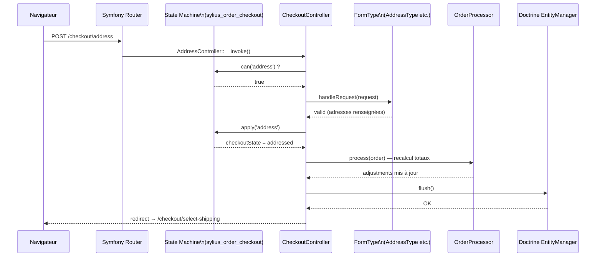

# Commande et Checkout Sylius

Le checkout Sylius est une machine d'état (`sylius_order_checkout`) pilotée par des **steps** (étapes). Chaque étape est un controller Symfony qui traite un formulaire et fait avancer la State Machine.

## Modèle Order/OrderItem



### Interfaces clés

```php
<?php
use Sylius\Component\Order\Model\OrderInterface;
use Sylius\Component\Core\Model\OrderInterface as CoreOrderInterface;

// Core OrderInterface adds:
$order->getNumber();              // generated after checkout
$order->getState();               // 'cart' | 'new' | 'fulfilled' | 'cancelled'
$order->getCheckoutState();       // checkout sub-workflow state
$order->getPaymentState();        // 'awaiting_payment' | 'paid' | 'refunded' ...
$order->getShippingState();       // 'ready' | 'shipped' | 'cancelled'
$order->getTotal();               // in cents (integers only)
$order->getChannel();
$order->getShippingAddress();     // AddressInterface
$order->getBillingAddress();
$order->getPayments();            // Collection of PaymentInterface
$order->getShipments();           // Collection of ShipmentInterface
```

## Workflow du Checkout



### Pipeline complet d'une requête checkout — du navigateur à la base



## Les étapes du Checkout

Sylius fournit des controllers pour chaque étape dans `SyliusShopBundle` :

| Étape | Controller | Route |
|---|---|---|
| Adresse | `AddressController` | `sylius_shop_checkout_address` |
| Livraison | `ShippingController` | `sylius_shop_checkout_select_shipping` |
| Paiement | `PaymentController` | `sylius_shop_checkout_select_payment` |
| Confirmation | `CompleteController` | `sylius_shop_checkout_complete` |
| Merci | `ThankYouController` | `sylius_shop_order_thank_you` |

## Mapping Symfony → Checkout Sylius

| Concept Symfony | Équivalent Checkout Sylius | Remarque |
|---|---|---|
| `AbstractController::createForm()` | `$this->createForm(AddressType::class, $order)` | Même API, FormType fourni par Sylius |
| `EventDispatcher` | `State Machine callback` | Les effets de bord (email, stock) sont dans les callbacks SM |
| `$em->flush()` | `$em->flush()` direct dans le controller | Mais **les totaux doivent passer par `OrderProcessor`** |
| Redirection entre pages | `$this->redirectToRoute('sylius_shop_checkout_select_shipping')` | Le SM détermine l'étape suivante autorisée |
| Middleware / décorateur | `OrderProcessorInterface` (tag `sylius.order_processor`) | Chaîne de processors pour recalculer les totaux |

## Personnaliser une étape — AddressStep

Pour ajouter un champ custom à l'étape adresse, on surcharge le FormType :

```php
<?php
// src/Form/Extension/AddressTypeExtension.php

namespace App\Form\Extension;

use Sylius\Bundle\AddressingBundle\Form\Type\AddressType;
use Symfony\Component\Form\AbstractTypeExtension;
use Symfony\Component\Form\Extension\Core\Type\TextType;
use Symfony\Component\Form\FormBuilderInterface;

final class AddressTypeExtension extends AbstractTypeExtension
{
    public static function getExtendedTypes(): iterable
    {
        return [AddressType::class];
    }

    public function buildForm(FormBuilderInterface $builder, array $options): void
    {
        $builder->add('instructions', TextType::class, [
            'label'    => 'app.form.address.delivery_instructions',
            'required' => false,
        ]);
    }
}
```

```yaml
# config/services.yaml
services:
    App\Form\Extension\AddressTypeExtension:
        tags:
            - { name: form.type_extension, extended_type: Sylius\Bundle\AddressingBundle\Form\Type\AddressType }
```

## Ajouter une étape custom au Checkout

Pour insérer une étape entre « Livraison » et « Paiement » :

```php
<?php
// src/Controller/Checkout/NewsletterStepController.php

namespace App\Controller\Checkout;

use Sylius\Bundle\ResourceBundle\Controller\RequestConfigurationFactoryInterface;
use Sylius\Component\Core\Model\OrderInterface;
use Symfony\Bundle\FrameworkBundle\Controller\AbstractController;
use Symfony\Component\HttpFoundation\Request;
use Symfony\Component\HttpFoundation\Response;

final class NewsletterStepController extends AbstractController
{
    public function __invoke(Request $request): Response
    {
        /** @var OrderInterface $order */
        $order = $this->container->get('sylius.context.cart')->getCart();

        // Handle the newsletter subscription form
        $form = $this->createForm(NewsletterStepType::class, $order);
        $form->handleRequest($request);

        if ($form->isSubmitted() && $form->isValid()) {
            // Save data, then advance the workflow manually if needed
            return $this->redirectToRoute('sylius_shop_checkout_select_payment');
        }

        return $this->render('checkout/newsletter.html.twig', ['form' => $form->createView()]);
    }
}
```

## OrderProcessor et Adjustments

L'`OrderProcessor` recalcule les totaux de la commande via une chaîne de `OrderProcessorInterface` :

```php
<?php
use Sylius\Component\Order\Processor\OrderProcessorInterface;

// Custom processor to add a custom fee
final class HandlingFeeProcessor implements OrderProcessorInterface
{
    public function process(\Sylius\Component\Order\Model\OrderInterface $order): void
    {
        // Remove existing handling fee adjustments
        $order->removeAdjustments('handling_fee');

        if ($order->getItemsTotal() < 5000) { // less than 50 EUR
            $adjustment = $this->adjustmentFactory->createNew();
            $adjustment->setType('handling_fee');
            $adjustment->setLabel('Handling fee');
            $adjustment->setAmount(200); // 2 EUR in cents
            $order->addAdjustment($adjustment);
        }
    }
}
```

```yaml
# Register as a tagged service
services:
    App\Processor\HandlingFeeProcessor:
        tags:
            - { name: sylius.order_processor, priority: 10 }
```

## Exemple d'agence : ajouter un champ "instructions de livraison" au checkout

Cas réel : un client veut que le client final puisse saisir des instructions de livraison (code d'accès, étage…) à l'étape adresse. L'information doit être stockée sur l'entité `Address`.

**Étape 1 — Étendre l'entité Address**

```php
<?php
// src/Entity/Address.php

namespace App\Entity;

use Doctrine\ORM\Mapping as ORM;
use Sylius\Component\Core\Model\Address as BaseAddress;

#[ORM\Entity]
#[ORM\Table(name: 'sylius_address')]
class Address extends BaseAddress
{
    #[ORM\Column(type: 'text', nullable: true)]
    private ?string $deliveryInstructions = null;

    public function getDeliveryInstructions(): ?string
    {
        return $this->deliveryInstructions;
    }

    public function setDeliveryInstructions(?string $instructions): void
    {
        $this->deliveryInstructions = $instructions;
    }
}
```

**Étape 2 — Déclarer l'override dans la config Resource**

```yaml
# config/packages/sylius_addressing.yaml
sylius_addressing:
    resources:
        address:
            classes:
                model: App\Entity\Address
```

**Étape 3 — Extension du FormType AddressType**

```php
<?php
// src/Form/Extension/AddressTypeExtension.php

namespace App\Form\Extension;

use Sylius\Bundle\AddressingBundle\Form\Type\AddressType;
use Symfony\Component\Form\AbstractTypeExtension;
use Symfony\Component\Form\Extension\Core\Type\TextareaType;
use Symfony\Component\Form\FormBuilderInterface;

final class AddressTypeExtension extends AbstractTypeExtension
{
    public static function getExtendedTypes(): iterable
    {
        return [AddressType::class];
    }

    public function buildForm(FormBuilderInterface $builder, array $options): void
    {
        $builder->add('deliveryInstructions', TextareaType::class, [
            'label'    => 'app.form.address.delivery_instructions',
            'required' => false,
            'attr'     => ['rows' => 3, 'placeholder' => 'app.form.address.delivery_instructions_placeholder'],
        ]);
    }
}
```

```yaml
# config/services.yaml
services:
    App\Form\Extension\AddressTypeExtension:
        tags:
            - { name: form.type_extension, extended_type: Sylius\Bundle\AddressingBundle\Form\Type\AddressType }
```

**Étape 4 — Afficher dans le template de confirmation**

```twig
{# templates/shop/checkout/complete/summary.html.twig #}

    <div class="delivery-instructions">
        <strong>{{ 'app.ui.delivery_instructions'|trans }}</strong>
        <p>{{ order.shippingAddress.deliveryInstructions }}</p>
    </div>

```

## Commandes CLI utiles

```bash
# Vérifier l'état d'une commande en base
bin/console sylius:debug:order --number=000000001

# Voir les State Machines liées au checkout
bin/console debug:config winzou_state_machine sylius_order_checkout   # Sylius 1.x
bin/console workflow:dump sylius_order_checkout                        # Sylius 2.x

# Relancer l'OrderProcessor sur une commande spécifique (debug)
bin/console sylius:recalculate-order --id=42

# Générer la migration après override d'entité
bin/console doctrine:migrations:diff
bin/console doctrine:migrations:migrate
```

## ⚠️ Pièges upgrade Sylius 1.x → 2.x — Checkout

| Point de rupture | Sylius 1.x | Sylius 2.x |
|---|---|---|
| Context du panier | `sylius.context.cart` (service) | `CartContextInterface` injecté proprement |
| Transitions checkout | Winzou `sylius_order_checkout` | Symfony Workflow `sylius_order_checkout` |
| Controllers checkout | dans `SyliusShopBundle` | déplacés, certains refactorisés |
| `CompleteController` | dispatche un event Sylius custom | dispatche un event Symfony Workflow |
| Override entité Address | `sylius_addressing: resources: address:` | identique |
| `getTotal()` / `setTotal()` | total modifiable manuellement | toujours calculé, `setTotal()` ignoré à terme |

## À retenir

- `Order` a **plusieurs états** simultanés : `state` (global), `checkoutState`, `paymentState`, `shippingState` — chacun piloté par un workflow distinct.
- Tous les montants sont en **centimes entiers** (pas de float) — c'est une règle absolue de Sylius.
- Le checkout est une suite de controllers Symfony standard + avance de State Machine.
- Les `Adjustment` (remises, frais) s'appliquent à trois niveaux : Order, OrderItem, OrderItemUnit.
- Pour ajouter un champ au checkout : override de l'entité + `TypeExtension` + déclaration dans `sylius_<bundle>: resources:`.

> **Piège agence** : modifier directement `$order->setTotal()`. Les totaux sont **calculés** par l'OrderProcessor — les modifier manuellement est écrasé au prochain recalcul. Passez toujours par les Adjustments et `$orderProcessor->process($order)`.
