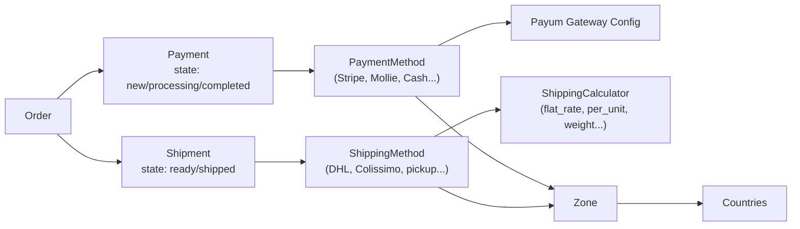
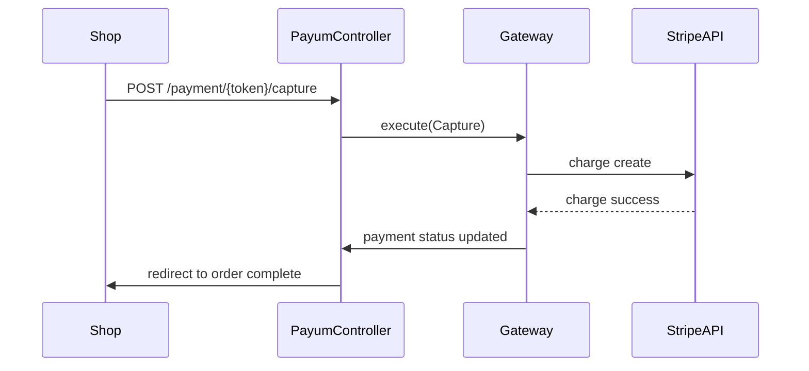

# Paiement et Livraison dans Sylius

Paiements et livraisons sont des **méthodes configurables** en Admin, associées à des zones géographiques et à des canaux. L'intégration de passerelles de paiement passe par **Payum**.

## PaymentMethod et ShippingMethod



## Zones

Une Zone définit un ensemble de pays (ou de provinces) :

```php
<?php
use Sylius\Component\Addressing\Model\ZoneInterface;

// Zones are created in Admin: Configuration > Zones
// A ShippingMethod or PaymentMethod is associated to a Zone
// If the order's shipping address is in the zone, the method is available

$zone->getCode();       // e.g. 'EU'
$zone->getName();       // e.g. 'European Union'
$zone->getType();       // 'country' | 'province' | 'zone'
$zone->getMembers();    // Collection of ZoneMember
```

## ShippingMethod et calculateurs

```php
<?php
use Sylius\Component\Shipping\Model\ShippingMethodInterface;

$shippingMethod->getCode();
$shippingMethod->getName();
$shippingMethod->getCalculator();  // 'flat_rate' | 'per_unit' | 'weight_based'
$shippingMethod->getConfiguration(); // ['amount' => 500] for flat_rate
$shippingMethod->getZone();
```

Calculateurs natifs :

| Code | Logique |
|---|---|
| `flat_rate` | Montant fixe par commande |
| `per_unit` | Montant × nombre d'unités |
| `weight_based` | Tranches de poids |

Créer un calculateur custom :

```php
<?php
namespace App\Shipping\Calculator;

use Sylius\Component\Shipping\Calculator\CalculatorInterface;
use Sylius\Component\Shipping\Model\ShipmentInterface;

final class FreeOverThresholdCalculator implements CalculatorInterface
{
    public function calculate(ShipmentInterface $subject, array $configuration): int
    {
        $order = $subject->getOrder();
        $threshold = $configuration['threshold'] ?? 10000; // 100 EUR

        if ($order->getItemsTotal() >= $threshold) {
            return 0; // free shipping
        }

        return $configuration['amount'] ?? 500;
    }

    public function getType(): string
    {
        return 'free_over_threshold';
    }
}
```

```yaml
# services.yaml
App\Shipping\Calculator\FreeOverThresholdCalculator:
    tags:
        - { name: sylius.shipping_calculator }
```

## Payum — intégration des passerelles de paiement

Payum est la couche d'abstraction de paiement utilisée par Sylius. Chaque gateway (Stripe, Mollie, PayPal…) est un package Payum séparé.



### Configurer Stripe via Mollie ou Stripe Payum

```yaml
# config/packages/payum.yaml
payum:
    gateways:
        stripe:
            factory: stripe_checkout_js
            publishable_key: '%env(STRIPE_PUBLISHABLE_KEY)%'
            secret_key:      '%env(STRIPE_SECRET_KEY)%'
```

```yaml
# Then in Admin: Configuration > Payment Methods > Create
# Select gateway "stripe", associate to a channel and zone
```

### Intégration via plugin officiel (recommandé)

Pour Stripe en production, utiliser `sylius-stripe-payment-plugin` ou `mollie/mollie-sylius-plugin` :

```bash
# Installation example
composer require stripe/stripe-php
composer require sylius-labs/sylius-stripe-payment-plugin
```

Ces plugins enregistrent leur gateway Payum automatiquement et fournissent les templates de paiement.

### États d'un Payment

```php
<?php
use Sylius\Component\Payment\Model\PaymentInterface;

// Payment states (defined in sylius_payment workflow):
// new → processing → completed
//                 → failed
//                 → cancelled
//                 → refunded

$payment->getState();           // current state
$payment->getAmount();          // in cents
$payment->getCurrencyCode();    // ISO 4217
$payment->getMethod();          // PaymentMethodInterface
$payment->getDetails();         // gateway-specific details array
```

## Créer une PaymentMethod custom (ex. virement bancaire)

```php
<?php
namespace App\Payum\Action;

use Payum\Core\Action\ActionInterface;
use Payum\Core\Bridge\Spl\ArrayObject;
use Payum\Core\Request\Capture;

final class BankTransferCaptureAction implements ActionInterface
{
    public function execute($request): void
    {
        /** @var Capture $request */
        $details = ArrayObject::ensureArrayObject($request->getModel());
        // Bank transfer: just mark as pending — no real capture
        $details['status'] = 'pending';
    }

    public function supports($request): bool
    {
        return $request instanceof Capture;
    }
}
```

## À retenir

- **PaymentMethod** et **ShippingMethod** sont configurées en Admin et associées à des **Zones**.
- Les montants de livraison sont calculés par des **Calculators** (services taggés `sylius.shipping_calculator`).
- Payum est la couche d'abstraction de paiement — Sylius n'implémente pas les gateways directement.
- Les états de paiement (`new`, `processing`, `completed`, `failed`, `refunded`) sont pilotés par le workflow `sylius_payment`.

> **Piège agence** : tester le paiement en mode sandbox avec des credentials de production. Configurez toujours des variables d'environnement distinctes (`STRIPE_SECRET_KEY_TEST` vs `STRIPE_SECRET_KEY`) et vérifiez l'environnement Payum dans `config/packages/dev/payum.yaml`.
