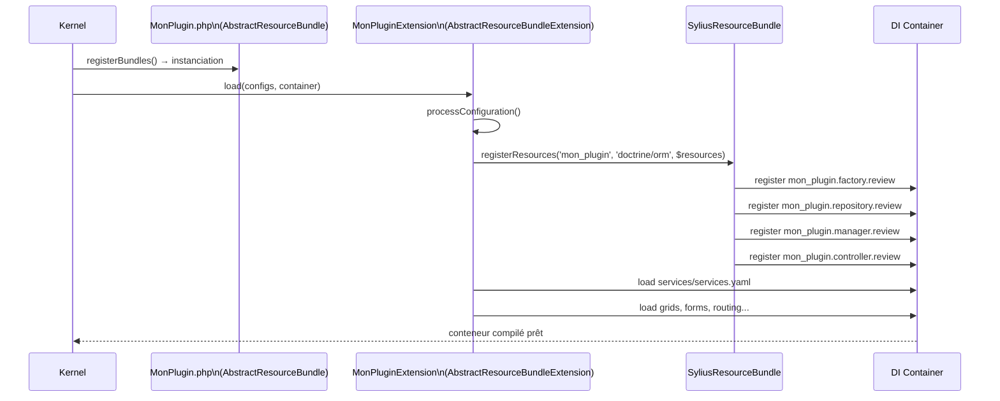

# Anatomie d'un plugin Sylius

Un plugin Sylius est un **Bundle Symfony avec des conventions supplémentaires**. Si vous avez déjà créé un Bundle Symfony réutilisable, vous connaissez 80 % de la structure. Les 20 % restants sont les conventions Sylius : `AbstractResourceBundle`, la déclaration des Resources, et le type `sylius-plugin` dans `composer.json`.

## Comparaison Bundle Symfony vs Plugin Sylius

| Élément | Bundle Symfony | Plugin Sylius |
|---|---|---|
| Classe principale | étend `Bundle` | étend `AbstractResourceBundle` |
| `composer.json` type | `symfony-bundle` | `sylius-plugin` |
| Config DI | `Extension` standard | `AbstractResourceBundleExtension` |
| Entités | Doctrine standard | Resources déclarées via `model_namespaces` |
| Routes | `routing.yaml` | `routing.yaml` + routes Resource auto |
| Tests | PHPUnit | PHPSpec + Behat (convention Sylius) |
| Migrations | dans `migrations/` de l'app | **ne jamais inclure dans le plugin** |
| Override par tiers | pas prévu | mécanisme `model_namespaces` intégré |

### Flux de chargement d'un plugin : de Kernel à Container



## Structure d'un plugin

```
acme/sylius-review-plugin/
├── composer.json
├── AcmeSyliusReviewPlugin.php
├── DependencyInjection/
│   ├── AcmeSyliusReviewExtension.php
│   └── Configuration.php
├── Resources/
│   └── config/
│       ├── app/
│       │   └── config.yaml          # resources + services to import
│       ├── doctrine/
│       │   └── model/
│       │       └── Review.orm.xml   # Doctrine mapping
│       ├── services/
│       │   └── services.yaml
│       └── routing/
│           └── sylius_shop.yaml
└── src/
    ├── Model/
    │   ├── ReviewInterface.php
    │   └── Review.php
    ├── Repository/
    │   └── ReviewRepository.php
    ├── Factory/
    │   └── ReviewFactory.php
    └── Form/
        └── Type/
            └── ReviewType.php
```

## La classe principale du plugin

```php
<?php
// AcmeSyliusReviewPlugin.php

namespace Acme\SyliusReviewPlugin;

use Sylius\Bundle\ResourceBundle\AbstractResourceBundle;
use Sylius\Bundle\ResourceBundle\SyliusResourceBundle;

final class AcmeSyliusReviewPlugin extends AbstractResourceBundle
{
    /**
     * Return the namespaces where Sylius should look for Resource models.
     * This enables the override mechanism via sylius_<bundle>: resources:
     */
    public static function getSupportedDrivers(): array
    {
        return [SyliusResourceBundle::DRIVER_DOCTRINE_ORM];
    }

    protected function getModelNamespace(): string
    {
        return 'Acme\SyliusReviewPlugin\Model';
    }
}
```

## Le `composer.json` avec l'extra `sylius-plugin`

```json
{
    "name": "acme/sylius-review-plugin",
    "type": "sylius-plugin",
    "description": "A review plugin for Sylius",
    "require": {
        "php": "^8.2",
        "sylius/sylius": "^2.0"
    },
    "autoload": {
        "psr-4": {
            "Acme\\SyliusReviewPlugin\\": "src/"
        },
        "files": [
            "AcmeSyliusReviewPlugin.php"
        ]
    },
    "extra": {
        "sylius-plugin": {
            "api": "auto",
            "shop": true,
            "admin": true
        }
    }
}
```

## L'Extension DI

```php
<?php
// DependencyInjection/AcmeSyliusReviewExtension.php

namespace Acme\SyliusReviewPlugin\DependencyInjection;

use Sylius\Bundle\ResourceBundle\DependencyInjection\Extension\AbstractResourceBundleExtension;
use Symfony\Component\Config\FileLocator;
use Symfony\Component\DependencyInjection\ContainerBuilder;
use Symfony\Component\DependencyInjection\Loader\YamlFileLoader;

final class AcmeSyliusReviewExtension extends AbstractResourceBundleExtension
{
    public function load(array $configs, ContainerBuilder $container): void
    {
        $config = $this->processConfiguration($this->getConfiguration([], $container), $configs);
        $loader = new YamlFileLoader($container, new FileLocator(__DIR__ . '/../Resources/config'));

        $this->registerResources('acme_sylius_review', 'doctrine/orm', $config['resources'], $container);

        $loader->load('services/services.yaml');
    }
}
```

## Déclarer les Resources du plugin

```yaml
# Resources/config/app/config.yaml
sylius_resource:
    resources:
        acme_sylius_review.review:
            classes:
                model:      Acme\SyliusReviewPlugin\Model\Review
                interface:  Acme\SyliusReviewPlugin\Model\ReviewInterface
                repository: Acme\SyliusReviewPlugin\Repository\ReviewRepository
                factory:    Acme\SyliusReviewPlugin\Factory\ReviewFactory
                form:       Acme\SyliusReviewPlugin\Form\Type\ReviewType
```

## Enregistrement dans l'application

```php
<?php
// config/bundles.php

return [
    // ...
    Acme\SyliusReviewPlugin\AcmeSyliusReviewPlugin::class => ['all' => true],
];
```

## Exemple complet d'agence : plugin Wishlist

Voici l'anatomie complète d'un plugin de wishlist, du `composer.json` jusqu'à la Grid admin.

### Structure des fichiers

```
acme/sylius-wishlist-plugin/
├── composer.json                              # type: sylius-plugin
├── AcmeSyliusWishlistPlugin.php               # extends AbstractResourceBundle
├── DependencyInjection/
│   ├── AcmeSyliusWishlistExtension.php
│   └── Configuration.php
├── Resources/config/
│   ├── app/config.yaml                        # resources declaration
│   ├── doctrine/model/Wishlist.orm.xml        # Doctrine mapping
│   ├── grids/sylius_admin_wishlist.yaml       # Grid admin
│   └── routing/
│       ├── sylius_shop.yaml
│       └── sylius_admin.yaml
└── src/
    ├── Model/
    │   ├── WishlistInterface.php
    │   └── Wishlist.php
    ├── Entity/
    │   └── WishlistItem.php
    ├── Repository/
    │   └── WishlistRepository.php
    └── Form/Type/
        └── WishlistType.php
```

### La classe principale

```php
<?php
// AcmeSyliusWishlistPlugin.php

namespace Acme\SyliusWishlistPlugin;

use Sylius\Bundle\ResourceBundle\AbstractResourceBundle;
use Sylius\Bundle\ResourceBundle\SyliusResourceBundle;

final class AcmeSyliusWishlistPlugin extends AbstractResourceBundle
{
    public static function getSupportedDrivers(): array
    {
        return [SyliusResourceBundle::DRIVER_DOCTRINE_ORM];
    }

    protected function getModelNamespace(): string
    {
        // Sylius looks here when an app declares an override
        return 'Acme\SyliusWishlistPlugin\Model';
    }
}
```

### Configuration des Resources

```yaml
# Resources/config/app/config.yaml
sylius_resource:
    resources:
        acme_wishlist.wishlist:
            classes:
                model:      Acme\SyliusWishlistPlugin\Model\Wishlist
                interface:  Acme\SyliusWishlistPlugin\Model\WishlistInterface
                repository: Acme\SyliusWishlistPlugin\Repository\WishlistRepository
                factory:    Sylius\Component\Resource\Factory\Factory
                form:       Acme\SyliusWishlistPlugin\Form\Type\WishlistType
```

### Grid admin associée

```yaml
# Resources/config/grids/sylius_admin_wishlist.yaml
sylius_grid:
    grids:
        acme_wishlist_admin_wishlist:
            driver:
                name: doctrine/orm
                options:
                    class: Acme\SyliusWishlistPlugin\Model\Wishlist
            fields:
                name:
                    type: string
                    label: sylius.ui.name
                    sortable: ~
                customer:
                    type: twig
                    label: sylius.ui.customer
                    options:
                        template: '@AcmeSyliusWishlistPlugin/Admin/Grid/customer.html.twig'
                createdAt:
                    type: datetime
                    label: sylius.ui.date
                    options:
                        format: 'd/m/Y'
                    sortable: ~
            filters:
                name:
                    type: string
                    label: sylius.ui.name
            actions:
                main:
                    create:
                        type: create
                item:
                    update:
                        type: update
                    delete:
                        type: delete
```

## Commandes CLI utiles pour les plugins

```bash
# Installer le plugin dans le projet (après composer require)
bin/console sylius:install:check    # vérifie l'environnement

# Charger les fixtures du plugin si elles existent
bin/console sylius:fixtures:load

# Vérifier que les services du plugin sont bien enregistrés
bin/console debug:container | grep acme_wishlist
bin/console debug:container acme_wishlist.factory.wishlist

# Générer la migration pour les nouvelles entités du plugin
bin/console doctrine:migrations:diff
bin/console doctrine:migrations:migrate --no-interaction

# Vider le cache après modification de config
bin/console cache:clear --env=prod
```

## ⚠️ Pièges upgrade Sylius 1.x → 2.x — Plugins

| Point de rupture | Sylius 1.x | Sylius 2.x |
|---|---|---|
| `AbstractResourceBundle` | `Sylius\Bundle\ResourceBundle\AbstractResourceBundle` | même namespace, mais `getSupportedDrivers()` obligatoire |
| `getModelNamespace()` | chaîne simple | même, mais vérifier si `Model\` ou `Entity\` |
| Templates admin dans le plugin | `@SyliusAdmin/` | restructuré en Sylius 2.x, vérifier les paths |
| Behat contexts du plugin | `Sylius\Behat\Context\*` | plusieurs renommés dans 2.x |
| `extra.sylius-plugin` dans composer.json | pas nécessaire en 1.x | requis en 2.x pour l'auto-configuration |
| Namespace `Sylius\Component\Resource\Factory\Factory` | inchangé | inchangé |

## À retenir

- Un plugin Sylius = `AbstractResourceBundle` + `composer.json type: sylius-plugin` + déclaration des Resources.
- La méthode `getModelNamespace()` indique à Sylius où chercher les modèles pour le mécanisme d'override.
- Les Resources du plugin sont déclarées sous le préfixe du plugin (`acme_wishlist.wishlist`) — jamais sous `app.`.
- Un plugin sans `AbstractResourceBundle` peut fonctionner, mais perd le mécanisme d'override automatique.

> **Piège agence** : publier un plugin avec des migrations Doctrine incluses dans le dossier `migrations/` de son propre répertoire. Les migrations Doctrine ne sont pas cumulatives entre plugins — toutes doivent être dans le dossier `migrations/` de l'application finale. Ne jamais shipper de migrations dans un plugin.
