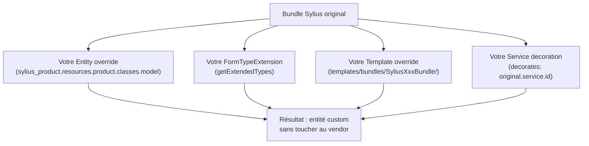

# Override et extension dans Sylius

Sylius est conçu pour être **étendu sans modification des fichiers vendor**. Les quatre mécanismes d'override à maîtriser : entité, formulaire, template, et décoration de service.

## 1. Override d'entité via Trait + Resource config

C'est le pattern central de Sylius. L'idée : votre entité **étend** la classe Sylius et **ajoute** vos champs via un Trait.

```php
<?php
// src/Entity/Product/Product.php

namespace App\Entity\Product;

use Doctrine\ORM\Mapping as ORM;
use Sylius\Component\Core\Model\Product as BaseProduct;

// 1. Your custom trait
trait ProductBrandTrait
{
    #[ORM\Column(type: 'string', nullable: true)]
    private ?string $brand = null;

    public function getBrand(): ?string { return $this->brand; }
    public function setBrand(?string $brand): void { $this->brand = $brand; }
}

// 2. Your entity extending Sylius
#[ORM\Entity]
#[ORM\Table(name: 'sylius_product')]
class Product extends BaseProduct
{
    use ProductBrandTrait;
}
```

```yaml
# config/packages/sylius_product.yaml
sylius_product:
    resources:
        product:
            classes:
                model: App\Entity\Product\Product
```

> Après cela, `php bin/console doctrine:migrations:diff` génère la migration pour le champ `brand`.

## 2. Override d'interface

Pour que les plugins tiers puissent dépendre de votre extension :

```php
<?php
// src/Model/ProductInterface.php

namespace App\Model;

use Sylius\Component\Core\Model\ProductInterface as BaseProductInterface;

interface ProductInterface extends BaseProductInterface
{
    public function getBrand(): ?string;
    public function setBrand(?string $brand): void;
}
```

```yaml
# config/packages/sylius_product.yaml
sylius_product:
    resources:
        product:
            classes:
                model:     App\Entity\Product\Product
                interface: App\Model\ProductInterface  # declared here!
```

## 3. Override de FormType

Pour ajouter le champ `brand` au formulaire Admin :

```php
<?php
// src/Form/Extension/ProductTypeExtension.php

namespace App\Form\Extension;

use Sylius\Bundle\ProductBundle\Form\Type\ProductType;
use Symfony\Component\Form\AbstractTypeExtension;
use Symfony\Component\Form\Extension\Core\Type\TextType;
use Symfony\Component\Form\FormBuilderInterface;

final class ProductTypeExtension extends AbstractTypeExtension
{
    public static function getExtendedTypes(): iterable
    {
        return [ProductType::class];
    }

    public function buildForm(FormBuilderInterface $builder, array $options): void
    {
        $builder->add('brand', TextType::class, [
            'label'    => 'app.form.product.brand',
            'required' => false,
        ]);
    }
}
```

C'est **exactement** la même syntaxe que les FormTypeExtension Symfony standard — aucune convention Sylius supplémentaire.

## 4. Override de template

Deux méthodes selon le contexte :

**Méthode A — surcharge globale** (valable pour tous les Bundles Symfony) :

```
templates/bundles/SyliusAdminBundle/Product/_form.html.twig
templates/bundles/SyliusShopBundle/Product/show.html.twig
```

**Méthode B — surcharge dans un plugin** (via `Resources/views/`) :

```php
<?php
// In your plugin:
// Resources/views/SyliusAdminBundle/Product/_form.html.twig
// This override is only active if the plugin is loaded AFTER SyliusAdminBundle
// in bundles.php
```

## 5. Décoration de service (Symfony Decorator pattern)

Pour modifier le comportement d'un service Sylius sans le remplacer entièrement :

```php
<?php
// src/Shipping/Calculator/LoggingShippingCalculator.php

namespace App\Shipping\Calculator;

use Psr\Log\LoggerInterface;
use Sylius\Component\Shipping\Calculator\CalculatorInterface;
use Sylius\Component\Shipping\Model\ShipmentInterface;

final class LoggingShippingCalculator implements CalculatorInterface
{
    public function __construct(
        private readonly CalculatorInterface $inner,
        private readonly LoggerInterface $logger,
    ) {}

    public function calculate(ShipmentInterface $subject, array $configuration): int
    {
        $amount = $this->inner->calculate($subject, $configuration);
        $this->logger->info('Shipping calculated', [
            'method' => $subject->getMethod()?->getCode(),
            'amount' => $amount,
        ]);

        return $amount;
    }

    public function getType(): string
    {
        return $this->inner->getType();
    }
}
```

```yaml
# config/services.yaml
App\Shipping\Calculator\LoggingShippingCalculator:
    decorates: acme_sylius_review.flat_rate_calculator
    arguments:
        $inner: '@.inner'
        $logger: '@logger'
```

Ou avec PHP 8 attributes (Symfony 6.3+) :

```php
<?php
use Symfony\Component\DependencyInjection\Attribute\AsDecorator;
use Symfony\Component\DependencyInjection\Attribute\AutowireDecorated;

#[AsDecorator(decorates: 'sylius.shipping_calculator.flat_rate')]
final class LoggingShippingCalculator implements CalculatorInterface
{
    public function __construct(
        #[AutowireDecorated] private readonly CalculatorInterface $inner,
        private readonly LoggerInterface $logger,
    ) {}
    // ...
}
```

## Ordre de chargement des overrides



## Règles anti-régression

| Override | Risque d'upgrade | Mitigation |
|---|---|---|
| Entité via Trait | Faible si on n'override pas de méthodes | Toujours utiliser un Trait séparé |
| FormTypeExtension | Faible | `getExtendedTypes()` = interface, pas classe concrète |
| Template | Moyen | `` + `{{ parent() }}` |
| Service decoration | Faible | Coder contre l'interface, pas la classe concrète |
| Réécriture complète | Élevé | À éviter — bloque les upgrades |

## À retenir

- Les quatre mécanismes d'override : **entité** (Trait + Resource), **formulaire** (TypeExtension), **template** (dossier `templates/bundles/`), **service** (decoration Symfony).
- Toujours coder **contre les interfaces** pour que vos decorators restent compatibles.
- Un Trait d'entité isolé = migration propre et facilité de mise à jour.

> **Piège agence** : copier-coller une classe Sylius dans `src/` et la modifier directement. À chaque upgrade, vous devez recomparer et reporter les changements manuellement. Utilisez **toujours** l'extension (hériter + Trait) — jamais la copie.
