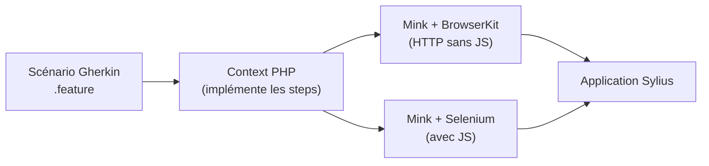

# Behat dans Sylius — tests d'acceptation

Sylius est l'un des projets PHP qui utilise le plus intensément **Behat** comme couche de tests d'acceptation. Si vous êtes habitué à PHPUnit, Behat représente un changement de paradigme : on teste le **comportement métier** (comme un utilisateur), pas les unités de code.

## Pourquoi Behat dans Sylius ?

Sylius a fait le choix de Behat pour documenter et vérifier le comportement de la boutique de bout en bout. Les scénarios Gherkin servent à la fois de **documentation vivante** et de **filet de sécurité** pour les upgrades.



## Structure d'un scénario Gherkin

```gherkin
# features/shop/product/viewing_products.feature
@viewing_products
Feature: Viewing products in shop
    In order to buy products
    As a visitor
    I want to browse products in the catalog

    Background:
        Given the store operates on a single channel in "France"
        And the store has a product "Sylius T-Shirt" priced at "€29.99"

    @ui
    Scenario: Viewing a product
        When I open page "/en_US/products/sylius-t-shirt"
        Then I should see the product name "Sylius T-Shirt"
        And I should see the price "€29.99"
```

## Contexts Sylius fournis

Sylius fournit des dizaines de Contexts prêts à l'emploi dans `Sylius\Behat\Context\` :

| Namespace | Exemples de Context |
|---|---|
| `Sylius\Behat\Context\Ui\Shop` | `HomepageContext`, `ProductContext`, `CheckoutContext` |
| `Sylius\Behat\Context\Ui\Admin` | `ManagingProductsContext`, `ManagingOrdersContext` |
| `Sylius\Behat\Context\Api\Shop` | `CartContext`, `ProductContext` (pour l'API) |
| `Sylius\Behat\Context\Setup` | `ProductContext`, `OrderContext` (setup des fixtures) |
| `Sylius\Behat\Context\Hook` | `DoctrineORMContext` (reset DB entre scénarios) |

## Le PageObject pattern

Sylius utilise le pattern **PageObject** pour encapsuler les interactions avec les pages :

```php
<?php
// src/Behat/Page/Shop/Product/ShowPage.php

namespace App\Behat\Page\Shop\Product;

use FriendsOfBehat\PageObjectExtension\Page\SymfonyPage;

class ShowPage extends SymfonyPage
{
    public function getRouteName(): string
    {
        return 'sylius_shop_product_show';
    }

    public function getProductName(): string
    {
        return $this->getElement('product_name')->getText();
    }

    public function addToCart(): void
    {
        $this->getElement('add_to_cart_button')->click();
    }

    protected function getDefinedElements(): array
    {
        return array_merge(parent::getDefinedElements(), [
            'product_name'        => '[data-test-product-name]',
            'add_to_cart_button'  => '[data-test-add-to-cart]',
        ]);
    }
}
```

## Écrire un Context custom

```php
<?php
// src/Behat/Context/Shop/WishlistContext.php

namespace App\Behat\Context\Shop;

use Behat\Behat\Context\Context;
use App\Behat\Page\Shop\Wishlist\IndexPage;

final class WishlistContext implements Context
{
    public function __construct(
        private readonly IndexPage $indexPage,
    ) {}

    /**
     * @When I add this product to my wishlist
     */
    public function iAddThisProductToMyWishlist(): void
    {
        $this->indexPage->addCurrentProductToWishlist();
    }

    /**
     * @Then I should see :count product(s) in my wishlist
     */
    public function iShouldSeeProductsInMyWishlist(int $count): void
    {
        \PHPUnit\Framework\Assert::assertCount(
            $count,
            $this->indexPage->getWishlistItems(),
            sprintf('Expected %d item(s), found %d', $count, count($this->indexPage->getWishlistItems()))
        );
    }
}
```

## Configuration Behat (`behat.yaml.dist`)

```yaml
# behat.yaml.dist
default:
    extensions:
        Behat\MinkExtension:
            default_session: symfony
            javascript_session: selenium2
            base_url: "http://localhost:8080"
            sessions:
                symfony:
                    symfony: ~
                selenium2:
                    wd_host: "http://selenium:4444/wd/hub"
                    capabilities: { "browserName": "chrome" }
        FriendsOfBehat\SymfonyExtension: ~
        FriendsOfBehat\PageObjectExtension: ~

    suites:
        ui:
            contexts:
                - App\Behat\Context\Shop\WishlistContext
                - Sylius\Behat\Context\Hook\DoctrineORMContext
                - Sylius\Behat\Context\Setup\ProductContext
            filters:
                tags: "@ui"
```

## Lancer les tests Behat

```bash
# Run all scenarios tagged @ui
vendor/bin/behat --suite=ui --tags=@ui

# Run a specific feature file
vendor/bin/behat features/shop/wishlist/adding_products.feature

# Run with step definitions output (debug)
vendor/bin/behat --dry-run features/shop/wishlist/adding_products.feature
```

## Pièges pour les développeurs non habitués à Behat

| Piège | Solution |
|---|---|
| Tests très lents (Selenium) | Utiliser `@javascript` seulement quand nécessaire ; les scénarios sans JS utilisent le driver Symfony (rapide) |
| Steps non trouvés | Vérifier que le Context est déclaré dans `behat.yaml` pour la suite concernée |
| Données qui persistent entre tests | Toujours inclure `Sylius\Behat\Context\Hook\DoctrineORMContext` qui reset la DB avec une transaction rollback |
| PageObjects couplés aux sélecteurs CSS internes | Utiliser `data-test-*` attributes dans les templates — jamais les classes Bootstrap |

## À retenir

- Behat dans Sylius = **Gherkin** (comportement) + **Context PHP** (implémentation) + **PageObject** (encapsulation des pages).
- Sylius fournit des dizaines de Contexts et Pages prêts à l'emploi — lisez-les avant d'en écrire.
- `DoctrineORMContext` est obligatoire pour l'isolation entre scénarios.
- Réservez `@javascript` (Selenium) aux scénarios qui en ont vraiment besoin — les autres sont 10× plus rapides.

> **Piège agence** : dupliquer des steps déjà fournis par Sylius. Avant d'écrire un Context, cherchez dans `vendor/sylius/sylius/src/Sylius/Behat/Context/` si le step existe déjà. Sylius couvre la grande majorité des actions shop et admin.
