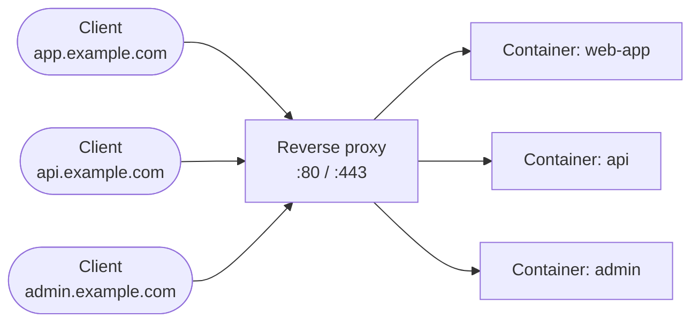
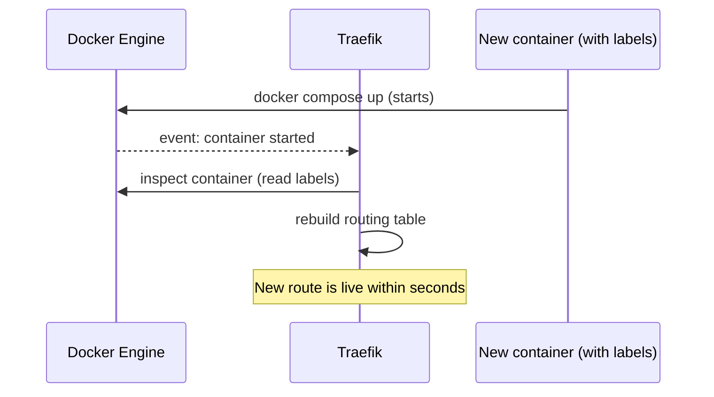

# Pourquoi un reverse proxy (et pourquoi Traefik)

Tu maîtrises déjà Docker : images, `docker compose`, réseaux, volumes. Tu sais lancer
cinq conteneurs qui tournent chacun très bien tout seuls. Le problème arrive quand il
faut les exposer **au monde extérieur, sur un seul serveur** : le port 80 (HTTP) et le
port 443 (HTTPS) ne peuvent être occupés que par **un seul processus** à la fois.

## Le problème sans reverse proxy

Sans intermédiaire, chaque service doit vivre sur son propre port :

```
https://mon-serveur.example.com:8081   -> app web
https://mon-serveur.example.com:8082   -> API
https://mon-serveur.example.com:8083   -> dashboard admin
```

C'est moche (personne ne retient un numéro de port), ça complique le DNS, et **chaque
service doit gérer son propre certificat TLS**. Ça ne passe pas à l'échelle.

## Le principe du reverse proxy

Un **reverse proxy** est le seul processus qui écoute sur 80/443. Il reçoit **toutes**
les requêtes, regarde le `Host` (le nom de domaine demandé) ou le chemin de l'URL, et
**redirige en interne** vers le bon conteneur — qui, lui, n'a besoin d'exposer aucun
port public.



> **Repère —** un seul point d'entrée public, N services en interne. Le reverse proxy
> est le seul conteneur avec des ports publiés (`ports:` dans son `docker-compose.yml`) ;
> tous les autres restent sur le réseau Docker interne, invisibles depuis l'extérieur.

## Pourquoi pas simplement nginx ?

Tu connais peut-être déjà nginx comme reverse proxy. La différence avec Traefik n'est
pas une question de performance : c'est une question de **façon de configurer**.

**nginx : configuration statique.** Tu écris un fichier `nginx.conf` (ou un fichier par
site dans `sites-available/`) qui décrit explicitement chaque backend :

```nginx
# nginx.conf — you write this by hand, for every service
server {
    server_name app.example.com;
    location / {
        proxy_pass http://web-app:3000;
    }
}
```

Quand tu ajoutes un nouveau conteneur, tu dois **éditer ce fichier à la main**, puis
recharger nginx (`nginx -s reload`) pour qu'il prenne en compte le changement. nginx ne
sait rien de Docker : il ne voit que le fichier qu'on lui a donné.

**Traefik : configuration dynamique.** Traefik se connecte à l'**API Docker** (le même
socket que `docker ps` utilise en coulisses) et **observe en continu** la liste des
conteneurs en cours d'exécution. Dès qu'un conteneur portant les bons labels démarre, sa
route apparaît **immédiatement** chez Traefik — sans redémarrage, sans fichier à éditer,
sans commande de reload.



> **Repère —** avec nginx, **le routage vit dans un fichier que tu maintiens**. Avec
> Traefik, **le routage vit dans les conteneurs eux-mêmes**, via leurs labels — c'est le
> conteneur qui s'annonce à Traefik, pas l'inverse. C'est tout l'objet de ce parcours :
> apprendre à écrire ces labels.

## À retenir

- Un reverse proxy centralise 80/443 et route vers les bons conteneurs internes, qui ne
  publient aucun port public.
- nginx = configuration **statique** (fichier à éditer + reload manuel à chaque
  changement de backend).
- Traefik = configuration **dynamique** : il lit l'API Docker en continu et se
  reconfigure automatiquement quand un conteneur démarre ou s'arrête.
- Ce mécanisme repose entièrement sur les **labels Docker** posés sur tes conteneurs —
  le sujet du module suivant.
