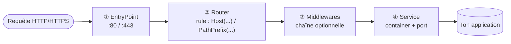

# L'architecture en 4 étages

Traefik traite chaque requête HTTP en la faisant traverser **quatre étages**, toujours
dans le même ordre. Comprendre ce pipeline, c'est comprendre 90 % de Traefik — tout le
reste n'est que du vocabulaire à poser dessus.



## 1. EntryPoint — le port d'écoute de Traefik lui-même

Un **EntryPoint** est un port que **Traefik ouvre** pour recevoir du trafic (typiquement
`:80` pour HTTP et `:443` pour HTTPS). C'est l'équivalent d'un `ports:` sur le conteneur
Traefik dans ton `docker-compose.yml` — sauf qu'il faut aussi le déclarer côté Traefik
pour qu'il sache quoi faire de ce qui arrive dessus.

## 2. Router — la règle de correspondance

Un **Router** examine la requête entrante (host demandé, chemin de l'URL, en-têtes…) et
décide : « est-ce que cette requête est pour moi ? ». Si oui, il la transmet — après
passage par ses middlewares — à un **Service**. La règle s'écrit avec des fonctions
comme `Host(...)` ou `PathPrefix(...)` (détail complet au module 2).

## 3. Middleware — la chaîne de traitement (optionnelle)

Entre le Router et le Service, une requête peut traverser une **chaîne de
middlewares** : redirection HTTPS, authentification, suppression d'un préfixe d'URL,
limitation de débit… Un router peut n'avoir **aucun** middleware (transmission directe)
ou en enchaîner plusieurs (module 3 entier dédié à ce sujet).

## 4. Service — la définition du backend

Le **Service** décrit *où* envoyer la requête au final : quel(s) conteneur(s), sur quel
port. C'est la dernière étape avant que la requête n'atteigne réellement ton
application.

> **Repère —** retiens l'ordre avec la question que se pose Traefik à chaque étage :
> « **Sur quel port j'écoute ?** » (EntryPoint) → « **Est-ce que ça me concerne ?** »
> (Router) → « **Faut-il transformer/filtrer avant ?** » (Middleware) → « **Vers quel
> conteneur, quel port ?** » (Service).

## Configuration statique vs configuration dynamique — LE piège de débutant

C'est ici que la plupart des débutants se trompent, alors prenons le temps.

Traefik distingue **deux mondes de configuration** qui n'obéissent pas aux mêmes règles :

| | Configuration **statique** | Configuration **dynamique** |
|---|---|---|
| Contenu | EntryPoints, providers (`docker`, `file`…), certificate resolvers | Routers, Services, Middlewares |
| Où on l'écrit | `traefik.yml`, flags CLI, ou la section `command:` du conteneur **traefik** lui-même | **Labels** posés sur **tes autres conteneurs** |
| Pour la changer | il faut **redémarrer** le conteneur Traefik | **rien** : Traefik la relit en continu, en live |

```yaml
# docker-compose.yml — static config: lives on the Traefik service itself,
# requires a restart of this container to change.
services:
  traefik:
    image: traefik:v3
    command:
      - "--providers.docker=true"
      - "--entrypoints.web.address=:80"
      - "--entrypoints.websecure.address=:443"
```

```yaml
# docker-compose.yml — dynamic config: lives as LABELS on any OTHER container,
# picked up live, no restart of Traefik needed.
services:
  my-app:
    image: my-app:latest
    labels:
      - "traefik.enable=true"
      - "traefik.http.routers.my-app.rule=Host(`app.example.com`)"
```

> **Piège classique —** un débutant qui veut ajouter un nouvel EntryPoint (par exemple
> un port `:8080` dédié à une app) essaie souvent de le faire **via un label**. Ça ne
> marchera jamais : un EntryPoint est un port que Traefik doit ouvrir **au démarrage du
> processus**, donc c'est forcément de la configuration **statique** — un label arrive
> beaucoup trop tard dans le cycle de vie pour ça. Seuls les Routers, Services et
> Middlewares se déclarent en dynamique (labels).

## Le dashboard

Traefik expose un **dashboard** web (lecture seule par défaut) qui montre en direct tout
ce qu'il a découvert : la liste des Routers, des Services, des Middlewares actifs, et
leur état (healthy/unhealthy). C'est l'outil de débogage n°1 quand un label ne produit
pas l'effet attendu.

```yaml
# Enable it (development only — see module 4/5 for securing it in production)
command:
  - "--api.dashboard=true"
  - "--api.insecure=true"   # dev only: dashboard reachable without auth
```

> **Piège classique —** `--api.insecure=true` expose le dashboard **sans aucune
> authentification** sur le port de l'API. Pratique en local, à bannir en production
> (module 3 montre comment le protéger avec un middleware `basicauth` + une règle
> `Host`, module 5 l'assemble dans une vraie stack).

## À retenir

- Le pipeline est toujours : **EntryPoints → Routers → Middlewares → Services**.
- Configuration **statique** (EntryPoints, providers, certresolvers) : sur le conteneur
  Traefik, redémarrage requis pour changer.
- Configuration **dynamique** (Routers, Services, Middlewares) : sur tes autres
  conteneurs, via des **labels**, appliquée en direct.
- Le dashboard montre en temps réel ce que Traefik a effectivement compris de tes
  labels — premier réflexe de débogage.
