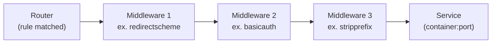

# La chaîne de middlewares

Entre le Router (qui décide « cette requête est pour moi ») et le Service (le
conteneur final), une requête peut traverser une **chaîne de middlewares** :
transformations, filtres, redirections, contrôles d'accès.



Chaque middleware peut **laisser passer**, **transformer** (l'URL, les en-têtes…) ou
**arrêter net** la requête (redirection, refus d'authentification). Un router peut
n'avoir **aucun** middleware, ou en enchaîner plusieurs, exécutés **dans l'ordre**
déclaré.

## Déclaration ≠ attachement — LE piège

C'est le piège n°1 sur les middlewares : **déclarer** un middleware ne suffit pas à
l'appliquer. Ce sont **deux labels distincts**, sur potentiellement deux lignes très
éloignées visuellement, qu'il faut toujours écrire en paire.

```yaml
labels:
  # 1. DECLARATION: defines a middleware named "my-app-auth", of type "basicauth"
  - "traefik.http.middlewares.my-app-auth.basicauth.users=admin:$$apr1$$...$$..."

  # 2. ATTACHMENT: without this line, the middleware above is defined but NEVER applied
  - "traefik.http.routers.my-app.middlewares=my-app-auth"
```

> **Piège classique — vérifié en conditions réelles.** Un middleware `basicauth`
> **déclaré** (label `traefik.http.middlewares.<nom>.basicauth.users=...`) mais **non
> attaché** à un router (label `traefik.http.routers.<router>.middlewares=<nom>`
> manquant) n'a **strictement aucun effet** : la route reste accessible sans
> authentification, sans qu'aucune erreur ne le signale nulle part. La déclaration et
> l'attachement sont deux labels **différents**, sur deux lignes différentes — les
> oublier de synchroniser est extrêmement fréquent en copiant-collant un exemple.

## Enchaîner plusieurs middlewares

Le label `middlewares` d'un router accepte une **liste séparée par des virgules**,
appliquée dans l'ordre :

```yaml
labels:
  - "traefik.http.middlewares.to-https.redirectscheme.scheme=https"
  - "traefik.http.middlewares.my-app-auth.basicauth.users=admin:$$apr1$$...$$..."
  - "traefik.http.routers.my-app.middlewares=to-https,my-app-auth"
```

Ici, chaque requête traverse d'abord `to-https` (redirection HTTPS le cas échéant), puis
`my-app-auth` (authentification) — dans cet ordre précis.

## Réutiliser un middleware sur plusieurs routers

Un middleware n'est pas lié à un seul router : il suffit de référencer le **même nom**
depuis plusieurs labels `middlewares` (même le déclarer sur un conteneur et l'attacher
depuis un autre est possible, tant que Traefik voit les deux — utile pour un middleware
« transversal », comme des en-têtes de sécurité communs à toute une stack).

## À retenir

- Une chaîne de middlewares s'exécute **dans l'ordre déclaré**, entre le Router et le
  Service.
- **Déclarer** un middleware (`traefik.http.middlewares.<nom>.<type>.<option>=...`) et
  l'**attacher** (`traefik.http.routers.<router>.middlewares=<nom>`) sont deux labels
  **distincts** — oublier le second rend le premier totalement inopérant, en silence.
- Plusieurs middlewares s'enchaînent avec une liste séparée par des virgules.
