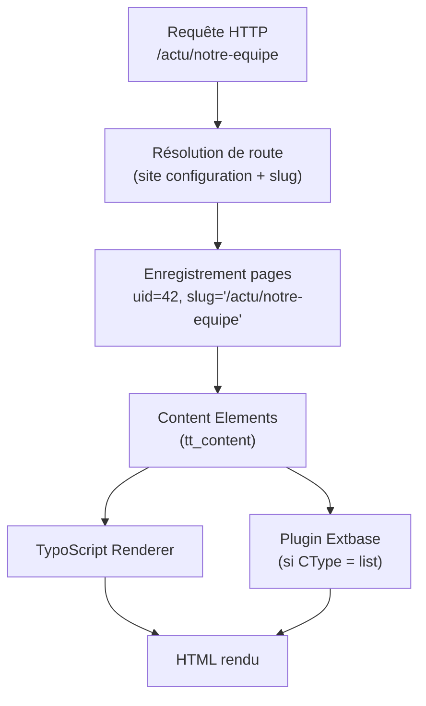
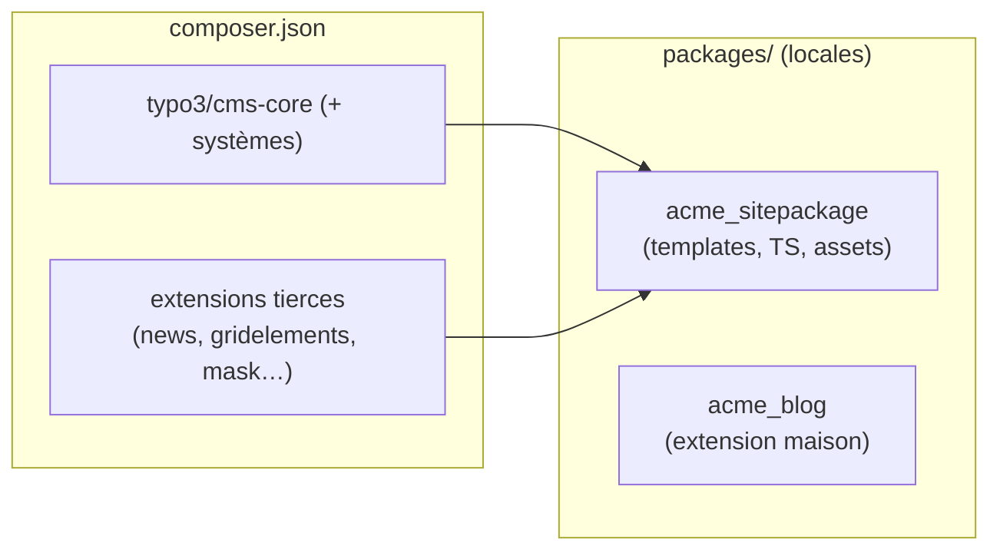
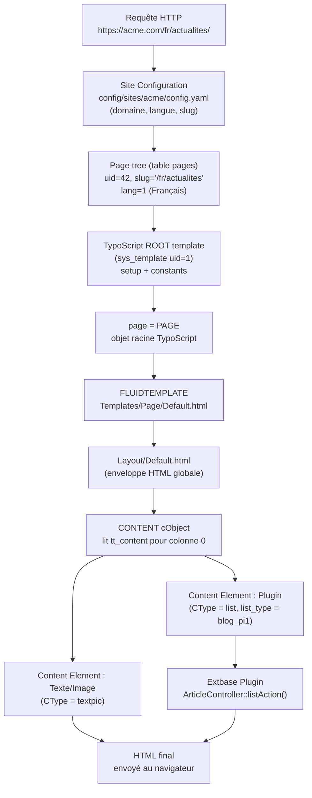

# Vue d'ensemble : TYPO3 vu d'un œil Symfony

Tu arrives sur TYPO3 avec 13 ans de Symfony. La bonne nouvelle : les concepts
fondamentaux sont proches (container de services, routing, templates Twig → Fluid,
Doctrine → Extbase/Doctrine). La mauvaise : les conventions de nommage, la configuration
déclarative et la notion de « page tree » n'ont pas d'équivalent Symfony. Ce module pose
le modèle mental avant de toucher la moindre ligne de code.

## La grande différence : l'arbre de pages est la source de vérité

En Symfony, le routeur lit tes annotations/attributs et décide quelle action appeler.
Dans TYPO3, **chaque URL correspond à une entrée dans l'arbre de pages** stockée en base
de données (table `pages`). Une page peut contenir des *content elements* (blocs de
contenu : texte, image, plugin…). Le routeur TYPO3 résout d'abord la page, puis les
plugins éventuels sur cette page.



> **Repère —** l'arbre de pages est persisté en BDD, pas dans des fichiers YAML. Sur une
> reprise de projet, la première chose à faire est de vider le cache et d'inspecter
> l'arbre dans le backend avant de lire le code.

## Anatomie d'une installation TYPO3

```
project-root/
├─ composer.json          # gère le core + les extensions (Composer mode)
├─ config/
│  └─ sites/
│     └─ acme/
│        └─ config.yaml   # site configuration (domaines, langues, routes)
├─ packages/              # extensions locales (sitepackage, extensions maison)
│  └─ acme_sitepackage/
├─ public/                # document root du serveur web
│  ├─ index.php
│  ├─ fileadmin/          # fichiers uploadés par les éditeurs
│  └─ typo3/              # symlink vers le core (Composer mode)
├─ var/
│  ├─ cache/              # caches générés (vider en premier si ça bug)
│  └─ log/
└─ vendor/                # dépendances Composer (dont le core TYPO3)
```

> **Repère —** en **Composer mode** (standard depuis TYPO3 10), le dossier `typo3/` dans
> `public/` n'est qu'un symlink ; le vrai code du core est dans `vendor/typo3/cms-*`.
> Si tu trouves un projet sans `composer.json` à la racine, tu es face à une **installation
> legacy** (mode « classic ») — voir le module 8 sur les reprises.

## Le core est découpé en extensions système

TYPO3 n'est pas un monolithe : même le core est un ensemble d'extensions :

| Extension système | Rôle |
|---|---|
| `cms-core` | API fondamentale (DataHandler, cache, hooks/events) |
| `cms-frontend` | Rendu frontend (TSFE, TypoScript renderer, Fluid) |
| `cms-backend` | Interface d'administration |
| `cms-extbase` | Framework MVC pour les extensions tierces |
| `cms-fluid` | Moteur de templates (ViewHelpers, partial, layout) |
| `cms-install` | Install Tool (mises à jour, wizard de base de données) |
| `cms-scheduler` | Tâches planifiées |
| `cms-filemetadata` | Métadonnées FAL (File Abstraction Layer) |

## Extensions tierces et extensions locales



Une **extension** est simplement un dossier avec un `ext_emconf.php` (ou `composer.json`
depuis TYPO3 12) et une structure conventionnelle. Ton sitepackage **est une extension**.

## Ce que tu ne trouves pas dans les fichiers

| En Symfony (fichiers) | En TYPO3 (BDD + cache) |
|---|---|
| `config/routes.yaml` | Table `pages` + site configuration |
| Contenu des pages | Table `tt_content` |
| Menus de navigation | Générés dynamiquement depuis `pages` |
| Configuration des plugins/modules | `tt_content.list_type` + TCA |

> **Repère —** si un éditeur te dit « la page ne s'affiche plus », la première réponse
> est toujours : **vider le cache** (Maintenance > Flush All Caches dans le backend, ou
> `vendor/bin/typo3 cache:flush` en CLI). Ensuite seulement, regarder les logs.

## Mapping Symfony → TYPO3 : la table de correspondance complète

Voici la vue d'ensemble des concepts que tu connais déjà et leurs équivalents TYPO3.
Les sections suivantes du parcours détaillent chaque point.

| Couche | Symfony | TYPO3 |
|---|---|---|
| **Persistance** | Doctrine ORM + attributs `#[ORM\Column]` | TCA (`Configuration/TCA/`) + mapping Extbase automatique |
| **Modèle** | `Entity` avec `#[ORM\Entity]` | `AbstractEntity` (Extbase), mapping piloté par TCA |
| **Repository** | `EntityRepository` (Doctrine) | `AbstractRepository` (Extbase QueryAPI) |
| **Événements** | `EventDispatcher` + `#[AsEventListener]` | PSR-14 Events (TYPO3 10+) + anciens Hooks (avant TYPO3 10) |
| **Templates** | Twig (`.html.twig`) | Fluid (`.html`) |
| **Configuration** | `services.yaml`, `config/packages/` | `Configuration/Services.yaml`, `ext_localconf.php`, `ext_tables.php` |
| **Bundle** | Symfony Bundle | Extension TYPO3 (dossier + `ext_emconf.php`) |
| **Container DI** | `services.yaml` avec autowire | `Configuration/Services.yaml` (même syntaxe Symfony) |
| **Routeur** | `config/routes.yaml` ou attributs | Site Configuration + Route Enhancers en YAML |
| **CLI** | `symfony console` / `bin/console` | `vendor/bin/typo3` |
| **Migrations BDD** | `doctrine:migrations:migrate` | `vendor/bin/typo3 database:updateschema` |

## Architecture de rendu : du page tree au HTML

Ce diagramme illustre comment une requête traverse le système, du page tree jusqu'au
HTML final rendu par Fluid. C'est le flux central à comprendre avant tout autre chose.



## Commandes CLI TYPO3 essentielles en mission d'agence

En reprenant un projet ou après un déploiement, ces commandes sont tes premières alliées.

```bash
# Flush all caches (first reflex on any TYPO3 issue)
vendor/bin/typo3 cache:flush

# Flush only frontend page caches (lighter, for content-only changes)
vendor/bin/typo3 cache:flush --group=pages

# Warm up caches after deployment
vendor/bin/typo3 cache:warmup

# Activate an extension (equivalent to backend Extension Manager)
vendor/bin/typo3 extension:activate acme_sitepackage

# Run setup for all active extensions (registers TCA, routes, etc.)
vendor/bin/typo3 extension:setup

# Apply pending database schema changes (ADD columns, CREATE tables — never DROP)
vendor/bin/typo3 database:updateschema

# Show all registered extensions and their status
vendor/bin/typo3 extension:list

# Dump current TypoScript setup for a given page (debug)
vendor/bin/typo3 typoscript:analyze --page-uid=1
```

> **Repère —** `database:updateschema` est l'équivalent de `doctrine:migrations:migrate`
> mais **il ne supprime jamais de colonnes sans confirmation explicite**. Après ajout d'une
> propriété dans un Model Extbase, tu dois toujours lancer cette commande pour créer la
> colonne correspondante en base.

## Cas concret d'agence : site multilingue avec deux domaines

La configuration multisite de TYPO3 repose sur `config/sites/`. Voici un exemple
représentatif d'une agence gérant un site FR/EN avec deux domaines distincts.

```yaml
# config/sites/acme/config.yaml
base: 'https://www.acme.com/'
rootPageId: 1
languages:
  -
    languageId: 0
    title: Français
    navigationTitle: FR
    base: 'https://www.acme.com/'
    locale: fr_FR.UTF-8
    iso-639-1: fr
    hreflang: fr-FR
    direction: ltr
    flag: fr
    typo3Language: fr
  -
    languageId: 1
    title: English
    navigationTitle: EN
    base: 'https://www.acme.com/en/'
    locale: en_GB.UTF-8
    iso-639-1: en
    hreflang: en-GB
    direction: ltr
    flag: gb
    typo3Language: default
    fallbackType: fallback
    fallbacks: '0'   # fall back to French if English translation is missing
```

Dans cet exemple, le fallback `fallbacks: '0'` garantit qu'une page non traduite
en anglais affiche quand même la version française plutôt qu'une erreur 404.

## À retenir

- TYPO3 résout les URLs via l'**arbre de pages en BDD**, pas un routeur de fichiers.
- En Composer mode, le document root est `public/` ; le core est dans `vendor/`.
- Le core lui-même est un ensemble d'extensions : comprendre cette modularité est clé.
- La première action sur n'importe quel projet TYPO3 : vider le cache, puis inspecter
  l'arbre de pages.
- Le mapping Symfony → TYPO3 est direct : Bundle → Extension, Doctrine → TCA/Extbase,
  EventDispatcher → PSR-14 Events, Twig → Fluid.
