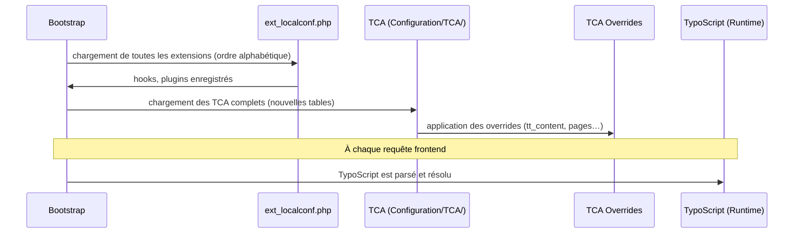

# Anatomie d'une extension TYPO3

Une extension TYPO3 suit une structure de dossiers très stricte. La connaître par cœur
évite 80 % des erreurs « fichier non trouvé » sur un projet repris.

## Structure canonique (TYPO3 12)

```
acme_myblog/
├─ composer.json               # déclaration Composer (type: typo3-cms-extension)
├─ ext_emconf.php              # métadonnées legacy (encore requis en TYPO3 12)
├─ ext_localconf.php           # hooks, plugins, icon registry (chargé très tôt)
├─ ext_tables.php              # TCA overrides globaux, backend modules (déprécié pour TCA)
├─ ext_tables.sql              # DDL SQL des nouvelles tables
│
├─ Configuration/
│  ├─ TCA/
│  │  ├─ tx_acmemyblog_domain_model_post.php   # TCA d'une nouvelle table
│  │  └─ Overrides/
│  │     ├─ pages.php           # override TCA de "pages"
│  │     └─ tt_content.php      # override TCA de "tt_content"
│  ├─ TypoScript/
│  │  ├─ setup.typoscript       # TS de configuration (rendu, conditions)
│  │  └─ constants.typoscript   # valeurs paramétrables (exposées dans le backend)
│  ├─ FlexForms/                # XML FlexForms (config UI des plugins)
│  ├─ Services.yaml             # DI container (symfony-style, depuis TYPO3 10)
│  └─ Icons.php                 # registration des icônes custom
│
├─ Classes/
│  ├─ Controller/               # Extbase controllers
│  ├─ Domain/
│  │  ├─ Model/                 # entités Extbase
│  │  └─ Repository/            # repositories Extbase
│  ├─ ViewHelpers/              # ViewHelpers Fluid custom
│  └─ EventListener/           # PSR-14 event listeners
│
├─ Resources/
│  ├─ Private/
│  │  ├─ Templates/            # templates Fluid (.html)
│  │  ├─ Partials/             # partials Fluid
│  │  ├─ Layouts/              # layouts Fluid
│  │  └─ Language/             # fichiers XLF de traduction
│  └─ Public/
│     ├─ Css/
│     ├─ JavaScript/
│     └─ Images/
│
└─ Tests/
   ├─ Unit/
   └─ Functional/
```

## Le fichier `ext_emconf.php`

Fichier hérité (pré-Composer), encore obligatoire en TYPO3 12.4 :

```php
<?php
// ext_emconf.php — extension metadata, required even in Composer mode
$EM_CONF[$_EXTKEY] = [
    'title'       => 'Acme SitePackage',
    'description' => 'Main sitepackage for the Acme website',
    'category'    => 'templates',
    'author'      => 'Acme Agency',
    'state'       => 'stable',
    'version'     => '1.0.0',
    'constraints' => [
        'depends' => [
            'typo3' => '12.4.0-12.4.99',
        ],
    ],
];
```

## Le fichier `composer.json` d'une extension

```json
{
    "name": "acme/myblog",
    "description": "Blog extension for Acme projects",
    "type": "typo3-cms-extension",
    "require": {
        "typo3/cms-core": "^12.4",
        "typo3/cms-extbase": "^12.4",
        "typo3/cms-fluid": "^12.4"
    },
    "extra": {
        "typo3/cms": {
            "extension-key": "acme_myblog"
        }
    },
    "autoload": {
        "psr-4": {
            "Acme\\Myblog\\": "Classes/"
        }
    }
}
```

> **Repère —** la clé `extension-key` dans `extra.typo3/cms` doit correspondre
> exactement au nom du dossier et à la variable `$_EXTKEY` dans `ext_emconf.php`.
> Une divergence ici crée des erreurs silencieuses très difficiles à diagnostiquer.

## Ordre de chargement



> **Repère —** si tu modifies un fichier TCA et que rien ne change, tu as oublié de
> **vider le cache** (les TCA sont mis en cache). La règle d'or : après toute
> modification de `Configuration/TCA/` ou `ext_localconf.php`, vider le cache système.

## Les deux types de TCA : nouveau vs override

| Fichier | Usage |
|---|---|
| `Configuration/TCA/ma_table.php` | Définit entièrement le TCA d'une **nouvelle** table |
| `Configuration/TCA/Overrides/tt_content.php` | Surcharge le TCA d'une table **existante** (core ou autre extension) |

**Règle impérative** : ne jamais modifier directement le TCA d'une table core dans
`ext_tables.php` (déprécié et dangereux). Passe toujours par `Configuration/TCA/Overrides/`.

## À retenir

- La structure de dossiers est conventionnelle et chargée automatiquement — respecte-la.
- `ext_emconf.php` reste obligatoire même en Composer mode.
- Les TCA de nouvelles tables : `Configuration/TCA/`. Les overrides : `Configuration/TCA/Overrides/`.
- Après tout changement de configuration : **vider le cache**.
