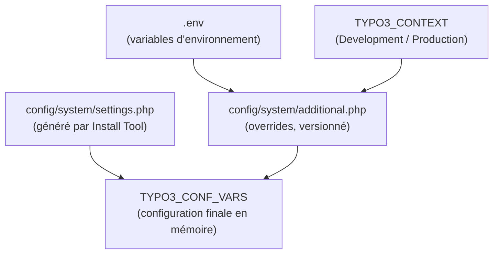

# Variables d'environnement et configuration multi-contexte

TYPO3 12 gère les environnements (dev/staging/prod) via un fichier `.env` et une API de
configuration inspirée de Symfony. En contexte agence, un même codebase tourne sur au
moins 3 serveurs différents — maîtriser cela évite les copier-coller de `LocalConfiguration.php`.

## Le fichier `.env`

```bash
# .env — project environment variables (never commit secrets)
TYPO3_DB_HOST=127.0.0.1
TYPO3_DB_PORT=3306
TYPO3_DB_NAME=acme_prod
TYPO3_DB_USERNAME=acme_user
TYPO3_DB_PASSWORD=secret

# Application context (determines which .env.* is loaded)
TYPO3_CONTEXT=Production
# Development: TYPO3_CONTEXT=Development
# Staging: TYPO3_CONTEXT=Production/Staging
```

TYPO3 lit les variables d'environnement via `getenv()` ou via le `Environment` API.
En Composer mode, le package `helhum/typo3-console` ou un simple `vlucas/phpdotenv` dans
`public/index.php` peut charger le `.env` automatiquement.

> **Repère —** TYPO3 possède sa propre notion de **contexte** (`TYPO3_CONTEXT`) qui
> peut être hiérarchique : `Production/Staging` est un sous-contexte de `Production`.
> Les conditions TypoScript peuvent tester ce contexte (ex. activer le débogage
> uniquement en Development).

## `AdditionalConfiguration.php`

Le fichier `public/typo3conf/AdditionalConfiguration.php` (ou `config/system/additional.php`
en TYPO3 12) surcharge la `LocalConfiguration.php` générée par l'Install Tool. C'est ici
qu'on lit les variables d'environnement :

```php
<?php
// config/system/additional.php — environment-aware overrides
// This file is NOT auto-generated and should be version-controlled.

use TYPO3\CMS\Core\Core\Environment;

$context = Environment::getContext();

// Database credentials from environment variables
$GLOBALS['TYPO3_CONF_VARS']['DB']['Connections']['Default'] = [
    'driver'   => 'mysqli',
    'host'     => getenv('TYPO3_DB_HOST') ?: '127.0.0.1',
    'port'     => (int)(getenv('TYPO3_DB_PORT') ?: 3306),
    'dbname'   => getenv('TYPO3_DB_NAME') ?: 'typo3',
    'user'     => getenv('TYPO3_DB_USERNAME') ?: 'root',
    'password' => getenv('TYPO3_DB_PASSWORD') ?: '',
    'charset'  => 'utf8mb4',
];

// Debugging: only in Development context
if ($context->isDevelopment()) {
    $GLOBALS['TYPO3_CONF_VARS']['SYS']['devIPmask'] = '*';
    $GLOBALS['TYPO3_CONF_VARS']['SYS']['displayErrors'] = 1;
    $GLOBALS['TYPO3_CONF_VARS']['SYS']['sqlDebug'] = 1;
}

// Mail: use MailHog locally, real SMTP in Production
if ($context->isDevelopment()) {
    $GLOBALS['TYPO3_CONF_VARS']['MAIL']['transport'] = 'smtp';
    $GLOBALS['TYPO3_CONF_VARS']['MAIL']['transport_smtp_server'] = 'mailhog:1025';
} else {
    $GLOBALS['TYPO3_CONF_VARS']['MAIL']['transport'] = 'smtp';
    $GLOBALS['TYPO3_CONF_VARS']['MAIL']['transport_smtp_server'] = getenv('SMTP_HOST');
    $GLOBALS['TYPO3_CONF_VARS']['MAIL']['transport_smtp_username'] = getenv('SMTP_USER');
    $GLOBALS['TYPO3_CONF_VARS']['MAIL']['transport_smtp_password'] = getenv('SMTP_PASS');
}

// Encryption key (must be unique per installation, never commit the real value)
$GLOBALS['TYPO3_CONF_VARS']['SYS']['encryptionKey'] = getenv('TYPO3_ENCRYPTION_KEY');
```

## La `LocalConfiguration.php` : à ne pas committer

`public/typo3conf/LocalConfiguration.php` (ou `config/system/settings.php` en v12) est
**généré par l'Install Tool**. Il contient la clé d'encryption et les credentials BDD
saisis lors de l'installation. Ne jamais le committer.

```
# .gitignore
config/system/settings.php
public/typo3conf/LocalConfiguration.php
.env
.env.local
```

## Résumé du flux de configuration



## À retenir

- Credentials BDD et `encryptionKey` passent par des variables d'environnement.
- `additional.php` est versionné et lit `getenv()` ; `settings.php` ne l'est pas.
- `TYPO3_CONTEXT` permet de brancher dev/staging/prod sans modifier le code.
- Ne jamais committer `settings.php`, `LocalConfiguration.php`, ni `.env`.
