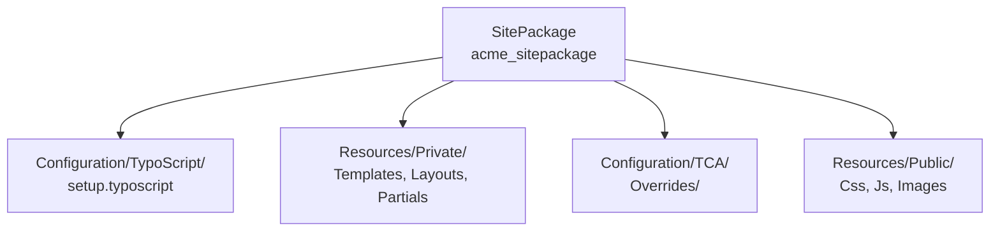
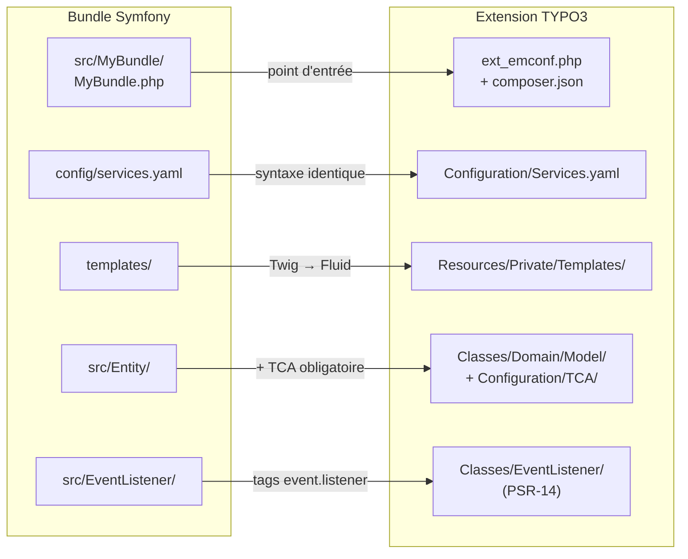

# Qu'est-ce qu'un SitePackage ?

En contexte agence, chaque projet a son propre design, ses propres templates, sa propre
configuration TypoScript. La convention TYPO3 pour centraliser tout cela dans une seule
extension versionnée s'appelle le **SitePackage**.

## Définition

Un SitePackage est une **extension TYPO3 locale** qui rassemble :

- Les **templates Fluid** (HTML de base, layouts, partials)
- La **configuration TypoScript** (rendu du frontend, références aux templates)
- Les **assets** (CSS, JS, images — référencés via TypoScript ou inclus via la pipeline)
- Les overrides TCA spécifiques au projet
- La configuration des content elements personnalisés



> **Repère —** en agence, le SitePackage est la première chose à créer sur un projet
> (avant même d'installer des extensions tierces). Il remplace l'ancienne pratique de
> modifier `fileadmin/templates/` directement — ce qui était ingérable sous Git.

## Pourquoi pas directement dans `fileadmin/` ?

`fileadmin/` est géré par le FAL (File Abstraction Layer) et ses fichiers sont destinés
aux **éditeurs**. Les templates et la configuration sont du **code source** : ils doivent
être dans Git, pas dans un dossier uploadé par les éditeurs.

| `fileadmin/` | `packages/acme_sitepackage/` |
|---|---|
| Géré par les éditeurs | Géré par les développeurs |
| Hors Git (optionnel) | Dans Git (obligatoire) |
| Backups de fichiers | Versionné, déployable |
| Pas de namespace PHP | Namespace, autoload PSR-4 |

## Structure minimale d'un SitePackage

```
packages/acme_sitepackage/
├─ composer.json
├─ ext_emconf.php
├─ ext_localconf.php          # (optionnel si pas de plugins)
│
├─ Configuration/
│  ├─ TypoScript/
│  │  ├─ setup.typoscript     # configuration du rendu
│  │  └─ constants.typoscript # valeurs paramétrables
│  └─ TCA/
│     └─ Overrides/
│        └─ sys_template.php  # auto-inclusion du TypoScript
│
└─ Resources/
   └─ Private/
      ├─ Templates/
      │  └─ Page/
      │     └─ Default.html   # template de page principal
      ├─ Layouts/
      │  └─ Default.html      # layout HTML global (<html>, <head>, <body>)
      └─ Partials/
         └─ Navigation/
            └─ Main.html      # menu de navigation
```

## Enregistrement dans `composer.json` principal

```json
{
    "repositories": [
        {
            "type": "path",
            "url": "packages/*"
        }
    ],
    "require": {
        "acme/sitepackage": "@dev"
    }
}
```

Puis :

```bash
# Register the local extension with Composer
composer require acme/sitepackage:@dev
vendor/bin/typo3 extension:setup
```

> **Repère —** le `"type": "path"` dans `repositories` indique à Composer de chercher
> les packages dans `packages/*/composer.json` localement, sans passer par Packagist.
> `@dev` signifie « utilise la version locale telle quelle ». [source: docs.typo3.org]

## Auto-inclusion du TypoScript via TCA Override

Pour que le TypoScript du SitePackage soit inclus automatiquement sur tous les sites,
on utilise un override TCA sur la table `sys_template` :

```php
<?php
// Configuration/TCA/Overrides/sys_template.php
// Auto-include this sitepackage's TypoScript in every TypoScript root template

\TYPO3\CMS\Core\Utility\ExtensionManagementUtility::addStaticFile(
    'acme_sitepackage',                              // extension key
    'Configuration/TypoScript/',                     // path to TS files
    'Acme SitePackage'                               // label in backend
);
```

Ensuite, dans le backend : Web > Template > Edit TypoScript Record > Include, cocher
« Acme SitePackage » dans la liste des includes statiques.

## Mapping Symfony Bundle → Extension TYPO3

Si tu crées une extension pour la première fois après des années de Symfony, voici
comment tes habitudes de Bundle se transposent.



La différence fondamentale : en Symfony, un Bundle peut s'ignorer si la DI n'est pas
configurée pour lui. En TYPO3, une extension **doit être activée** (dans la table
`sys_ext` via `extension:activate`) pour que son `ext_localconf.php` et ses TCA soient
chargés.

## Cas concret : backend layout 2 colonnes

En agence, les maquettes demandent souvent des mises en page avec des colonnes séparées
(en-tête + contenu principal + sidebar). TYPO3 gère cela via les **Backend Layouts**,
qui définissent dans quelles colonnes les éditeurs peuvent placer leurs blocs.

```php
<?php
// Configuration/TCA/Overrides/pages.php
// Register a backend layout usable on any page in the site

\TYPO3\CMS\Core\Utility\ExtensionManagementUtility::addTcaSelectItem(
    'pages',
    'backend_layout',
    [
        'label'  => 'LLL:EXT:acme_sitepackage/Resources/Private/Language/locallang.xlf:backendLayout.twoColumns',
        'value'  => 'acme_sitepackage__two_columns',
        'icon'   => 'EXT:acme_sitepackage/Resources/Public/Icons/BackendLayouts/two-columns.svg',
    ]
);
```

```typoscript
# Configuration/TypoScript/setup.typoscript
# Map the backend layout key to a different Fluid template
[page["backend_layout"] == "acme_sitepackage__two_columns"]
    page.10.templateName = TwoColumns
[end]

# TwoColumns template renders column 0 (main) and column 1 (sidebar)
page.10.variables {
    colMain = CONTENT
    colMain {
        table = tt_content
        select.where = colPos = 0
    }
    colSidebar = CONTENT
    colSidebar {
        table = tt_content
        select.where = colPos = 1
    }
}
```

```html
<!-- Resources/Private/Templates/Page/TwoColumns.html -->
<f:layout name="Default" />
<f:section name="Main">
    <div class="layout-two-columns">
        <main class="col-main">
            <f:format.raw>{colMain}</f:format.raw>
        </main>
        <aside class="col-sidebar">
            <f:format.raw>{colSidebar}</f:format.raw>
        </aside>
    </div>
</f:section>
```

Le Backend Layout est sélectionné par l'éditeur dans les propriétés de la page
(onglet « Apparence »). TYPO3 bascule automatiquement sur le template Fluid correspondant.

## ⚠️ Piège agence — migration TYPO3 10→11 : `addStaticFile` et auto-include

Avant TYPO3 11, certains projets utilisaient un `ext_tables.php` pour inclure le
TypoScript directement sans passer par `addStaticFile`. Cette approche était dépréciée
dès TYPO3 10 et **supprimée en TYPO3 12**.

```php
<?php
// ANCIEN code (TYPO3 < 10) — NE PAS reproduire en TYPO3 11/12
// ext_tables.php (fichier lui-même déprécié en TYPO3 12)
\TYPO3\CMS\Core\Utility\ExtensionManagementUtility::addTypoScriptSetup(
    '@import "EXT:acme_sitepackage/Configuration/TypoScript/setup.typoscript"'
);
```

```php
<?php
// CORRECT pour TYPO3 11+ : toujours passer par TCA Override
// Configuration/TCA/Overrides/sys_template.php
\TYPO3\CMS\Core\Utility\ExtensionManagementUtility::addStaticFile(
    'acme_sitepackage',
    'Configuration/TypoScript/',
    'Acme SitePackage'
);
```

En TYPO3 12, `ext_tables.php` est toujours chargé mais les fonctions qui y étaient
traditionnellement placées ont migré vers `Configuration/TCA/Overrides/` et
`Configuration/Services.yaml`. Si tu reprends un projet TYPO3 10 à migrer, liste
tous les `ext_tables.php` et planifie leur refactorisation.

## À retenir

- Le SitePackage centralise templates, TypoScript et TCA overrides dans une extension
  versionnée sous Git.
- Il est déclaré en `"type": "path"` dans `composer.json` pour les extensions locales.
- `ext_emconf.php` + `composer.json` d'extension sont tous les deux nécessaires.
- Le TypoScript s'inclut via `addStaticFile()` + sélection dans le backend.
- Les Backend Layouts permettent aux éditeurs de choisir une mise en page par page
  sans toucher au code.
- En migration TYPO3 10→12 : purger les `ext_tables.php` et les `addTypoScriptSetup`
  directs.
