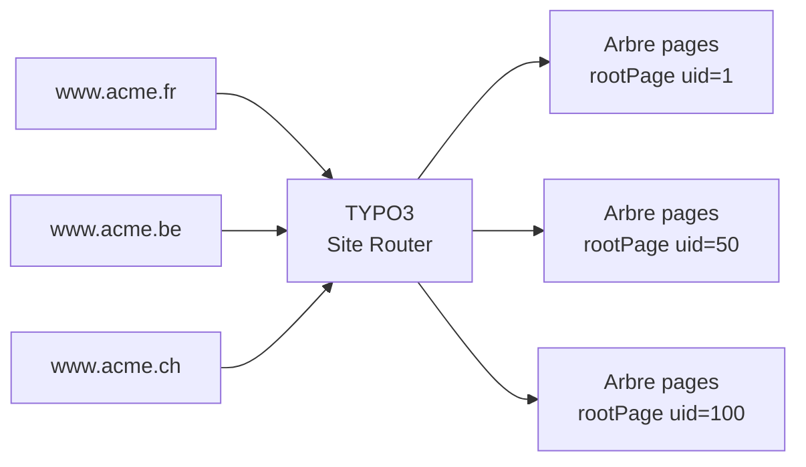

# Site Configuration : domaines, langues, routes

La **Site Configuration** (`config/sites/<identifier>/config.yaml`) est la "colonne
vertébrale" d'un site TYPO3 12. Elle relie un domaine web à une page racine de l'arbre
et déclare les langues disponibles.

## Structure du fichier `config.yaml`

```yaml
# config/sites/acme/config.yaml
# [source: docs.typo3.org]
base: 'https://www.acme.com/'           # base URL of the site
rootPageId: 1                            # uid of the root page in the page tree

# Language configuration
languages:
  -
    title: 'Français'
    enabled: true
    languageId: 0                        # default language is always 0
    base: '/'
    locale: 'fr_FR.UTF-8'
    iso-639-1: 'fr'
    websiteTitle: 'Acme — Site officiel'
    hreflang: 'fr-FR'
    direction: ''
    flag: 'fr'
    navigationTitle: 'FR'
  -
    title: 'English'
    enabled: true
    languageId: 1
    base: '/en/'
    locale: 'en_GB.UTF-8'
    iso-639-1: 'en'
    websiteTitle: 'Acme — Official website'
    hreflang: 'en-GB'
    direction: ''
    flag: 'gb'
    navigationTitle: 'EN'

# Error handling
errorHandling:
  -
    errorCode: 404
    errorHandler: 'Page'                 # use a TYPO3 page as 404
    errorContentSource: 't3://page?uid=99'
  -
    errorCode: 403
    errorHandler: 'PHP'
    errorPhpClassFQCN: 'Acme\Sitepackage\Error\AccessDeniedHandler'

# Routing enhancers (human-readable URLs for plugins)
routeEnhancers:
  AcmeNewsPlugin:
    type: Extbase
    extension: AcmeNews
    plugin: List
    routes:
      -
        routePath: '/article/{article_title}'
        _controller: 'News::detail'
        _arguments:
          article_title: article
    defaultController: 'News::list'
    aspects:
      article_title:
        type: PersistedAliasMapper
        tableName: tx_acmenews_domain_model_article
        routeFieldName: slug
```

## Multi-domaine dans un seul TYPO3

En agence, il est courant d'héberger plusieurs sites dans une installation TYPO3
(multi-tenant). Chaque site a son propre `config.yaml` :

```
config/
└─ sites/
   ├─ acme-fr/
   │  └─ config.yaml      # base: https://www.acme.fr/, rootPageId: 1
   ├─ acme-be/
   │  └─ config.yaml      # base: https://www.acme.be/, rootPageId: 50
   └─ acme-ch/
      └─ config.yaml      # base: https://www.acme.ch/, rootPageId: 100
```



## Les routeEnhancers : URLs propres pour les plugins

Sans `routeEnhancers`, une page de détail d'article ressemble à :
`/actualites?tx_news_pi1[action]=detail&tx_news_pi1[controller]=News&tx_news_pi1[news]=42`

Avec un routeEnhancer `Extbase`, on obtient `/actualites/titre-de-larticle`.

> **Repère —** les `routeEnhancers` sont définis dans la Site Configuration, pas dans
> le TypoScript. C'est un piège fréquent sur les migrations depuis TYPO3 9 où les
> « RealURL » étaient configurés différemment.

## Éditer la Site Configuration

La Site Configuration peut être gérée via :

1. **Le backend** : Site Management > Sites (interface graphique depuis TYPO3 10)
2. **Directement le YAML** (recommandé en contexte agence) : versionné dans Git

> **Repère —** si tu édites le YAML manuellement, vide le cache ensuite
> (`vendor/bin/typo3 cache:flush`). TYPO3 met en cache la site configuration résolue.

## À retenir

- Chaque site = un `config/sites/<id>/config.yaml` lié à une `rootPageId`.
- La langue `languageId: 0` est toujours la langue par défaut.
- Les `routeEnhancers` remplacent les anciennes extensions RealURL/CoolUri.
- Le fichier YAML doit être commité dans Git — c'est de la configuration, pas du contenu.
