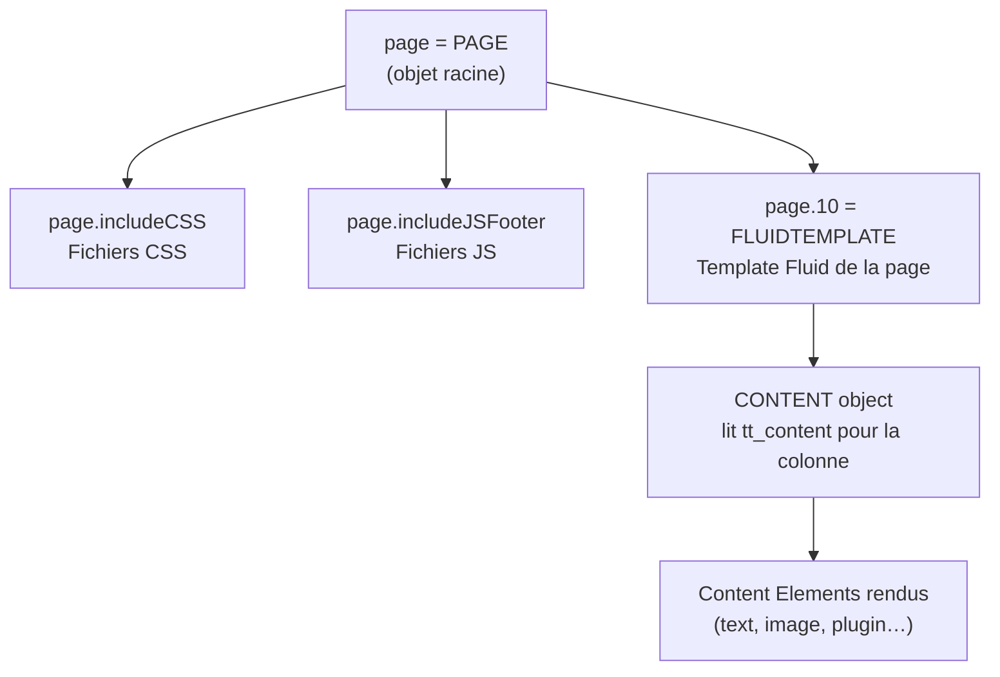
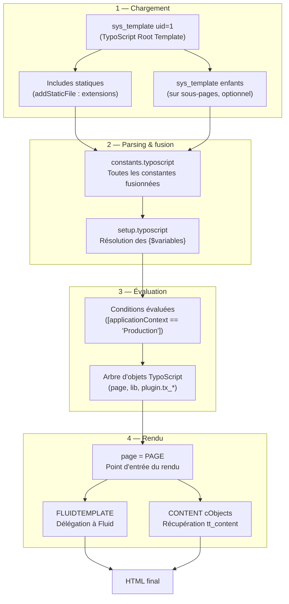

# Modèle mental TypoScript

TypoScript est probablement ce qui déroute le plus un développeur Symfony qui arrive sur
TYPO3. Ce n'est ni un langage de programmation, ni un template engine — c'est un **langage
de configuration déclaratif** qui décrit une **arborescence d'objets de rendu**.

## Ce que TypoScript n'est pas

- Ce n'est pas du PHP.
- Ce n'est pas du Twig/Fluid.
- Ce n'est pas des routes.
- Ce n'est pas du CSS (malgré la syntaxe similaire en surface).

## Ce que TypoScript est

TypoScript est un **arbre de clés-valeurs** qui configure le pipeline de rendu TYPO3.
Chaque nœud de l'arbre est soit une valeur scalaire, soit un **objet TypoScript** (cObject)
qui sait se rendre en HTML.

```typoscript
# The root "page" object defines how a TYPO3 page is rendered
page = PAGE
page {
    # Include a CSS file
    includeCSS {
        main = EXT:acme_sitepackage/Resources/Public/Css/main.css
        main.media = all
    }

    # Include a JS file in the footer
    includeJSFooter {
        app = EXT:acme_sitepackage/Resources/Public/JavaScript/app.js
    }

    # Render the page body via a Fluid template
    10 = FLUIDTEMPLATE
    10 {
        templateName = Default
        templateRootPaths.0 = EXT:acme_sitepackage/Resources/Private/Templates/Page/
        partialRootPaths.0  = EXT:acme_sitepackage/Resources/Private/Partials/
        layoutRootPaths.0   = EXT:acme_sitepackage/Resources/Private/Layouts/
    }
}
```

> **Repère —** `page = PAGE` déclare que la variable `page` est de type `PAGE` (un
> cObject qui rend une page entière). `page.10 = FLUIDTEMPLATE` est le premier rendu
> numéroté (les nombres définissent l'ordre). `EXT:` est un préfixe qui résout le
> chemin absolu vers une extension. [source: docs.typo3.org]

## La syntaxe de base

```typoscript
# Assignment
lib.myText = TEXT
lib.myText.value = Hello World

# Block assignment (equivalent to the above)
lib.myText {
    value = Hello World
    wrap = <p>|</p>
}

# Copy an object
lib.myTextCopy < lib.myText

# Condition (context-based)
[applicationContext == "Development"]
    page.config.debug = 1
[end]

# Include another TypoScript file
@import 'EXT:acme_sitepackage/Configuration/TypoScript/Includes/*.typoscript'
```

## Les objets cObject principaux

| cObject | Rôle |
|---|---|
| `TEXT` | Rend une valeur texte avec `stdWrap` optionnel |
| `COA` | Content Object Array : combine plusieurs cObjects |
| `FLUIDTEMPLATE` | Délègue le rendu à un template Fluid (cas le plus courant) |
| `RECORDS` | Récupère et rend des enregistrements BDD |
| `CONTENT` | Rend les content elements d'une colonne de page |
| `IMAGE` | Rend une image via le FAL avec traitement |
| `HMENU` | Génère des menus de navigation |
| `USER` | Appelle une méthode PHP (userFunc) |

## Rendu d'une page typique



## TypoScript Constants vs Setup

| Fichier | Rôle |
|---|---|
| `constants.typoscript` | Déclare des **variables** éditables dans le backend (Constants Editor) |
| `setup.typoscript` | Configuration **effective** du rendu, peut utiliser `{$ma.constante}` |

```typoscript
# constants.typoscript — editable in the backend Constants Editor
plugin.tx_acme.settings.itemsPerPage = 10
plugin.tx_acme.settings.dateFormat = d/m/Y

# setup.typoscript — uses constants with {$ }
plugin.tx_acme {
    settings {
        itemsPerPage = {$plugin.tx_acme.settings.itemsPerPage}
        dateFormat    = {$plugin.tx_acme.settings.dateFormat}
    }
}
```

> **Repère —** les constantes TypoScript sont éditables par les administrateurs dans
> Web > Template > Constants Editor, **sans toucher au code**. Utilise cette mécanique
> pour exposer les paramètres que les chefs de projet veulent ajuster (couleurs,
> pagination, etc.).

## Pipeline TypoScript complet : de la configuration au HTML

Ce diagramme montre comment les fichiers TypoScript sont chargés, fusionnés, puis
évalués pour produire le rendu. C'est important en mission de débogage.



## Cas concret d'agence : `lib.*` pour les blocs réutilisables

En agence, on utilise souvent `lib.*` pour définir des fragments TypoScript réutilisables
(navigation, breadcrumb, contenu d'une sidebar) qu'on référence depuis le template Fluid.

```typoscript
# setup.typoscript — define reusable TypoScript objects in lib.*

# Breadcrumb menu rendered as an unordered list
lib.breadcrumb = HMENU
lib.breadcrumb {
    special = rootline
    special.range = 0|-1
    1 = TMENU
    1.wrap = <ol class="breadcrumb">|</ol>
    1.NO {
        wrapItemAndSub = <li class="breadcrumb-item">|</li>
        ATagTitle.field = title
    }
    1.CUR = 1
    1.CUR {
        wrapItemAndSub = <li class="breadcrumb-item active" aria-current="page">|</li>
        doNotLinkIt = 1
    }
}

# Sidebar content: render tt_content from column 1 (colPos=1)
lib.sidebarContent = CONTENT
lib.sidebarContent {
    table = tt_content
    select {
        orderBy = sorting
        where = colPos = 1
        languageField = sys_language_uid
    }
}
```

Utilisation depuis un template Fluid via TypoScript :

```typoscript
# Inject lib.* objects as Fluid template variables
page.10.variables {
    breadcrumb   =< lib.breadcrumb
    sidebarContent =< lib.sidebarContent
}
```

```html
<!-- Resources/Private/Partials/Navigation/Breadcrumb.html -->
<!-- lib.breadcrumb is already rendered HTML, output raw -->
<f:format.raw>{breadcrumb}</f:format.raw>
```

## ⚠️ Piège agence — migration TYPO3 10→11 : stdWrap et `getText`

TYPO3 10 a renommé ou déprécié plusieurs propriétés `stdWrap`. Si tu reprends un projet
TYPO3 8/9, les `stdWrap.data` avec certains types `getText` ont changé de syntaxe.

```typoscript
# ANCIEN (TYPO3 < 10) — peut lever une deprecation notice en TYPO3 11
lib.pageTitle = TEXT
lib.pageTitle.data = page:title

# MODERNE (TYPO3 10+) — syntaxe recommandée
lib.pageTitle = TEXT
lib.pageTitle.data = page : title
# OR use field directly:
lib.pageTitle.field = title
```

De même, les conditions ont changé de syntaxe entre TYPO3 9 et TYPO3 10 :

```typoscript
# ANCIEN format condition (TYPO3 < 10, EXT:TypoScript conditions syntax)
[globalVar = TSFE:id = 42]
    page.10.templateName = Special
[global]

# MODERNE (TYPO3 10+ — Symfony ExpressionLanguage)
[traverse(page, "uid") == 42]
    page.10.templateName = Special
[end]
```

> **Repère —** si en reprenant un projet tu vois des conditions entre `[` et `[global]`
> (sans `[end]`), tu es sur du TYPO3 9 ou antérieur. La syntaxe `[end]` est obligatoire
> depuis TYPO3 10. Un `cache:flush` ne suffit pas : il faut migrer les conditions.

## À retenir

- TypoScript est un **langage de configuration**, pas un langage de programmation.
- `page = PAGE` est le point d'entrée du rendu frontend.
- `FLUIDTEMPLATE` délègue le rendu aux templates Fluid — c'est le standard moderne.
- `EXT:` résout les chemins vers les extensions.
- Constants = variables éditables ; Setup = configuration effective.
- `lib.*` sert à définir des blocs réutilisables injectés comme variables dans Fluid.
- En migration TYPO3 9→10+ : migrer les anciennes conditions `[global]` vers `[end]`.
