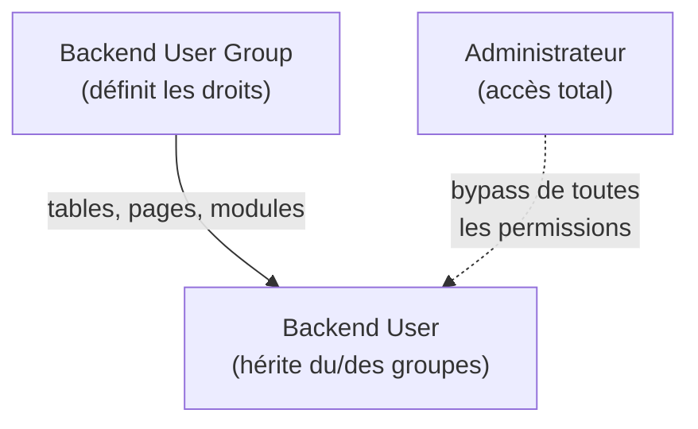

# Gestion des éditeurs et groupes backend

En contexte agence, tu livres un TYPO3 que des **éditeurs non-techniques** vont utiliser
quotidiennement. Configurer correctement les permissions backend évite 80 % des tickets
de support « je ne trouve pas le bouton ».

## Architecture des permissions TYPO3



TYPO3 distingue :
- **Administrateurs** : accès total, pas de restriction de permissions.
- **Éditeurs** : membres de groupes ; les droits sont cumulatifs (union de tous les
  groupes dont l'utilisateur est membre).

## Ce qu'un groupe backend contrôle

| Onglet dans le groupe | Ce qu'on configure |
|---|---|
| Access Lists > Tables (modify) | Tables BDD que l'éditeur peut modifier (ex. `tt_content`, `pages`) |
| Access Lists > Table fields | Colonnes TCA visibles/modifiables |
| Access Lists > Modules | Modules du backend accessibles (Web > Page, Web > List…) |
| Mounts > DB mounts | Sous-arbre de pages accessible (ex. uid=5 = section France seulement) |
| Mounts > File mounts | Dossiers `fileadmin/` accessibles en upload |
| Explicit deny/allow | Permissions fines sur les CTypes, plugins, champs |

## Créer un groupe éditeur standard

Dans le backend : Backend Users > Backend User Groups > Create new group.

Points essentiels pour un éditeur de contenu standard :

1. **Tables à modifier** : `pages`, `tt_content`, `sys_file_reference`, `sys_category`
2. **Modules** : Web > Page, Web > List (optionnel), File > Filelist
3. **DB Mount** : la page racine du site (ou une section spécifique)
4. **File Mount** : `fileadmin/user_uploads/`
5. **CTypes autorisés** : `text`, `textmedia`, `bullets`, `table`, `shortcut` — et les
   CTypes du SitePackage si tu en as créé. Utiliser « Explicit allow » pour restreindre.

> **Repère —** en agence, crée toujours un groupe `Éditeur standard` et un groupe
> `Administrateur éditorial` (peut créer des pages, modifier les menus) — n'utilise
> les comptes administrateur TYPO3 que pour les développeurs. Un éditeur avec les droits
> admin peut vider le cache, modifier le TypoScript et casser la prod.

## Restreindre l'accès à certaines pages

Les permissions de pages sont gérées **par page** dans le backend (Web > Access) :

```
Page "Offres d'emploi" → Propriétaire : groupe RH
                        → Lecture : tout le monde
                        → Modification : groupe RH uniquement
```

Pour automatiser cela via le TCA, utilise `perms_everybody`, `perms_user`, `perms_group`
dans les valeurs par défaut d'une page.

## FlexForms : configuration UI par plugin

Les FlexForms permettent d'ajouter une interface de configuration directement dans
le formulaire d'un content element (plugin) sans créer de table supplémentaire :

```xml
<!-- Configuration/FlexForms/PluginSettings.xml -->
<?xml version="1.0" encoding="UTF-8"?>
<T3DataStructure>
    <sheets>
        <sDEF>
            <ROOT>
                <TCEforms>
                    <sheetTitle>Settings</sheetTitle>
                </TCEforms>
                <type>array</type>
                <el>
                    <settings.storageUid>
                        <TCEforms>
                            <label>Storage folder (PID)</label>
                            <config>
                                <type>group</type>
                                <allowed>pages</allowed>
                                <size>1</size>
                                <maxitems>1</maxitems>
                            </config>
                        </TCEforms>
                    </settings.storageUid>
                    <settings.itemsPerPage>
                        <TCEforms>
                            <label>Items per page</label>
                            <config>
                                <type>input</type>
                                <eval>int</eval>
                                <default>10</default>
                            </config>
                        </TCEforms>
                    </settings.itemsPerPage>
                </el>
            </ROOT>
        </sDEF>
    </sheets>
</T3DataStructure>
```

Enregistrement du FlexForm dans le TCA Override :

```php
<?php
// Configuration/TCA/Overrides/tt_content.php
\TYPO3\CMS\Core\Utility\ExtensionManagementUtility::addPiFlexFormValue(
    '*',                                               // plugin signature (all)
    'FILE:EXT:acme_blog/Configuration/FlexForms/PluginSettings.xml',
    'acmeblog_list'                                    // list_type value
);
```

> **Repère —** les valeurs FlexForm sont stockées dans `tt_content.pi_flexform` comme
> du XML sérialisé. Pour les lire dans un Controller Extbase, TYPO3 les injecte
> automatiquement dans `$this->settings` si tu utilises la convention de nommage
> `settings.<clé>`. [source: docs.typo3.org]

## À retenir

- Ne jamais donner les droits Admin TYPO3 à un éditeur de contenu.
- Un groupe backend contrôle : tables, champs, modules, montages de pages et fichiers.
- Crée au minimum deux niveaux : « Éditeur » et « Administrateur éditorial ».
- Les FlexForms exposent une interface de configuration par plugin dans le content element.
- Les valeurs FlexForm → `$this->settings` dans les Controllers Extbase.
