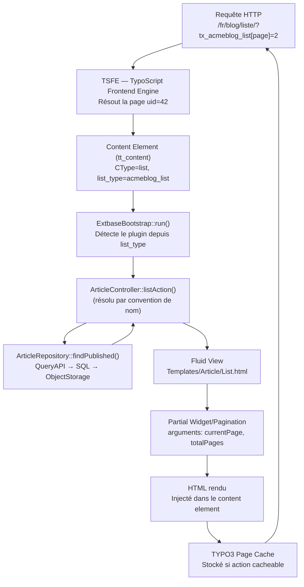
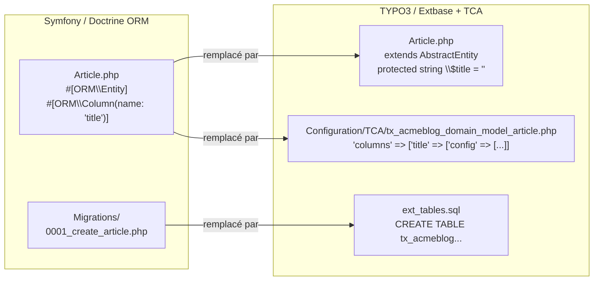

# Extbase MVC : le Symfony du TYPO3

Extbase est le framework MVC intégré à TYPO3. Si tu viens de Symfony, tu retrouveras
les concepts : Controller, Model (Entity), Repository, Dependency Injection, Domain
Events. Les différences sont surtout dans la convention de nommage et l'intégration
au cycle de vie TYPO3.

## Les correspondances Symfony ↔ Extbase

| Symfony | Extbase | Différence notable |
|---|---|---|
| `Entity` | `Model` (hérite `AbstractEntity`) | Le mapping BDD est déclaré dans le TCA, pas en attributs PHP |
| `Repository` (Doctrine) | `Repository` (hérite `AbstractRepository`) | Des méthodes magiques `findBy*` disponibles automatiquement |
| `Controller` | `ActionController` | Actions nommées `*Action()`, pas d'attribut routing |
| `Form` | FlexForm + TCA | Configuration XML (FlexForm) pour les plugins |
| `services.yaml` | `Configuration/Services.yaml` | Syntaxe identique, autoconfigure disponible |
| `Request` | `Request` (PSR-7 compatible) | Accès via injection, pas via `$_GET` |
| `Routing` | Route Enhancers (Site Configuration) | Déclaré en YAML, pas en PHP/attributs |

## Un Model Extbase

```php
<?php
// Classes/Domain/Model/Article.php
namespace Acme\Blog\Domain\Model;

use TYPO3\CMS\Extbase\DomainObject\AbstractEntity;
use TYPO3\CMS\Extbase\Persistence\ObjectStorage;

class Article extends AbstractEntity
{
    // Properties MUST match the TCA column names (snake_case → camelCase auto-mapping)
    protected string $title = '';
    protected string $teaser = '';
    protected string $bodytext = '';
    protected ?\DateTime $publishDate = null;

    // Relation 1-N: one article has many tags
    // ObjectStorage is the Extbase equivalent of Doctrine ArrayCollection
    protected ObjectStorage $tags;

    // FAL image relation
    protected ?\TYPO3\CMS\Extbase\Domain\Model\FileReference $image = null;

    public function __construct()
    {
        // ObjectStorage must be initialized in constructor
        $this->tags = new ObjectStorage();
    }

    public function getTitle(): string
    {
        return $this->title;
    }

    public function setTitle(string $title): void
    {
        $this->title = $title;
    }

    public function getBodytext(): string
    {
        return $this->bodytext;
    }

    public function getTags(): ObjectStorage
    {
        return $this->tags;
    }

    public function addTag(Tag $tag): void
    {
        $this->tags->attach($tag);
    }

    public function removeTag(Tag $tag): void
    {
        $this->tags->detach($tag);
    }

    public function getImage(): ?\TYPO3\CMS\Extbase\Domain\Model\FileReference
    {
        return $this->image;
    }
}
```

> **Repère —** Extbase mappe automatiquement les colonnes TCA en propriétés PHP :
> `publish_date` (SQL) → `publishDate` (PHP). **Il ne lit pas les attributs PHP ni
> les annotations Doctrine**. La source de vérité du mapping est le TCA, pas la classe.
> [source: docs.typo3.org]

## Un Repository Extbase

```php
<?php
// Classes/Domain/Repository/ArticleRepository.php
namespace Acme\Blog\Domain\Repository;

use TYPO3\CMS\Extbase\Persistence\Repository;
use TYPO3\CMS\Extbase\Persistence\QueryInterface;

class ArticleRepository extends Repository
{
    // Default ordering applied to all queries from this repository
    protected $defaultOrderings = [
        'publishDate' => QueryInterface::ORDER_DESCENDING,
    ];

    // Find published articles (not hidden, not in future)
    public function findPublished(int $limit = 10): array
    {
        $query = $this->createQuery();
        $query->matching(
            $query->logicalAnd(
                $query->equals('hidden', 0),
                $query->lessThanOrEqual('publishDate', new \DateTime())
            )
        );
        $query->setLimit($limit);
        return $query->execute()->toArray();
    }

    // Find by tag (relation ObjectStorage)
    public function findByTag(Tag $tag): array
    {
        $query = $this->createQuery();
        $query->matching(
            $query->contains('tags', $tag)
        );
        return $query->execute()->toArray();
    }
}
```

## Un ActionController Extbase

```php
<?php
// Classes/Controller/ArticleController.php
namespace Acme\Blog\Controller;

use Acme\Blog\Domain\Repository\ArticleRepository;
use Psr\Http\Message\ResponseInterface;
use TYPO3\CMS\Extbase\Mvc\Controller\ActionController;

class ArticleController extends ActionController
{
    public function __construct(
        private readonly ArticleRepository $articleRepository
    ) {}

    // Rendered for the "list" action (default)
    public function listAction(): ResponseInterface
    {
        $limit = (int)($this->settings['itemsPerPage'] ?? 10);
        $articles = $this->articleRepository->findPublished($limit);

        $this->view->assignMultiple([
            'articles' => $articles,
            'currentPage' => $this->request->hasArgument('page')
                ? (int)$this->request->getArgument('page')
                : 1,
        ]);

        return $this->htmlResponse();
    }

    // Rendered for the "detail" action (?tx_blog_pi1[action]=detail&...article=42)
    public function detailAction(
        \Acme\Blog\Domain\Model\Article $article
    ): ResponseInterface {
        $this->view->assign('article', $article);
        return $this->htmlResponse();
    }
}
```

## Enregistrement du plugin

```php
<?php
// ext_localconf.php — register the Extbase plugin
\TYPO3\CMS\Extbase\Utility\ExtensionUtility::configurePlugin(
    'AcmeBlog',                      // extension name (UpperCamelCase)
    'List',                          // plugin name (used in list_type)
    [
        \Acme\Blog\Controller\ArticleController::class => 'list, detail',
    ],
    // Non-cacheable actions (forms, search results)
    [
        \Acme\Blog\Controller\ArticleController::class => '',
    ]
);
```

```php
<?php
// Configuration/TCA/Overrides/tt_content.php — register in backend selector
\TYPO3\CMS\Extbase\Utility\ExtensionUtility::registerPlugin(
    'AcmeBlog',
    'List',
    'Acme Blog — Article list',
    'EXT:acme_blog/Resources/Public/Icons/plugin_list.svg'
);
```

## DI avec Services.yaml

```yaml
# Configuration/Services.yaml — standard Symfony DI syntax
services:
  _defaults:
    autowire: true
    autoconfigure: true
    public: false

  Acme\Blog\:
    resource: '../Classes/*'
    exclude:
      - '../Classes/Domain/Model/*'   # Models are not services

  # Override a core service
  Acme\Blog\EventListener\ArticlePublishedListener:
    tags:
      - name: event.listener
        identifier: 'acme-blog-article-published'
        event: \Acme\Blog\Event\ArticlePublishedEvent::class
```

> **Repère —** depuis TYPO3 10, la DI utilise exactement la syntaxe Symfony
> `Services.yaml`. Les Controllers Extbase sont auto-wirés. La seule particularité :
> les **Models ne sont pas des services** (ils sont instanciés par Extbase via le
> Persistence Manager) — toujours les exclure de l'autoregistration.

## Cycle de vie complet d'un plugin Extbase

Ce diagramme couvre les étapes depuis la requête HTTP jusqu'au HTML rendu, en passant
par la résolution du plugin, le dispatch MVC et la persistance.



Les actions non-cacheables (formulaires, résultats de recherche) doivent être listées
dans le quatrième paramètre de `configurePlugin`. Si tu oublies de les marquer
non-cacheables, TYPO3 met en cache la première réponse et la sert telle quelle à tous
les utilisateurs suivants.

## Mapping Doctrine ORM → TCA/Extbase

C'est la différence la plus déroutante pour un développeur Symfony. Chez Symfony,
le mapping BDD est dans la classe PHP (attributs `#[ORM\Column]`). Chez Extbase,
il est dans `Configuration/TCA/`.



Le TCA fait bien plus qu'un mapping : il pilote aussi le formulaire d'édition dans le
backend TYPO3 (étiquettes des champs, types de widgets, validations, onglets). Une même
définition TCA sert à la fois à la persistance et à l'interface d'administration.

```php
<?php
// Configuration/TCA/tx_acmeblog_domain_model_article.php
// Full TCA definition for the Article model — controls both DB mapping AND backend form

return [
    'ctrl' => [
        'title'                    => 'LLL:EXT:acme_blog/Resources/Private/Language/locallang.xlf:tx_acmeblog_domain_model_article',
        'label'                    => 'title',           // field shown as record title
        'tstamp'                   => 'tstamp',
        'crdate'                   => 'crdate',
        'delete'                   => 'deleted',         // soft delete
        'enablecolumns'            => [
            'disabled'  => 'hidden',
            'starttime' => 'starttime',
            'endtime'   => 'endtime',
        ],
        'languageField'            => 'sys_language_uid',
        'transOrigPointerField'    => 'l10n_parent',
        'sortby'                   => 'sorting',
        'searchFields'             => 'title,teaser,bodytext',
    ],
    'columns' => [
        'title' => [
            'label'  => 'LLL:EXT:acme_blog/Resources/Private/Language/locallang.xlf:article.title',
            'config' => [
                'type'     => 'input',
                'size'     => 50,
                'eval'     => 'trim,required',  // TYPO3 11 syntax
                // TYPO3 12+ syntax: 'required' => true, 'eval' => 'trim'
            ],
        ],
        'publish_date' => [
            'label'  => 'LLL:EXT:acme_blog/Resources/Private/Language/locallang.xlf:article.publishDate',
            'config' => [
                'type'     => 'input',
                'renderType' => 'inputDateTime',
                'eval'     => 'datetime',
                'default'  => 0,
            ],
        ],
        'image' => [
            'label'  => 'LLL:EXT:acme_blog/Resources/Private/Language/locallang.xlf:article.image',
            'config' => \TYPO3\CMS\Core\Utility\ExtensionManagementUtility::getFileFieldTCAConfig(
                'image',
                [
                    'appearance' => ['createNewRelationLinkTitle' => 'Add image'],
                    'maxitems'   => 1,
                ],
                $GLOBALS['TYPO3_CONF_VARS']['GFX']['imagefile_ext']
            ),
        ],
    ],
];
```

## ⚠️ Piège agence — migration TCA TYPO3 10→11→12 : `eval` vs propriétés directes

L'une des régressions les plus piégeuses en migration LTS concerne la clé `eval` du TCA.

```php
<?php
// TYPO3 10 / 11 — eval en chaîne de caractères (toujours valide en 11)
'config' => [
    'type' => 'input',
    'eval' => 'trim,required,uniqueInPid',
],

// TYPO3 12 — eval déprécié pour certaines valeurs ; utiliser les clés directes
'config' => [
    'type'     => 'input',
    'eval'     => 'trim',        // trim reste dans eval pour TYPO3 12
    'required' => true,          // required sort de eval
],
// 'uniqueInPid' reste dans eval en TYPO3 12 mais 'unique' devient 'unique' => true
```

En TYPO3 12, plusieurs valeurs autrefois dans `eval` sont devenues des clés de premier
niveau dans `config`. Si tu ne migres pas, TYPO3 lève des deprecation notices qui
deviendront des erreurs en TYPO3 13.

Tableau de migration `eval` → clés directes (TYPO3 12) :

| Ancienne valeur `eval` | Nouvelle clé `config` |
|---|---|
| `required` | `'required' => true` |
| `unique` | `'unique' => true` |
| `uniqueInPid` | `'uniqueInPid' => true` |
| `null` | `'nullable' => true` |

## EventDispatcher Symfony → PSR-14 Events TYPO3

TYPO3 a remplacé ses anciens Hooks (TYPO3 < 10) par des événements PSR-14 depuis
TYPO3 10. La syntaxe `Services.yaml` est identique à Symfony.

```php
<?php
// Classes/Event/ArticlePublishedEvent.php
// Custom PSR-14 event dispatched when an article is published

namespace Acme\Blog\Event;

final class ArticlePublishedEvent
{
    public function __construct(
        private readonly \Acme\Blog\Domain\Model\Article $article
    ) {}

    public function getArticle(): \Acme\Blog\Domain\Model\Article
    {
        return $this->article;
    }
}
```

```php
<?php
// Classes/EventListener/NotifyEditorListener.php
// Listens to ArticlePublishedEvent and sends a notification email

namespace Acme\Blog\EventListener;

use Acme\Blog\Event\ArticlePublishedEvent;
use TYPO3\CMS\Core\Mail\MailMessage;

final class NotifyEditorListener
{
    public function __invoke(ArticlePublishedEvent $event): void
    {
        $article = $event->getArticle();

        $mail = new MailMessage();
        $mail->to('editor@acme.com')
             ->subject('New article published: ' . $article->getTitle())
             ->text('The article "' . $article->getTitle() . '" has been published.')
             ->send();
    }
}
```

```yaml
# Configuration/Services.yaml — register the event listener (same as Symfony)
services:
  Acme\Blog\EventListener\NotifyEditorListener:
    tags:
      - name: event.listener
        identifier: 'acme-blog-notify-editor'
        event: Acme\Blog\Event\ArticlePublishedEvent
```

```php
<?php
// Usage in controller or service — dispatch the event
use Psr\EventDispatcher\EventDispatcherInterface;

class ArticleController extends ActionController
{
    public function __construct(
        private readonly ArticleRepository $articleRepository,
        private readonly EventDispatcherInterface $eventDispatcher
    ) {}

    public function publishAction(\Acme\Blog\Domain\Model\Article $article): ResponseInterface
    {
        $article->setHidden(false);
        $this->articleRepository->update($article);

        // Dispatch the custom event — all registered listeners will be called
        $this->eventDispatcher->dispatch(new \Acme\Blog\Event\ArticlePublishedEvent($article));

        return $this->redirect('list');
    }
}
```

## ⚠️ Piège agence — migration TYPO3 10→11 : anciens Hooks vs PSR-14 Events

Sur les projets TYPO3 8/9, les Hooks étaient la seule façon d'intervenir dans le
cycle de vie TYPO3. En TYPO3 10+, les PSR-14 Events les remplacent progressivement.
Les deux coexistent en TYPO3 10 et 11, mais de nombreux Hooks sont **dépréciés en 11**
et **supprimés en 12**.

```php
<?php
// ANCIEN (TYPO3 < 10) — hook dans ext_localconf.php
$GLOBALS['TYPO3_CONF_VARS']['SC_OPTIONS']['t3lib/class.t3lib_tcemain.php']['processDatamapClass'][]
    = \Acme\Blog\Hook\DataHandlerHook::class;

// MODERNE (TYPO3 10+) — PSR-14 Event via Services.yaml
// L'équivalent du hook DataHandler est AfterRecordPublishedEvent ou
// BeforeRecordIsPublishedEvent selon la version et le besoin.
```

Si tu reprends un projet TYPO3 10 avec des Hooks, vérifie la liste officielle des
dépréciations dans `TYPO3_CONF_VARS['SC_OPTIONS']`. Un `vendor/bin/typo3 cache:flush`
suivi de la consultation du backend en mode debug (`TYPO3_CONTEXT=Development`) affichera
les deprecation notices en header HTTP ou dans `var/log/typo3_*.log`.

## À retenir

- Extbase = MVC Symfony-like mais le mapping Model ↔ BDD vient du TCA.
- Repository utilise une QueryAPI fluente (pas DQL/DBAL directement).
- Les plugins s'enregistrent dans `ext_localconf.php` (configurePlugin) et
  `TCA/Overrides/tt_content.php` (registerPlugin).
- `Services.yaml` est la DI standard Symfony depuis TYPO3 10.
- En migration TYPO3 10→12 : migrer les Hooks vers PSR-14 Events et les valeurs `eval`
  vers les clés TCA directes.
- Les actions non-cacheables doivent être déclarées dans le 4e paramètre de
  `configurePlugin`, sinon TYPO3 cache la première réponse pour tous.
