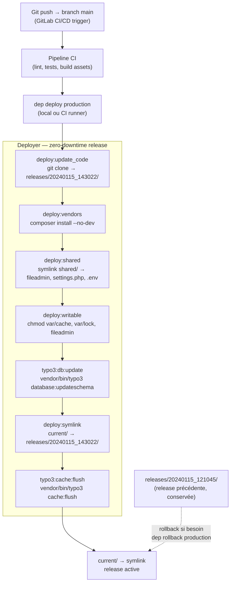

# Déploiement en production

TYPO3 en contexte agence se déploie sur des serveurs partagés ou des VPS — rarement du
Kubernetes. Cette leçon couvre les pratiques de déploiement propres avec Deployer (PHP),
les variables d'environnement et les pièges fréquents.

## Checklist avant déploiement

```
[ ] TYPO3_CONTEXT=Production dans les variables d'environnement du serveur
[ ] config/system/settings.php exclu de Git (dans .gitignore)
[ ] Clé d'encryption unique par installation (TYPO3_ENCRYPTION_KEY)
[ ] ENABLE_INSTALL_TOOL absent ou vide dans public/typo3conf/
[ ] Document root du vhost = public/ uniquement
[ ] Droits fichiers : var/, config/, typo3conf/ non accessibles depuis le web
[ ] PHP opcache activé, opcache.revalidate_freq = 0 en prod (ne pas revalider)
```

## Deployer (recipe TYPO3)

[Deployer](https://deployer.org/) est le standard PHP pour les déploiements zero-downtime.
Il existe une recette TYPO3 officielle :

```php
<?php
// deploy.php — Deployer configuration for TYPO3 12
namespace Deployer;

require 'recipe/typo3.php';

// Project name
set('application', 'acme-website');

// Repository
set('repository', 'git@gitlab.acme.com:acme/website.git');
set('branch', 'main');

// Shared files/dirs between deployments (persist across releases)
add('shared_files', [
    'config/system/settings.php',   // generated by Install Tool
    '.env',                          // environment-specific secrets
]);
add('shared_dirs', [
    'public/fileadmin',              // editor-uploaded files
    'public/typo3temp',              // generated thumbnails, temp files
    'var/log',
]);

// Writable dirs (must be writable by the web server)
add('writable_dirs', [
    'public/fileadmin',
    'public/typo3temp',
    'var/cache',
    'var/lock',
    'var/log',
]);

// Hosts
host('production')
    ->set('hostname', 'acme-prod.server.com')
    ->set('remote_user', 'deploy')
    ->set('deploy_path', '/var/www/acme-website')
    ->set('branch', 'main');

host('staging')
    ->set('hostname', 'acme-staging.server.com')
    ->set('remote_user', 'deploy')
    ->set('deploy_path', '/var/www/acme-website-staging')
    ->set('branch', 'develop');

// Post-deploy tasks
after('deploy:update_code', 'deploy:vendors');

task('typo3:cache:flush', function () {
    run('cd {{release_path}} && vendor/bin/typo3 cache:flush');
});
task('typo3:db:update', function () {
    run('cd {{release_path}} && vendor/bin/typo3 database:updateschema --no-interaction');
});

after('deploy:symlink', 'typo3:db:update');
after('deploy:symlink', 'typo3:cache:flush');
```

```bash
# Deploy to production
dep deploy production

# Deploy to staging
dep deploy staging

# Rollback if something goes wrong
dep rollback production
```

## Variables d'environnement côté serveur

Sur un serveur Apache/nginx, définir les variables dans la config du vhost :

```apache
# Apache VirtualHost — set environment variables
<VirtualHost *:443>
    ServerName www.acme.com
    DocumentRoot /var/www/acme-website/current/public

    SetEnv TYPO3_CONTEXT Production
    SetEnv TYPO3_DB_HOST 127.0.0.1
    SetEnv TYPO3_DB_NAME acme_prod
    SetEnv TYPO3_DB_USERNAME acme_user
    SetEnv TYPO3_DB_PASSWORD "strong-password"
    SetEnv TYPO3_ENCRYPTION_KEY "64-chars-random-string"

    # ... SSL, logs, etc.
</VirtualHost>
```

> **Repère —** ne jamais stocker les secrets dans `.env` commité. En prod, les variables
> d'environnement doivent être injectées par le système (vhost, systemd, Docker env).
> Le `.env` sert uniquement au développement local.

## Gestion des caches en déploiement

```bash
# Full cache flush (use after each deployment)
vendor/bin/typo3 cache:flush

# Flush only frontend caches (lighter, for content-only deployments)
vendor/bin/typo3 cache:flush --group=pages

# Warm up the cache (optional but recommended)
vendor/bin/typo3 cache:warmup
```

## Sécuriser l'Install Tool en production

```bash
# Remove the ENABLE_INSTALL_TOOL file after installation
rm public/typo3conf/ENABLE_INSTALL_TOOL

# Or create it temporarily when needed, then remove it
touch public/typo3conf/ENABLE_INSTALL_TOOL
# ... do your install tool work ...
rm public/typo3conf/ENABLE_INSTALL_TOOL
```

Depuis TYPO3 12, l'Install Tool est accessible via le backend (Admin Tools) pour les
administrateurs — le fichier `ENABLE_INSTALL_TOOL` n'est requis que si le backend est
inaccessible (urgence). [source: docs.typo3.org]

## Pipeline de déploiement complet : de Git à la production

Ce diagramme représente le flux Deployer tel qu'on le met en place en agence pour
un déploiement zero-downtime.



## Commandes TYPO3 CLI utiles dans une mission d'agence

Ces commandes couvrent 90 % des interventions courantes sur un projet TYPO3 en
production ou lors d'une reprise.

```bash
# ── CACHES ──────────────────────────────────────────────────────────────────

# Flush all caches (go-to on any issue)
vendor/bin/typo3 cache:flush

# Flush only page/frontend caches (lighter for content-only deploys)
vendor/bin/typo3 cache:flush --group=pages

# Warm up caches after deployment
vendor/bin/typo3 cache:warmup

# ── BASE DE DONNÉES ──────────────────────────────────────────────────────────

# Show pending schema changes (safe: preview only)
vendor/bin/typo3 database:updateschema --dry-run

# Apply ADD/CREATE changes (safe: never drops columns automatically)
vendor/bin/typo3 database:updateschema

# Apply ALL changes including DROP (dangerous: always --dry-run first)
vendor/bin/typo3 database:updateschema --schema-update-types=drop

# ── EXTENSIONS ───────────────────────────────────────────────────────────────

# Activate a local extension (registers TCA, routes, etc.)
vendor/bin/typo3 extension:activate acme_sitepackage

# Run setup for all active extensions
vendor/bin/typo3 extension:setup

# List all extensions with their status (active / inactive / not installed)
vendor/bin/typo3 extension:list

# ── DIAGNOSTICS ──────────────────────────────────────────────────────────────

# Show current TYPO3 context and version
vendor/bin/typo3 --version
echo $TYPO3_CONTEXT

# Check system requirements (PHP modules, file permissions, etc.)
vendor/bin/typo3 syscheck

# Dump TypoScript setup for a given page (extremely useful for debugging)
vendor/bin/typo3 typoscript:analyze --page-uid=1
```

## ⚠️ Piège agence — migration TYPO3 10→11 : `database:updateschema` et colonnes TCA renommées

En TYPO3 11, certaines colonnes système ont été renommées dans le TCA du core. Si
tu as des overrides TCA qui référencent les anciens noms, le schéma peut devenir
incohérent.

```php
<?php
// ANCIEN (TYPO3 10) — colonne de tri dans ctrl
'ctrl' => [
    'sortby' => 'sorting',
    'crdate' => 'crdate',
    'tstamp' => 'tstamp',
],

// TYPO3 11+ — même noms, mais certains champs comme 'fe_group' ont des changements
// de comportement subtils. Toujours faire un --dry-run avant d'appliquer.
```

La procédure sûre pour une migration LTS en agence :

```bash
# 1. Back up the database before any schema change
mysqldump -u root -p acme_prod > acme_prod_backup_$(date +%Y%m%d).sql

# 2. Preview all changes before applying
vendor/bin/typo3 database:updateschema --dry-run

# 3. Apply only safe changes (add columns, create tables)
vendor/bin/typo3 database:updateschema

# 4. Flush all caches
vendor/bin/typo3 cache:flush

# 5. Check logs for deprecation notices
tail -f var/log/typo3_*.log | grep -i deprecat
```

## ⚠️ Piège agence — migration TYPO3 11→12 : `ext_tables.php` et `ext_localconf.php`

TYPO3 12 charge encore `ext_localconf.php` et `ext_tables.php`, mais plusieurs
fonctions qu'on y plaçait sont désormais dépréciées ou ont migré ailleurs.

| Ancienne pratique (TYPO3 < 12) | TYPO3 12+ |
|---|---|
| `addPlugin()` dans `ext_tables.php` | `registerPlugin()` dans `TCA/Overrides/tt_content.php` |
| `addStaticFile()` dans `ext_tables.php` | `addStaticFile()` dans `TCA/Overrides/sys_template.php` |
| `$GLOBALS['TCA']` dans `ext_tables.php` | Fichiers dans `Configuration/TCA/` et `TCA/Overrides/` |
| Hooks dans `ext_localconf.php` | PSR-14 Events dans `Configuration/Services.yaml` |

Si en reprenant un projet tu vois un `ext_tables.php` de 300 lignes, c'est le
signal d'une extension non migrée depuis TYPO3 8 ou 9. Plan de migration :
1. Déplacer chaque bloc vers son fichier TCA/Override approprié.
2. Remplacer les Hooks par des PSR-14 Event Listeners.
3. Vider le cache et tester en `TYPO3_CONTEXT=Development` pour voir les deprecation notices.

## À retenir

- `TYPO3_CONTEXT=Production` désactive le debug, active les caches stricts.
- `public/typo3conf/ENABLE_INSTALL_TOOL` doit être absent en production normale.
- Deployer partage `public/fileadmin/`, `var/log/`, `settings.php` entre les releases.
- Après chaque déploiement : `vendor/bin/typo3 database:updateschema` puis `cache:flush`.
- Toujours `database:updateschema --dry-run` avant d'appliquer en production.
- En migration LTS : sauvegarder la BDD, lire les deprecation notices dans `var/log/`,
  migrer `ext_tables.php` vers `TCA/Overrides/` et les Hooks vers PSR-14 Events.
