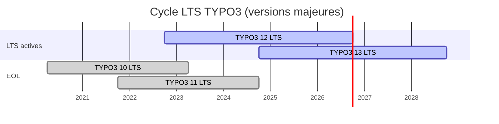
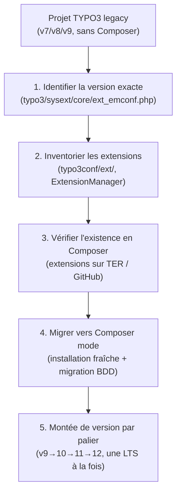

# Montées de version LTS : 11 → 12 et la roadmap LTS

TYPO3 suit un cycle LTS prévisible. En contexte agence, tu seras souvent sollicité pour
des montées de version (TYPO3 10 EOL depuis avril 2023, TYPO3 11 EOL depuis octobre 2024,
**TYPO3 12 LTS support jusqu'en octobre 2026**).

## Cycle LTS TYPO3



> **Repère —** TYPO3 12.4 est la version courante (LTS jusqu'en oct. 2026). TYPO3 13.0
> est sorti en octobre 2024 avec PHP 8.2 minimum. En agence, la migration vers 13 sera
> le prochain grand chantier. Les projets sur TYPO3 10/11 sont en **end of life** :
> pas de correctifs de sécurité. [source: docs.typo3.org]

## Processus de montée de version 11 → 12

### 1. Préparer l'environnement

```bash
# Ensure PHP 8.1+ is available (TYPO3 12 requires PHP 8.1)
php -v

# Create a dedicated branch for the upgrade
git checkout -b upgrade/typo3-12
```

### 2. Mettre à jour les dépendances Composer

```bash
# Update the core and all extensions in one step
composer require \
    typo3/cms-backend:^12.4 \
    typo3/cms-core:^12.4 \
    typo3/cms-extbase:^12.4 \
    typo3/cms-fluid:^12.4 \
    typo3/cms-frontend:^12.4 \
    typo3/cms-install:^12.4

# Check for extension compatibility before updating
composer outdated --direct

# Update all extensions (check for ^12 compatibility first!)
composer update
```

### 3. Lancer l'Upgrade Wizard

```bash
# Run all pending upgrade wizards via CLI
vendor/bin/typo3 upgrade:run --all

# Or selectively
vendor/bin/typo3 upgrade:list
vendor/bin/typo3 upgrade:run wizardIdentifier
```

### 4. Mettre à jour le schéma BDD

```bash
vendor/bin/typo3 database:updateschema
```

### 5. Vérifier les dépréciations

```bash
# Enable deprecation logging in Development context
# config/system/additional.php
$GLOBALS['TYPO3_CONF_VARS']['LOG']['writerConfiguration'][\TYPO3\CMS\Core\Log\LogLevel::DEBUG] = [
    \TYPO3\CMS\Core\Log\Writer\FileWriter::class => [
        'logFile' => \TYPO3\CMS\Core\Core\Environment::getVarPath() . '/log/deprecations.log',
    ],
];
```

Puis inspecter `var/log/deprecations.log` pour les usages dépréciés à corriger.

## Changements Breaking dans TYPO3 12 (vs 11)

| Changement | Impact |
|---|---|
| PHP 8.1 minimum | Vérifier `ext_emconf.php` de toutes les extensions |
| Symfony 6 (DI, Event Dispatcher) | `Services.yaml` reste compatible |
| `$GLOBALS['TSFE']` dépréciations | Remplacer par l'API `ServerRequestInterface` |
| `GeneralUtility::makeInstance()` | Toujours valide, mais préférer DI constructor |
| `ext_localconf.php` : hooks → PSR-14 Events | Migrer les anciens hooks vers EventListeners |
| FormEngine : nouveaux types TCA (`json`, `uuid`) | Non-breaking mais à exploiter |
| RTE CKEditor 5 | Revoir les configurations CKEditor 4 custom |

## Reprises de projets TYPO3 legacy

Les projets TYPO3 legacy (version < 10, mode classic sans Composer) ont leurs propres
pièges :



### Pièges classiques sur une reprise

**Piège 1 : TypoScript dans la BDD**
Sur les vieux projets, le TypoScript est souvent stocké directement dans la table
`sys_template` (champ `config`). Il faut l'exporter, le mettre dans des fichiers et
l'inclure via `@import`.

**Piège 2 : Extensions locales sans Composer**
Les extensions dans `typo3conf/ext/` n'ont pas de `composer.json`. Il faut les migrer :
créer un `composer.json` d'extension, les déplacer dans `packages/`, les enregistrer
comme packages path.

**Piège 3 : RealURL (extensions de routing legacy)**
Les projets TYPO3 < 10 utilisent souvent `DmitryDulepov/realurl` ou `AOE/aoe_realurl`
pour les URLs propres. Depuis TYPO3 10, c'est natif via les `routeEnhancers` dans la
Site Configuration. Migration obligatoire.

**Piège 4 : `$GLOBALS['BE_USER']` et hooks**
Les vieilles extensions utilisent les hooks TYPO3 (`$GLOBALS['TYPO3_CONF_VARS']['SC_OPTIONS']`)
et accèdent à `$GLOBALS['BE_USER']` directement. En TYPO3 12, les hooks sont dépréciés au
profit des PSR-14 Events. Prévoir un refactoring.

**Piège 5 : `tslib_pibase` (le vrai legacy)**
Les extensions pré-Extbase héritent de `tslib_pibase`. C'est du code TYPO3 3/4. Il n'y
a pas de migration automatique — réécriture complète en Extbase nécessaire.

> **Repère —** sur une reprise legacy, commence **toujours** par un audit complet :
> version TYPO3, PHP, liste des extensions actives + version, présence de Composer mode.
> Documente avant de toucher quoi que ce soit. Une montée de version sans Composer mode
> d'abord est une source de chaos. [source: docs.typo3.org]

## À retenir

- TYPO3 12.4 LTS → support jusqu'en octobre 2026, TYPO3 13 est la prochaine LTS.
- Montée de version : `composer update` + Upgrade Wizard + `database:updateschema` + audit dépréciations.
- Reprise legacy : auditer, Composer-ifier, monter par palier LTS (jamais un saut de 3 versions).
- TypoScript dans la BDD, extensions sans Composer, RealURL, hooks → les 4 dettes techniques
  les plus fréquentes.
