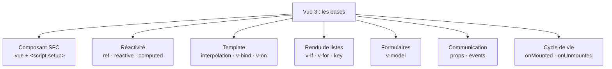

# Étape 3 — Vue 3 : les bases

Tu quittes le JavaScript « à la main » pour entrer dans Vue 3 : la **Composition API** et
`<script setup>`. On construit un premier composant fonctionnel, brique par brique, dans un
ordre qui suit exactement la façon dont un composant prend vie : d'abord **où** vit le code
(le fichier `.vue`), puis **le moteur** qui le fait réagir (la réactivité), puis **ce qu'il
affiche** (le template), et enfin **comment il parle** aux autres composants (props /
événements). Impossible de sauter une étape : sans SFC pas de composant, sans réactivité
rien ne bouge à l'écran, sans template rien ne s'affiche, et sans props/events les
composants restent isolés.

> **Objectif de l'étape —** comprendre la réactivité et écrire un composant qui affiche des
> données et réagit aux interactions.

## Au programme

- Le composant `.vue` (SFC) et `<script setup>`
- Réactivité : `ref`, `reactive`, `computed`
- Le template : interpolation, `v-bind`, `v-on`
- Rendu conditionnel et listes : `v-if`, `v-for` (et la `key`)
- Formulaires : `v-model`
- Props (`defineProps`) et événements (`defineEmits`)
- Cycle de vie : `onMounted`, `onUnmounted`
