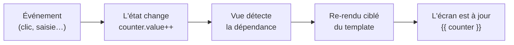

# La réactivité

La réactivité, c'est **le** concept fondateur de Vue : quand une donnée change, le
**template se met à jour tout seul**. Tu n'écris jamais « va modifier le texte de ce
`<span>` » — tu changes la donnée, et Vue s'occupe du reste.

> **Pourquoi c'est un tel gain ?** Sans réactivité (le vieux JS « à la main »), tu dois
> pour chaque changement : trouver le bon élément (`document.querySelector`), le mettre à
> jour, et ne rien oublier. Dès que l'UI grossit, ça devient un plat de spaghettis. La
> réactivité **inverse** le problème : tu décris *quelle donnée s'affiche où* (une fois),
> et Vue **synchronise** automatiquement l'écran avec l'état. Moins de code, moins de bugs.



> 🧠 **Rappel algo.** La réactivité, c'est le patron **observateur** (*observer*) : une
> valeur « observable » tient une liste de ce qui dépend d'elle (ici, les morceaux de
> template qui l'affichent). Quand elle change, elle **notifie** ses dépendants pour qu'ils
> se recalculent. Tu retrouves cette idée partout : les formules d'un tableur (change une
> cellule → les cellules qui la référencent se recalculent), ou un `SELECT` matérialisé.

## `ref` — une valeur réactive

`ref(...)` emballe une valeur dans une « boîte réactive ». On lit/écrit son contenu via
`.value` **dans le script** :

```js
import { ref } from 'vue'

const counter = ref(0)
counter.value++          // dans le <script> : toujours .value
```

Dans le **template**, pas besoin de `.value` — Vue le déballe pour toi : `{{ counter }}`.

> **Pourquoi ce `.value` ?** En JavaScript, on ne peut pas « surveiller » une variable
> primitive (`let n = 0`) : réassigner `n` ne prévient personne. En emballant la valeur
> dans un **objet** (`{ value: 0 }`), Vue peut intercepter les accès à `.value` et savoir
> quand ça change. Le `.value` est le petit prix à payer pour la réactivité sur les types
> simples.

## `reactive` — un objet réactif

Pour un **groupe de champs liés** (un formulaire), `reactive` rend tout l'objet réactif —
et là, **pas de `.value`** :

```js
import { reactive } from 'vue'

const form = reactive({ name: '', age: 0 })
form.name = 'Ada'         // pas de .value avec reactive
```

> **ref ou reactive ?** En pratique : **`ref` par défaut** (marche pour tout, y compris les
> objets), `reactive` seulement pour un groupe de champs cohérents (un formulaire). En cas
> de doute, `ref` est le choix sûr.

## `computed` — une valeur dérivée

Une valeur **calculée** à partir d'autres, recalculée automatiquement (et **mise en
cache** tant que ses sources ne bougent pas) :

```js
import { ref, computed } from 'vue'

const priceExclTax = ref(100)
const priceInclTax = computed(() => priceExclTax.value * 1.2)   // 120, suit priceExclTax
```

> **Passerelle data / SQL.** Un `computed` est une **colonne calculée** : `montant * 1.2 AS
> ttc`. Tu ne stockes pas le TTC en base, tu le **dérives** du HT. Vue applique la même
> hygiène : on ne stocke pas ce qu'on peut recalculer.

> **Règle d'or —** ne **duplique** jamais un état que tu peux **dériver**. Si une valeur se
> calcule à partir d'une autre, c'est un `computed`, pas un second `ref` à maintenir à la
> main (deux sources de vérité finissent toujours par diverger).

## À toi de jouer

Survole le bloc ci-dessous et clique **« Tester »** : le composant s'exécute en direct dans
le playground. Change le `step`, regarde `double` suivre `counter` tout seul, essaie
d'ajouter ton propre `computed` (par exemple `triple`).

```vue
<script setup>
import { ref, computed } from 'vue'

const counter = ref(0)
const step = ref(1)
const double = computed(() => counter.value * 2)
</script>

<template>
  <p>Compteur : {{ counter }} — double : {{ double }}</p>
  <button @click="counter += step">+{{ step }}</button>
  <button @click="step++">Augmenter le pas</button>
</template>
```

## À retenir

- La **réactivité** synchronise l'écran avec l'état : tu changes la donnée, Vue re-rend
  le template ciblé (patron **observateur**).
- **`ref(v)`** : une valeur réactive ; `.value` **dans le script**, rien dans le template.
- **`reactive({...})`** : un objet réactif (formulaire) ; pas de `.value`. En doute → `ref`.
- **`computed(() => ...)`** : une valeur **dérivée**, mise en cache — l'équivalent d'une
  colonne calculée. **Ne duplique jamais un état dérivable.**
