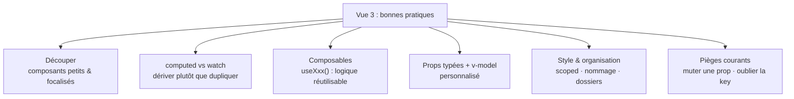

# Étape 4 — Vue 3 : bonnes pratiques

Tes premiers composants marchent — l'étape suivante est de les rendre **propres et
maintenables**, la façon « pro » de faire du Vue. On avance dans un ordre volontaire :
d'abord **découper** en composants petits et focalisés (l'architecture), puis, à l'intérieur
de chacun, choisir le bon outil réactif (`computed` pour dériver, `watch` pour un effet de
bord), et enfin **extraire** ce qui se répète entre composants dans un composable. Chaque
étape prépare la suivante : un composant trop gros est difficile à nettoyer ; une fois
petit, sa logique interne devient facile à clarifier ; une fois clarifiée, elle devient facile
à partager.

> **Objectif de l'étape —** écrire des composants lisibles, réutilisables et faciles à faire
> évoluer.

## Au programme

- Composants **petits et focalisés** (une responsabilité)
- État **dérivé** en `computed` plutôt que dupliqué
- `watch` vs `computed` : quand utiliser quoi
- **Composables** (`useXxx`) : extraire la logique réutilisable
- Props typées (TypeScript) + valeurs par défaut ; `v-model` personnalisé
- Styles `scoped`, conventions de nommage, organisation des dossiers
- Pièges courants : muter une prop, oublier la `key`, abuser de `watch`
