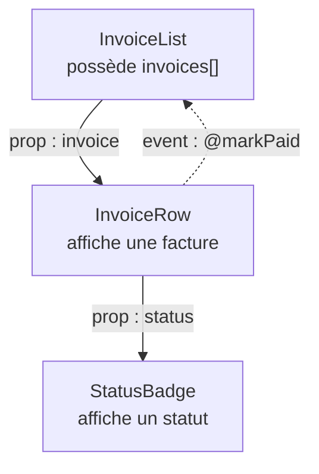

# Un composant = une responsabilité

Le réflexe pro : des composants **petits**, chacun avec **un seul rôle**. Un gros composant
qui fait tout devient vite illisible et impossible à réutiliser.

## Signes qu'il faut découper

- Le `<template>` dépasse l'écran.
- Le composant gère plusieurs sujets sans rapport (une liste **et** une modale **et** un formulaire).
- Tu copies-colles un bout de template d'un composant à l'autre.

## Découper proprement

```
InvoiceList.vue          ← orchestrates
├─ InvoiceRow.vue        ← displays one row
└─ StatusBadge.vue       ← displays a status
```

Chaque enfant reçoit ses **props** et **émet** ses événements ; le parent orchestre.



> **Rappel du flux —** les **props descendent**, les **événements remontent**. Un enfant
> ne modifie jamais une prop : il émet, et le parent décide.

## Avant / après

**Avant — un composant monolithique** (liste, ligne et badge mélangés) :

```vue
<template>
  <ul>
    <li v-for="invoice in invoices" :key="invoice.id">
      {{ invoice.client }} — {{ invoice.amount }} €
      <span :class="invoice.paid ? 'badge-ok' : 'badge-late'">
        {{ invoice.paid ? 'Paid' : 'Late' }}
      </span>
    </li>
  </ul>
</template>
```

**Après — découpé** (`InvoiceList` ne fait plus qu'orchestrer) :

```vue
<template>
  <ul>
    <InvoiceRow
      v-for="invoice in invoices"
      :key="invoice.id"
      :invoice="invoice"
      @mark-paid="onMarkPaid"
    />
  </ul>
</template>
```

`InvoiceRow` (le détail d'une ligne) et `StatusBadge` (le badge coloré) deviennent chacun un
petit fichier avec **un seul rôle**, testable et réutilisable ailleurs.

> **Bonne pratique —** nomme les composants en **PascalCase** (`InvoiceRow`), un fichier
> par composant, et garde la logique partagée dans des **composables** (leçon suivante)
> plutôt que de la dupliquer.
