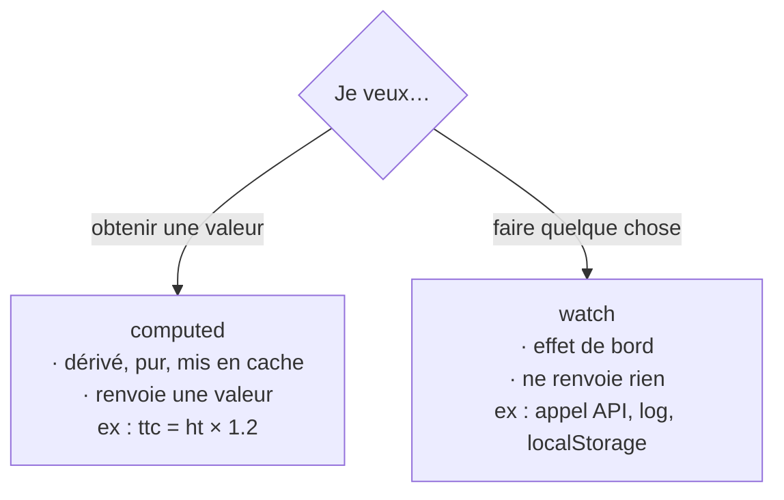

# `computed` ou `watch` ?

C'est **la** confusion numéro un chez les débutants Vue. Les deux « réagissent à un
changement », alors on hésite. La règle qui tranche tout :

- **`computed`** → quand tu veux **calculer une valeur** à partir d'autres. Pur, mis en cache.
- **`watch`** → quand tu veux **déclencher une action** (un effet de bord) quand une valeur
  change.



> 🧠 **Rappel algo.** C'est la distinction **fonction pure** vs **effet de bord**. Une
> fonction pure : mêmes entrées → même sortie, sans rien modifier d'autre (`computed`). Un
> effet de bord : elle *agit* sur le monde extérieur — écrire un fichier, appeler le réseau,
> logger (`watch`). Garder les deux séparés est un principe qui dépasse Vue : c'est ce qui
> rend un programme prévisible et testable.

## `computed` : une valeur dérivée

```js
const priceExclTax = ref(100)
const priceInclTax = computed(() => priceExclTax.value * 1.2)   // une VALEUR
```

Il **renvoie** une valeur, ne touche à rien d'autre, et se met en cache : tant que
`priceExclTax` ne change pas, il ne recalcule pas.

## `watch` : réagir à un changement

```js
watch(query, async (newValue) => {
  results.value = await api.search(newValue)   // un EFFET (appel API)
})
```

Il ne renvoie rien : il **fait** quelque chose (ici, un appel réseau) en réaction au
changement de `query`.

> **Passerelle — data / SQL.** Un `computed` est une **colonne calculée** ou une **vue**
> (`SELECT montant * 1.2 AS ttc`) : purement dérivé, recalculé à la demande. Un `watch` est
> plutôt un **trigger** (`AFTER UPDATE`) : « quand cette valeur change, exécute cette
> action ». Les vues décrivent, les triggers agissent — même partage des rôles.

## Le test mental

> « Est-ce que je veux **obtenir une valeur**, ou **faire quelque chose** ? »
> Une valeur → `computed`. Une action (API, log, `localStorage`…) → `watch`.

> **Anti-pattern fréquent —** utiliser un `watch` pour **recopier** une valeur dérivée dans
> un autre `ref`. Si c'est dérivable, c'est un `computed` — sinon tu maintiens deux sources
> de vérité qui finiront par diverger. Le `watch` ne devrait servir qu'à des **effets**, pas
> à recalculer des valeurs.

## À retenir

- **`computed`** = **valeur dérivée**, pure et mise en cache (une colonne calculée / une vue
  SQL). Il **renvoie** quelque chose.
- **`watch`** = **effet de bord** en réaction à un changement (un trigger). Il **fait**
  quelque chose et ne renvoie rien.
- Le test qui tranche : « je veux une valeur → `computed` ; je veux agir → `watch` ».
- Ne recopie **jamais** un dérivé via `watch` : c'est le travail d'un `computed`.
