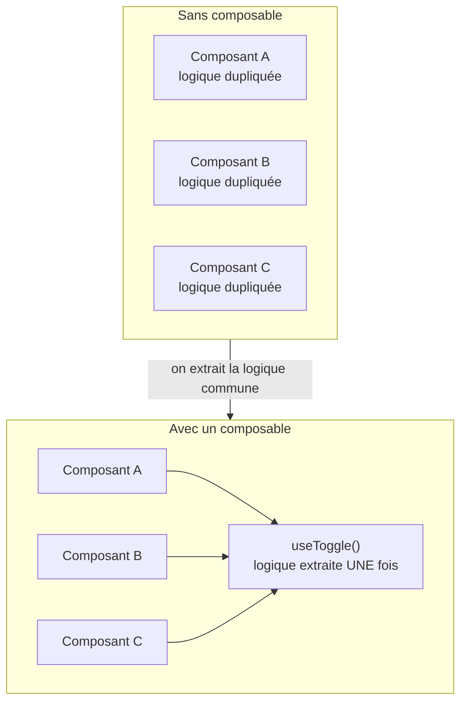

# Les composables

Un **composable** est une fonction `useXxx()` qui encapsule de la **logique réactive
réutilisable**. C'est LE moyen, en Vue 3, de partager du code (de la logique, pas de
l'affichage) entre plusieurs composants.

> **Pourquoi les composables existent-ils ?** Parce que tôt ou tard, deux composants ont
> besoin de la *même* logique : suivre l'état ouvert/fermé d'un panneau, charger des
> données, gérer une pagination. Sans outil, tu copies-colles — et le jour d'un bug, tu le
> corriges à trois endroits (ou tu en oublies un). Le composable **extrait cette logique
> une seule fois** ; les composants ne font plus que l'*utiliser*.



> 🧠 **Rappel algo.** Un composable, c'est le principe **DRY** (*Don't Repeat Yourself*) et
> la **factorisation** appliqués à de la logique *avec état réactif*. Comme une fonction
> utilitaire que tu importes partout — sauf qu'ici la fonction renvoie des `ref`/`computed`
> vivants, pas juste une valeur figée.

## Exemple : `useToggle`

Une logique minuscule mais qu'on réécrit sans arrêt : un booléen qu'on bascule.

```js
// composables/useToggle.js
import { ref } from 'vue'

export function useToggle(initial = false) {
  const state = ref(initial)
  const toggle = () => { state.value = !state.value }
  return { state, toggle }
}
```

Utilisation dans **n'importe quel** composant :

```vue
<script setup>
import { useToggle } from '@/composables/useToggle'

const { state: open, toggle } = useToggle()
</script>

<template>
  <button @click="toggle">{{ open ? 'Fermer' : 'Ouvrir' }}</button>
</template>
```

Chaque appel de `useToggle()` crée **son propre** `state` : deux panneaux qui utilisent le
même composable ont chacun leur état indépendant. C'est un point clé — on partage la
*logique*, pas l'*état*.

## Conventions

- Le nom commence par **`use`** (`useToggle`, `useFetch`, `usePagination`). C'est une
  convention forte : en lisant `useXxx`, on sait qu'on manipule un composable.
- Il **renvoie** des `ref`/`computed`/fonctions (un objet simple à déstructurer), pas un
  gros objet réactif figé.
- Il peut appeler **d'autres composables** et les hooks de cycle de vie (`onMounted`…) — on
  les compose entre eux, d'où le nom.

> **Passerelle — React / Angular / autres langages.** Un composable est l'équivalent Vue
> d'un **hook** React (`useState`, `useEffect`, `useXxx` maison) : même convention de nom,
> même idée d'extraire de la logique *avec état*. Côté services Angular, l'intention est
> proche (partager de la logique injectable). Et si tu viens de PHP/Python, pense à un
> **trait** (PHP) ou à une classe/fonction utilitaire importée : de la factorisation, mais
> ici avec de l'état réactif embarqué.

> **Pourquoi c'est mieux que les anciens *mixins* ?** Les mixins (Vue 2) injectaient des
> propriétés dans le composant sans qu'on voie **d'où** elles venaient — conflits de noms,
> magie invisible. Un composable est une **fonction explicite** : tu vois ce que tu importes
> et ce que tu récupères. Plus lisible, plus sûr, sans les pièges des mixins.

## À toi de jouer

Clique **« Tester »** : ici le composable est défini dans le même fichier (en vrai il serait
dans `composables/useToggle.js`). On l'utilise **deux fois** — et chaque appel a bien son
état à lui.

```vue
<script setup>
import { ref } from 'vue'

function useToggle(initial = false) {
  const state = ref(initial)
  const toggle = () => (state.value = !state.value)
  return { state, toggle }
}

const { state: menu, toggle: toggleMenu } = useToggle()
const { state: help, toggle: toggleHelp } = useToggle(true)
</script>

<template>
  <button @click="toggleMenu">Menu : {{ menu ? 'ouvert' : 'fermé' }}</button>
  <button @click="toggleHelp">Aide : {{ help ? 'visible' : 'cachée' }}</button>
</template>
```

## À retenir

- Un **composable** = une fonction **`useXxx()`** qui encapsule une **logique réactive
  réutilisable** (factorisation / DRY appliqué à l'état).
- Il **renvoie** des `ref`/`computed`/fonctions ; chaque appel crée **son propre état** — on
  partage la logique, pas l'état.
- Conventions : préfixe **`use`**, objet renvoyé déstructurable, composables composables
  entre eux.
- C'est l'équivalent des **hooks React** ; c'est aussi le remplaçant moderne et explicite
  des anciens *mixins*.
