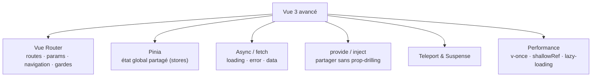

# Étape 5 — Vue 3 avancé

Tes composants sont propres — reste à les assembler en une **vraie application**. Trois
briques, dans un ordre qui suit la vie d'un écran : d'abord **Vue Router**, qui associe une
URL à un composant (sans lui, il n'y a qu'un seul écran) ; puis **Pinia**, pour l'état
partagé entre des écrans que le routeur vient de rendre navigables (le panier vu par le
header *et* la page paiement, par exemple) ; enfin les **appels API asynchrones**, qui
remplissent ces écrans et ce store avec de vraies données — et leurs trois états
incontournables : chargement, erreur, données.

> **Objectif de l'étape —** organiser une app complète : navigation, état global et async.

## Au programme

- **Vue Router** : routes, params, navigation, gardes
- **Pinia** : état global propre (stores)
- Appels API et gestion async (chargement / erreurs)
- `provide` / `inject` pour partager sans prop-drilling
- `Teleport` et `Suspense`
- Performance : `v-once`, `shallowRef`, découpage / lazy-loading
